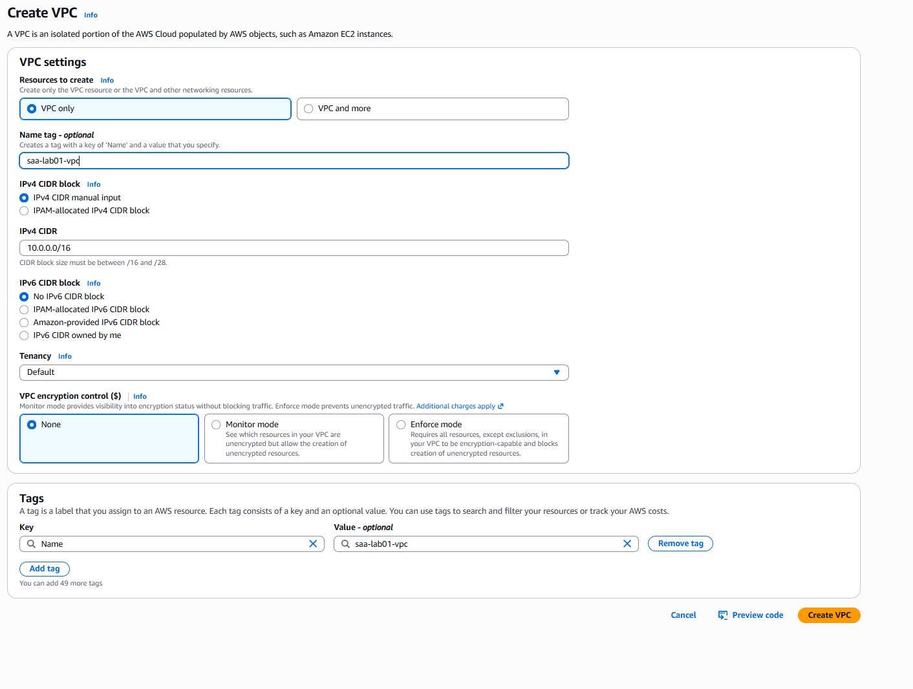
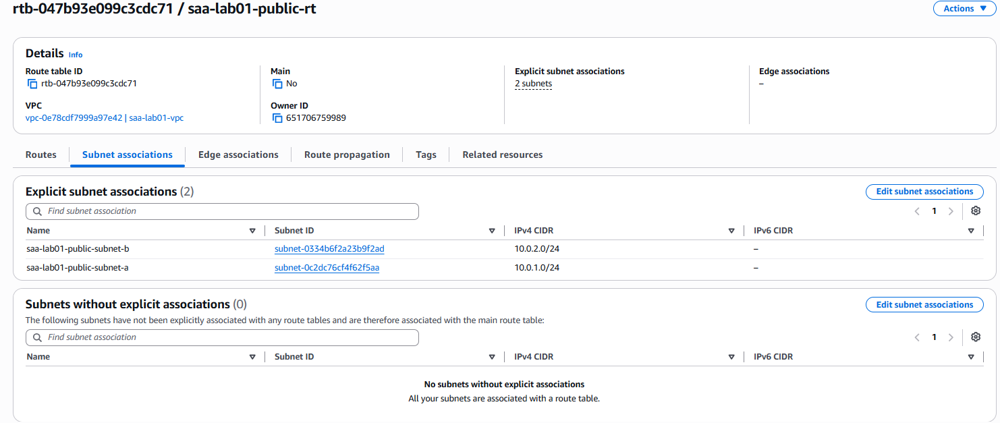
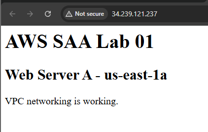
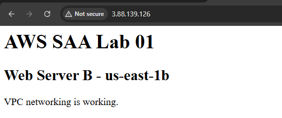
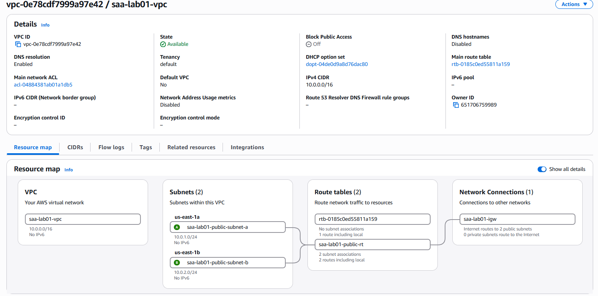
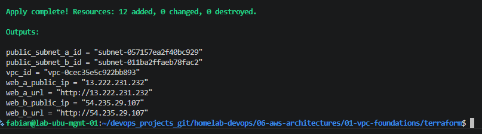
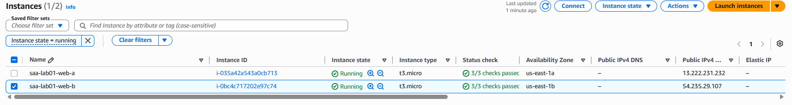
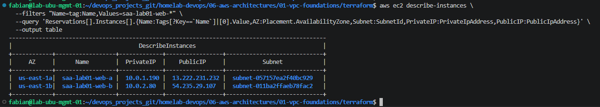
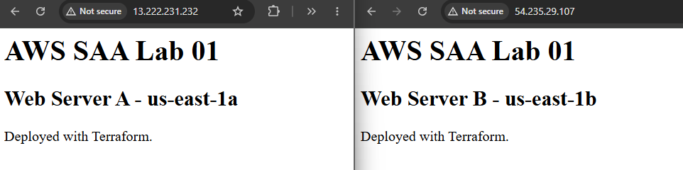
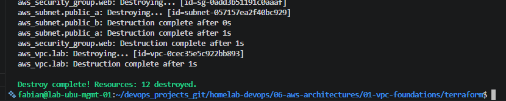

# AWS SAA Lab 01 — VPC Foundations

## Overview

This lab demonstrates the fundamentals of Amazon VPC networking by building a simple Multi-AZ public architecture.

The architecture was implemented twice:

1. Manually using the AWS Management Console.
2. Automatically using Terraform Infrastructure as Code (IaC).

The goal is to understand the AWS networking components commonly tested in the AWS Certified Solutions Architect – Associate (SAA-C03) exam and then reproduce the same infrastructure using Terraform.

---

## Learning Objectives

By completing this lab, I practiced how to:

- Create a custom Amazon VPC.
- Design IPv4 CIDR ranges for a VPC and its subnets.
- Create subnets in multiple Availability Zones.
- Attach an Internet Gateway to a VPC.
- Configure a public route table.
- Associate multiple subnets with a route table.
- Configure Security Group rules.
- Launch EC2 instances in different Availability Zones.
- Assign public IPv4 addresses to EC2 instances.
- Bootstrap EC2 instances using User Data.
- Verify HTTP connectivity from the Internet.
- Deploy AWS infrastructure using Terraform.
- Validate infrastructure using the AWS CLI.
- Destroy Terraform-managed infrastructure safely.

---

## Architecture

The lab uses one VPC spanning two Availability Zones.

```text
                         INTERNET
                            |
                     Internet Gateway
                            |
                    Public Route Table
                     0.0.0.0/0 -> IGW
                            |
                 +----------+----------+
                 |                     |
        Public Subnet A         Public Subnet B
         10.0.1.0/24            10.0.2.0/24
         us-east-1a             us-east-1b
                 |                     |
          EC2 Web Server A       EC2 Web Server B
             Apache                 Apache
             HTTP/80                HTTP/80
```

### Network Design

| Resource | Configuration |
|---|---|
| AWS Region | us-east-1 |
| VPC | 10.0.0.0/16 |
| Public Subnet A | 10.0.1.0/24 |
| Availability Zone A | us-east-1a |
| Public Subnet B | 10.0.2.0/24 |
| Availability Zone B | us-east-1b |
| Internet Route | 0.0.0.0/0 → Internet Gateway |
| Web Protocol | HTTP |
| Web Port | TCP/80 |
| EC2 OS | Amazon Linux 2023 |
| EC2 Instance Type | t3.micro |

---

## AWS Services Used

- Amazon VPC
- Amazon EC2
- Internet Gateway
- Route Tables
- Security Groups
- AWS Management Console
- AWS CLI

## Infrastructure as Code

Terraform was used to reproduce the manually created AWS architecture.

The Terraform deployment manages the VPC, subnets, routing, security rules, and EC2 web servers as code.

---

# Part I — Manual Deployment

Before automating the infrastructure with Terraform, the architecture was built manually using the AWS Management Console.

This helped demonstrate how the individual AWS networking components work together before representing them as Infrastructure as Code.

## 1. Create the VPC

A custom VPC was created with the following configuration:

| Setting | Value |
|---|---|
| Name | saa-lab01-vpc |
| IPv4 CIDR | 10.0.0.0/16 |
| Tenancy | Default |
| IPv6 | Disabled |

The `/16` CIDR provides a large private address space that can be divided into smaller subnets.



---

## 2. Create Public Subnets

Two public subnets were created in different Availability Zones.

| Subnet | CIDR | Availability Zone |
|---|---|---|
| saa-lab01-public-subnet-a | 10.0.1.0/24 | us-east-1a |
| saa-lab01-public-subnet-b | 10.0.2.0/24 | us-east-1b |

Using different Availability Zones introduces the basic concept of Multi-AZ architecture and failure-domain isolation.

---

## 3. Create and Attach an Internet Gateway

An Internet Gateway named:

```text
saa-lab01-igw
```

was created and attached to the VPC.

The Internet Gateway provides a path between resources inside the VPC and the public Internet.

---

## 4. Configure the Public Route Table

A public route table named:

```text
saa-lab01-public-rt
```

was configured with the following Internet route:

```text
Destination: 0.0.0.0/0
Target:      Internet Gateway
```

Both public subnets were explicitly associated with this route table.



### Important SAA Concept

A subnet does not become public simply because an EC2 instance has a public IPv4 address.

For Internet connectivity, the architecture requires:

```text
EC2 Public IPv4
        +
Public Subnet
        +
Route 0.0.0.0/0 → Internet Gateway
        +
Security Group allowing the required traffic
```

---

## 5. Configure the Web Security Group

A Security Group was created for the web servers.

Inbound rule:

| Type | Protocol | Port | Source |
|---|---|---|---|
| HTTP | TCP | 80 | 0.0.0.0/0 |

This allows Internet clients to access the web servers over HTTP.

No public SSH access was required for this lab.

---

## 6. Launch EC2 Web Servers

Two Amazon Linux EC2 instances were deployed:

```text
Web Server A
Subnet: 10.0.1.0/24
AZ:     us-east-1a

Web Server B
Subnet: 10.0.2.0/24
AZ:     us-east-1b
```

Apache HTTP Server was configured on both instances.

This provided a simple workload for validating VPC Internet connectivity.

---

## 7. Validate Web Server A

Web Server A was successfully reached through its public IPv4 address.



The successful HTTP response confirms connectivity through:

```text
Internet
   ↓
Internet Gateway
   ↓
Public Route Table
   ↓
Public Subnet A
   ↓
Security Group
   ↓
EC2 Web Server A
```

---

## 8. Validate Web Server B

Web Server B was also successfully reached through its public IPv4 address.



This validates Internet connectivity from the second Availability Zone.

---

## 9. Validate the VPC Resource Map

The AWS VPC Resource Map provides a visual representation of the network architecture.

It confirms:

- One VPC.
- Two subnets.
- Two Availability Zones.
- Public route table associations.
- Internet Gateway connectivity.



The completed manual architecture validated the networking design before recreating the same infrastructure using Terraform.


---

# Part II — Terraform Deployment

After validating the architecture manually, the same infrastructure was recreated using Terraform.

The objective was to represent the AWS architecture as Infrastructure as Code (IaC), allowing the environment to be deployed and destroyed consistently.

## 10. Terraform Project Structure

The Terraform implementation uses the following structure:

```text
terraform/
├── main.tf
├── outputs.tf
├── providers.tf
├── terraform.tfvars
├── variables.tf
└── screenshots/
```

### File Responsibilities

| File | Purpose |
|---|---|
| `main.tf` | Defines the AWS infrastructure resources |
| `variables.tf` | Declares Terraform input variables |
| `terraform.tfvars` | Provides values for the variables |
| `providers.tf` | Configures Terraform and the AWS provider |
| `outputs.tf` | Displays important infrastructure information after deployment |
| `screenshots/` | Stores Terraform deployment evidence |

---

## 11. Infrastructure Managed by Terraform

Terraform creates the following AWS resources:

```text
VPC
│
├── Internet Gateway
│
├── Public Route Table
│   ├── 0.0.0.0/0 → Internet Gateway
│   ├── Association → Public Subnet A
│   └── Association → Public Subnet B
│
├── Public Subnet A
│   └── EC2 Web Server A
│
├── Public Subnet B
│   └── EC2 Web Server B
│
└── Web Security Group
    ├── Inbound TCP/80
    └── Outbound All
```

The two EC2 instances are deployed across separate Availability Zones:

```text
us-east-1a → Web Server A
us-east-1b → Web Server B
```

---

## 12. Terraform Variables

Infrastructure values were separated from the resource definitions using Terraform variables.

Examples include:

```hcl
aws_region = "us-east-1"

vpc_cidr = "10.0.0.0/16"

public_subnet_a_cidr = "10.0.1.0/24"
public_subnet_b_cidr = "10.0.2.0/24"

availability_zone_a = "us-east-1a"
availability_zone_b = "us-east-1b"

instance_type = "t3.micro"
```

This makes the Terraform configuration easier to modify and reuse.

---

## 13. Dynamic Amazon Linux AMI

Instead of hardcoding an AMI ID, Terraform retrieves an Amazon Linux 2023 AMI dynamically using a data source.

```hcl
data "aws_ami" "amazon_linux" {
  most_recent = true
  owners      = ["amazon"]

  filter {
    name   = "name"
    values = ["al2023-ami-2023.*-x86_64"]
  }

  filter {
    name   = "virtualization-type"
    values = ["hvm"]
  }
}
```

This avoids depending on a specific AMI ID that may differ between AWS Regions or become outdated.

---

## 14. EC2 Bootstrap with User Data

Both EC2 instances use EC2 User Data to automatically install and start Apache during instance initialization.

The bootstrap process performs:

```text
EC2 Launch
    ↓
Amazon Linux boots
    ↓
User Data executes
    ↓
Apache is installed
    ↓
Apache service starts
    ↓
index.html is created
    ↓
Web server becomes available on TCP/80
```

Each server returns a different page so that its Availability Zone can be identified.

Example:

```text
AWS SAA Lab 01

Web Server A - us-east-1a

Deployed with Terraform.
```

---

## 15. Initialize Terraform

Terraform was initialized with:

```bash
terraform init
```

This downloads the required AWS provider and initializes the working directory.

---

## 16. Validate the Configuration

The Terraform configuration was validated before deployment:

```bash
terraform fmt
terraform validate
```

`terraform fmt` standardizes the formatting of the Terraform files.

`terraform validate` verifies that the configuration is syntactically valid and internally consistent.

---

## 17. Create the Terraform Execution Plan

An execution plan was generated and saved:

```bash
terraform plan -out=tfplan
```

Terraform calculated:

```text
Plan: 12 to add, 0 to change, 0 to destroy.
```

This allowed the infrastructure changes to be reviewed before modifying the AWS environment.

---

## 18. Deploy the Infrastructure

The reviewed Terraform plan was applied using:

```bash
terraform apply tfplan
```

Terraform successfully created the infrastructure:

```text
Apply complete! Resources: 12 added, 0 changed, 0 destroyed.
```

The outputs returned information including:

```text
public_subnet_a_id
public_subnet_b_id
vpc_id
web_a_public_ip
web_a_url
web_b_public_ip
web_b_url
```



### Infrastructure as Code Concept

The important difference between the two implementations is:

```text
Manual Deployment
AWS Console
    ↓
Administrator creates resources
    ↓
AWS Infrastructure


Terraform Deployment
Terraform Configuration
    ↓
terraform plan
    ↓
terraform apply
    ↓
AWS API
    ↓
AWS Infrastructure
```

Terraform provides a repeatable and version-controlled definition of the infrastructure.

---

# Part III — Infrastructure Validation

After Terraform deployed the infrastructure, the environment was validated from both the AWS Management Console and the AWS CLI.

The objective was to confirm that the resources were deployed in the correct VPC, subnets, and Availability Zones and that both web servers were reachable from the Internet.

## 19. Validate EC2 Instances

The AWS EC2 Console confirmed that both web servers were running.

| Instance | Availability Zone | Instance Type |
|---|---|---|
| saa-lab01-web-a | us-east-1a | t3.micro |
| saa-lab01-web-b | us-east-1b | t3.micro |

Both instances successfully passed their EC2 status checks.



This confirms that the workload was distributed across two Availability Zones.

---

## 20. Validate EC2 Placement with AWS CLI

The following AWS CLI command was used to verify the placement and network configuration of both instances:

```bash
aws ec2 describe-instances \
  --filters "Name=tag:Name,Values=saa-lab01-web-*" \
  --query 'Reservations[].Instances[].{Name:Tags[?Key==`Name`][0].Value,AZ:Placement.AvailabilityZone,Subnet:SubnetId,PrivateIP:PrivateIpAddress,PublicIP:PublicIpAddress}' \
  --output table
```

The output confirmed that:

```text
Web Server A
AZ:         us-east-1a
Private IP: 10.0.1.x
Subnet:     Public Subnet A

Web Server B
AZ:         us-east-1b
Private IP: 10.0.2.x
Subnet:     Public Subnet B
```



This demonstrates that Terraform correctly placed each EC2 instance in its intended subnet and Availability Zone.

---

## 21. Validate HTTP Connectivity

Both EC2 instances were accessed through their public IPv4 addresses.

### Web Server A

```text
Internet
   ↓
Public IPv4
   ↓
Internet Gateway
   ↓
Public Route Table
   ↓
Public Subnet A
   ↓
Security Group TCP/80
   ↓
Web Server A
```

The Apache page was successfully returned from Web Server A.

### Web Server B

The same test was performed against Web Server B.

Both web servers returned their respective pages:

```text
AWS SAA Lab 01
Web Server A - us-east-1a
Deployed with Terraform.
```

and:

```text
AWS SAA Lab 01
Web Server B - us-east-1b
Deployed with Terraform.
```



The successful HTTP requests confirm that:

- The Internet Gateway is attached correctly.
- The public route is working.
- Both subnet associations are correct.
- Public IPv4 addressing is working.
- The Security Group allows TCP/80.
- Apache was successfully configured by EC2 User Data.

---

## 22. Validate the VPC Architecture

The VPC Resource Map was used to verify the final network topology.

The deployed architecture contains:

```text
VPC: 10.0.0.0/16

├── Public Subnet A
│   ├── 10.0.1.0/24
│   ├── us-east-1a
│   └── Web Server A
│
├── Public Subnet B
│   ├── 10.0.2.0/24
│   ├── us-east-1b
│   └── Web Server B
│
├── Public Route Table
│   ├── Association → Subnet A
│   ├── Association → Subnet B
│   └── 0.0.0.0/0 → Internet Gateway
│
└── Internet Gateway
```

---

## 23. Verify Route Table Associations

Both public subnets were explicitly associated with the public route table.

```text
saa-lab01-public-subnet-a ──┐
                            ├── saa-lab01-public-rt ── Internet Gateway
saa-lab01-public-subnet-b ──┘
```

This is important because a subnet requires a route to an Internet Gateway to provide direct Internet connectivity to resources with public IPv4 addresses.

---

## Validation Result

The Terraform deployment was successfully validated.

```text
✓ VPC created
✓ Two public subnets created
✓ Two Availability Zones used
✓ Internet Gateway attached
✓ Public route configured
✓ Route table associated with both subnets
✓ Security Group allowing HTTP
✓ EC2 instance deployed in each subnet
✓ Public IPv4 addresses assigned
✓ Apache installed automatically
✓ Web Server A reachable
✓ Web Server B reachable
✓ AWS CLI placement validation successful
```

The infrastructure behaved as expected and matched the architecture previously created manually.

---

# Part IV — AWS SAA Concepts

This lab covers several networking concepts that are important for the AWS Certified Solutions Architect – Associate (SAA-C03) exam.

## 24. VPC and Availability Zones

An Amazon VPC is a regional resource and can contain subnets across multiple Availability Zones.

A subnet, however, belongs to exactly one Availability Zone.

In this lab:

```text
VPC 10.0.0.0/16
│
├── Subnet A → us-east-1a
│
└── Subnet B → us-east-1b
```

This distinction is important when designing highly available architectures.

---

## 25. What Makes a Subnet Public?

A subnet is considered public when its associated route table contains a route to an Internet Gateway.

For example:

```text
Destination     Target
10.0.0.0/16     local
0.0.0.0/0       Internet Gateway
```

For an EC2 instance to communicate directly with the Internet over IPv4, the architecture also requires the instance to have a public IPv4 address or Elastic IP and the required Security Group rules.

```text
EC2
 │
 ├── Public IPv4
 │
 ▼
Public Subnet
 │
 ▼
Route Table
 │
 └── 0.0.0.0/0 → Internet Gateway
                    │
                    ▼
                 Internet
```

---

## 26. Internet Gateway

An Internet Gateway is attached to the VPC and provides a target for Internet-routable traffic.

The Internet Gateway alone does not make a subnet public.

The route table must explicitly route Internet-bound traffic to the Internet Gateway.

---

## 27. Route Tables

Route tables determine where network traffic from a subnet is directed.

Both public subnets in this lab use the same public route table.

```text
Public Subnet A ──┐
                  ├── Public Route Table
Public Subnet B ──┘
                           │
                           ▼
                    0.0.0.0/0 → IGW
```

Each route table also contains a local route that enables communication within the VPC CIDR.

---

## 28. Security Groups

Security Groups operate as virtual firewalls associated with resources such as EC2 network interfaces.

For this lab, inbound HTTP was allowed:

```text
Protocol: TCP
Port:     80
Source:   0.0.0.0/0
```

Security Groups are stateful.

This means that response traffic for an allowed connection is automatically permitted.

The difference between stateful Security Groups and stateless Network ACLs will be explored in a later security lab.

---

## 29. Multi-AZ Architecture

The two EC2 instances were intentionally deployed in different Availability Zones.

```text
us-east-1a              us-east-1b
    │                       │
    ▼                       ▼
Web Server A            Web Server B
```

This lab introduces the foundation of Multi-AZ architecture.

However, this architecture is not yet automatically highly available.

There is currently:

- No Application Load Balancer.
- No Auto Scaling Group.
- No automatic health-based traffic distribution.
- No automatic replacement architecture.

Those capabilities will be introduced in later labs.

---

# Part V — Manual vs Terraform

## 30. Comparing Deployment Methods

The same architecture was implemented manually and with Terraform.

| Manual Deployment | Terraform Deployment |
|---|---|
| Resources created through AWS Console | Resources defined as code |
| Useful for learning individual AWS components | Useful for repeatable deployments |
| Changes performed manually | Changes calculated through Terraform plans |
| Difficult to reproduce exactly | Infrastructure can be recreated consistently |
| No Terraform state | Terraform tracks managed resources |
| Useful for understanding AWS | Useful for automation and DevOps |

The manual implementation helped explain how the AWS components work.

Terraform then reproduced the same architecture using Infrastructure as Code.

```text
Understand AWS
      ↓
Build Manually
      ↓
Validate
      ↓
Represent as Code
      ↓
Terraform Plan
      ↓
Terraform Apply
      ↓
Validate Again
```

---

# Part VI — Infrastructure Cleanup

## 31. Destroy the Terraform Environment

Because AWS resources may generate charges while running, the Terraform environment was destroyed after completing the validation.

Before destruction, Terraform can display the resources it manages:

```bash
terraform state list
```

The destruction plan can be reviewed with:

```bash
terraform plan -destroy
```

The environment can then be removed using:

```bash
terraform destroy
```

After confirmation, Terraform deletes the resources it manages while respecting resource dependencies.

The completed cleanup returned:

```text
Destroy complete! Resources: 12 destroyed.
```



---

## 32. Verify Cleanup

After the destruction completed, the Terraform state can be checked again:

```bash
terraform state list
```

No lab resources should remain in the Terraform state.

AWS Console or AWS CLI can also be used to confirm that the EC2 instances, VPC networking components, and other lab resources were removed.

---

## Cost Considerations

This lab was designed to remain relatively inexpensive and short-lived.

Resources should still be destroyed when they are no longer required.

The workflow used throughout the AWS architecture labs is:

```text
Deploy
   ↓
Validate
   ↓
Document
   ↓
Destroy
   ↓
Verify
```

Later labs may introduce resources such as NAT Gateways, Load Balancers, RDS, and EKS that require greater attention to cost.

---

# Part VII — Lessons Learned

## 33. Key Takeaways

This lab demonstrated that building Internet connectivity in AWS requires several components working together.

A public web server requires more than simply launching an EC2 instance.

The complete traffic path is:

```text
Internet
   ↓
Internet Gateway
   ↓
Public Route Table
   ↓
Public Subnet
   ↓
Security Group
   ↓
EC2
   ↓
Apache
```

The lab also demonstrated the relationship between AWS networking and Infrastructure as Code.

Key lessons include:

- A VPC can span multiple Availability Zones.
- A subnet belongs to a single Availability Zone.
- CIDR planning determines the IP ranges available to the network.
- An Internet Gateway attaches to a VPC.
- A public subnet requires a route to an Internet Gateway.
- An EC2 instance requires public addressing for direct IPv4 Internet connectivity.
- Security Groups control allowed traffic to EC2 instances.
- Security Groups are stateful.
- Deploying resources across multiple AZs is a foundation for high availability.
- Terraform can reproduce AWS infrastructure consistently.
- `terraform plan` should be reviewed before applying changes.
- Terraform state identifies resources managed by Terraform.
- Infrastructure should be destroyed after temporary labs to control AWS costs.

---

# SAA Exam Review

After completing this lab, I should be able to answer the following questions:

1. Can a VPC span multiple Availability Zones?
2. Can a subnet span multiple Availability Zones?
3. What makes a subnet public?
4. What is the purpose of an Internet Gateway?
5. What route provides IPv4 Internet connectivity from a public subnet?
6. Does assigning a public IPv4 address automatically make a subnet public?
7. Are Security Groups stateful or stateless?
8. Why deploy workloads across multiple Availability Zones?
9. What is the purpose of the local route in a VPC route table?
10. What is the difference between understanding an AWS architecture manually and deploying it through Infrastructure as Code?

---

# Conclusion

AWS SAA Lab 01 established the networking foundation for the remaining AWS architecture and security labs.

The same Multi-AZ VPC architecture was successfully:

```text
Designed
   ↓
Built Manually
   ↓
Validated
   ↓
Recreated with Terraform
   ↓
Validated Again
   ↓
Destroyed Safely
```

The next lab will expand this architecture by introducing public and private subnets and controlled outbound Internet access.
