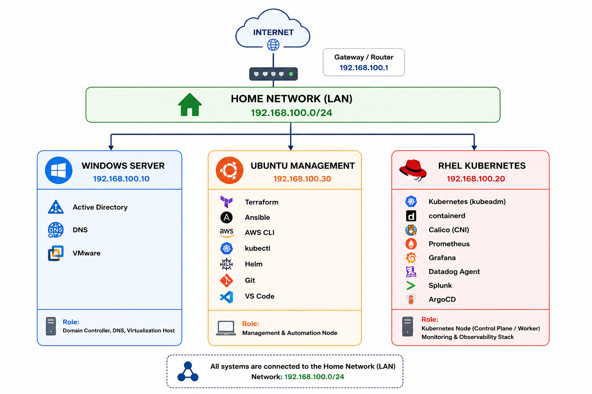

# Enterprise DevOps Homelab

A production-inspired DevOps, SRE and Cloud Homelab built from scratch using Kubernetes, Terraform, Ansible, AWS and modern observability tools.

---

# Architecture

> Homelab Network Diagram



---

# Projects

- Kubernetes Platform
- Monitoring Platform
- GitOps Platform
- Terraform Infrastructure
- Ansible Automation
- CI/CD Platform
- AWS Cloud Platform

---

# Technologies

## Operating Systems

- Windows Server
- Ubuntu Server
- Red Hat Enterprise Linux

## Kubernetes

- kubeadm
- containerd
- Calico
- Helm

## Monitoring

- Prometheus
- Grafana
- Datadog
- Splunk

## Automation

- Terraform
- Ansible

## GitOps

- ArgoCD

## Cloud

- AWS

---

# Documentation

```
docs/
├── 01-kubernetes-platform/
├── 02-monitoring-platform/
├── 03-gitops/
├── 04-terraform/
├── 05-ansible/
├── 06-cicd/
└── 07-aws/
```

---

# Repository Structure

```
ansible/
containers/
diagrams/
docs/
gitops/
helm/
kubernetes/
monitoring/
networking/
scripts/
security/
terraform/
```
