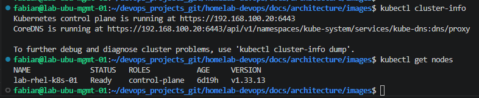
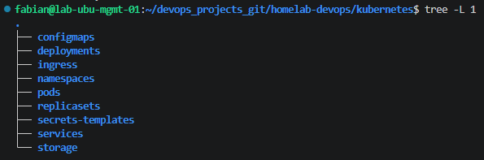

# 00 - Architecture & Workflow

## Overview

This document describes the initial setup and workflow used to manage the Kubernetes cluster.

The Ubuntu Management server is used as the administration workstation. All Kubernetes resources are managed remotely using `kubectl`.

---

# Verify Cluster Connectivity

Verify that the cluster is reachable.

```bash
kubectl cluster-info
```

Verify that the Kubernetes node is ready.

```bash
kubectl get nodes
```

List all namespaces.

```bash
kubectl get ns
```

---

# Project Structure

The Kubernetes manifests are organized by resource type.

```text
kubernetes/
├── configmaps/
├── deployments/
├── ingress/
├── namespaces/
├── pods/
├── replicasets/
├── secrets-templates/
├── services/
└── storage/
```

---

# Screenshots

## Cluster Connectivity
| `kubectl cluster-info` and `kubectl get nodes` |



## Project Structure
| Repository structure (`tree -L 1`) |


---

# Lessons Learned

- The Ubuntu Management workstation is used to administer the cluster.
- `kubectl` communicates with the Kubernetes API Server.
- Organizing manifests by resource type simplifies project management.