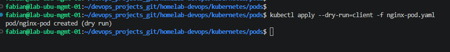
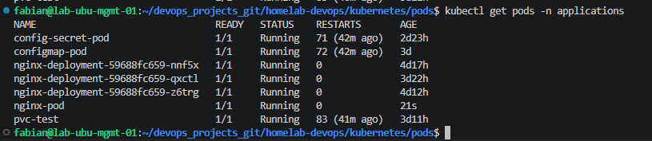
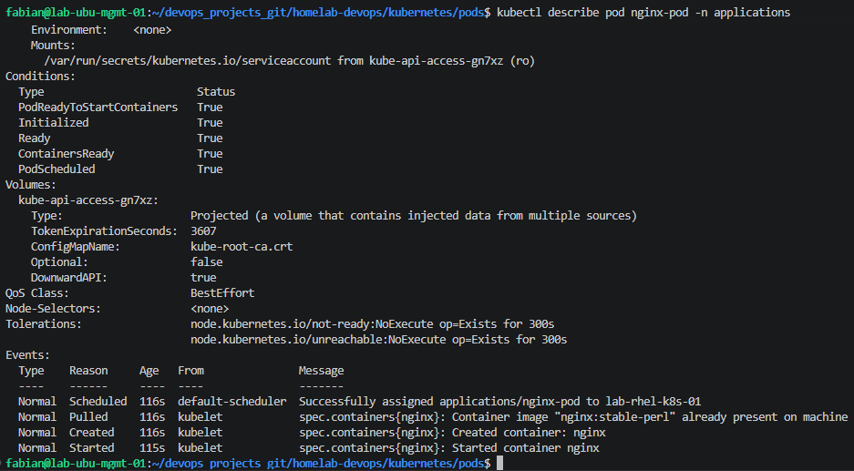

# 01 - Pods

## Overview

In this lesson, the first application is deployed to the Kubernetes cluster using a standalone Pod.

The objective is to understand what a Pod is, how it is created, and how to verify that it is running correctly.

---

# What is a Pod?

A Pod is the smallest deployable object in Kubernetes.

A Pod can contain one or more containers that share the same network and storage.

In this lab, a single NGINX container is deployed.

---

# Pod Manifest

File:

```text
kubernetes/pods/nginx-pod.yaml
```

```yaml
apiVersion: v1
kind: Pod
metadata:
  name: nginx-pod
  namespace: applications
  labels:
    app: nginx
    environment: lab
spec:
  containers:
    - name: nginx
      image: nginx:stable-perl
      ports:
        - containerPort: 80
```

---

# Deploy the Pod

Validate the manifest.

```bash
kubectl apply --dry-run=client -f kubernetes/pods/nginx-pod.yaml
```

Create the Pod.

```bash
kubectl apply -f kubernetes/pods/nginx-pod.yaml
```

---

# Verify the Deployment

Check the Pod.

```bash
kubectl get pods -n applications
```

Display detailed information.

```bash
kubectl describe pod nginx-pod -n applications
```

---

# Screenshots

## Dry Run Validation

kubectl apply --dry-run=client -f kubernetes/pods/nginx-pod.yaml



## Pod Running

kubectl get pods -n applications




## Pod Details

kubectl describe pod nginx-pod




---

# Lessons Learned

- A Pod is the smallest deployable unit in Kubernetes.
- The manifest defines the desired state of the Pod.
- `kubectl apply --dry-run=client` validates the manifest before deployment.
- A standalone Pod is not self-healing.