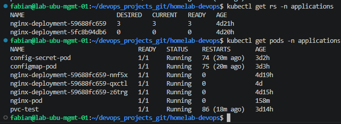
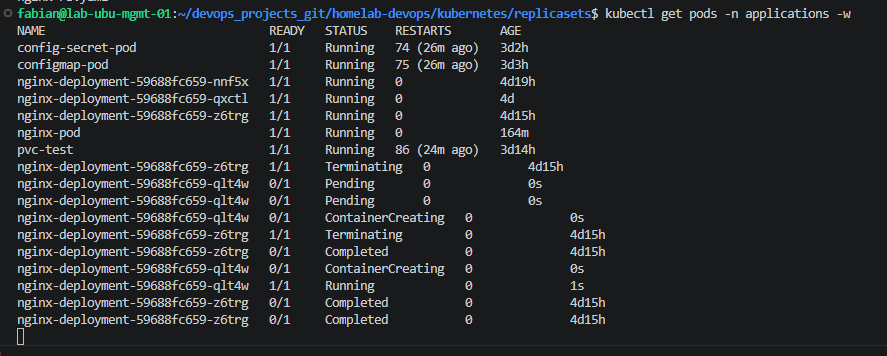
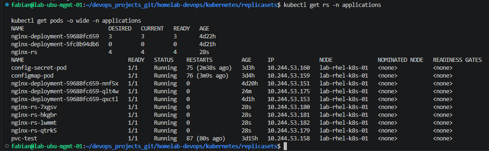

# 02 - ReplicaSets

## Overview

In this lesson, a ReplicaSet is used to automatically maintain the desired number of Pods running in the cluster.

---

# What is a ReplicaSet?

A ReplicaSet continuously monitors the cluster and ensures that the desired number of Pod replicas are running.

If a Pod is deleted or fails, the ReplicaSet automatically creates a new one.

---

# ReplicaSet Manifest

File:

```text
kubernetes/replicasets/nginx-rs.yaml
```

```yaml
apiVersion: apps/v1
kind: Deployment
metadata:
  name: nginx-deployment
  namespace: applications
spec:
  replicas: 3
  selector:
    matchLabels:
      app: nginx
  template:
    metadata:
      labels:
        app: nginx
    spec:
      containers:
      - name: nginx
        image: nginx:1.29
        ports:
        - containerPort: 80

        
```

---

# Deploy the ReplicaSet

Validate the manifest.

```bash
kubectl apply --dry-run=client -f kubernetes/replicasets/nginx-rs.yaml
```

Create the ReplicaSet.

```bash
kubectl apply -f kubernetes/replicasets/nginx-rs.yaml
```

---

# Verify the ReplicaSet

```bash
kubectl get rs -n applications

kubectl get pods -n applications
```

---

## ReplicaSet Created



---

# Self-Healing

Delete one Pod.

```bash
kubectl delete pod nginx-deployment-59688fc659-z6trg -n applications
```

Watch the ReplicaSet recreate it automatically.

```bash
kubectl get pods -n applications -w
```

---

## Self-Healing



---

# Scaling

Increase the number of replicas.

```yaml
replicas: 4
```

Apply the changes.

```bash
kubectl apply -f kubernetes/replicasets/nginx-rs.yaml
```

Verify the new Pods.

```bash
kubectl get rs -n applications

kubectl get pods -n applications -o wide
```

---

## ReplicaSet Scaled



---

# Limitations

A ReplicaSet only maintains the desired number of Pods.

It does **not** provide:

- Rolling Updates
- Rollbacks
- Version management

These features are provided by Deployments.

---

# Lessons Learned

- ReplicaSets provide self-healing.
- ReplicaSets maintain the desired number of Pods.
- Pods are identified using labels.
- Production applications are typically managed through Deployments.