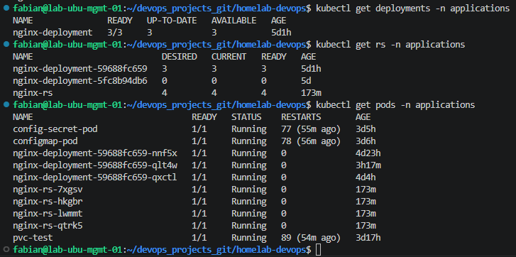
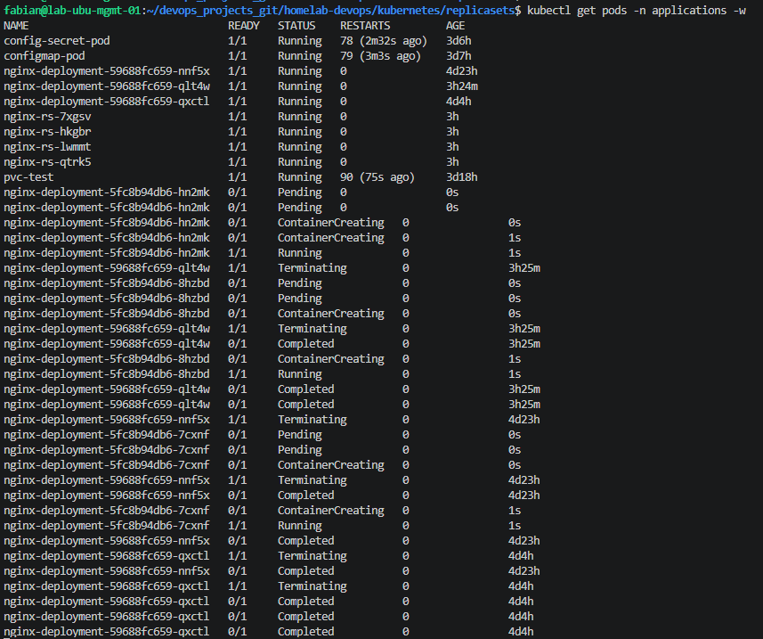
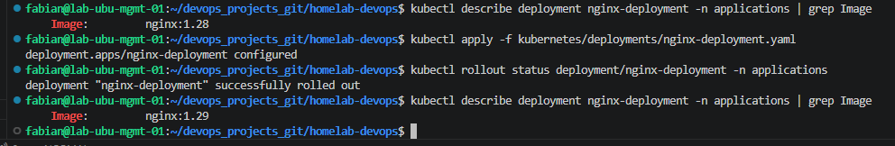
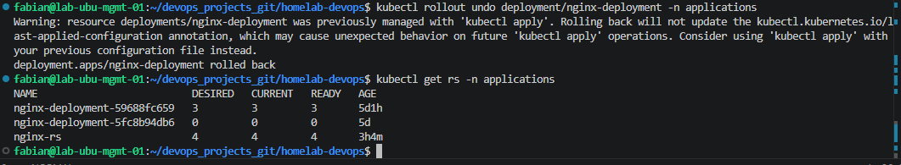

# 03 - Deployments

## Overview

A Deployment is the standard way to run applications in Kubernetes.

It provides:

- Self-healing
- Scaling
- Rolling Updates
- Rollbacks

Deployments manage ReplicaSets, which in turn manage Pods.

---

# Deployment Manifest

File:

```text
kubernetes/deployments/nginx-deployment.yaml
```

```yaml
apiVersion: apps/v1
kind: Deployment
metadata:
  name: nginx-deployment
  namespace: applications
spec:
  replicas: 3
  selector:
    matchLabels:
      app: nginx
  template:
    metadata:
      labels:
        app: nginx
    spec:
      containers:
      - name: nginx
        image: nginx:1.28
```

---

# Deploy the Application

Validate the manifest.

```bash
kubectl apply --dry-run=client -f kubernetes/deployments/nginx-deployment.yaml
```

Create the Deployment.

```bash
kubectl apply -f kubernetes/deployments/nginx-deployment.yaml
```

---

# Verify the Deployment

```bash
kubectl get deployments -n applications

kubectl get rs -n applications

kubectl get pods -n applications
```

---

## Deployment Created



---

# Rolling Update

Update the container image.

```yaml
image: nginx:1.29
```

Apply the changes.

```bash
kubectl apply -f kubernetes/deployments/nginx-deployment.yaml
```

Watch the rollout.

```bash
kubectl get pods -n applications -w
```

Verify the rollout.

```bash
kubectl rollout status deployment/nginx-deployment -n applications
```

---

## Rolling Update



---

## Rollout Status



---

# Rollback

Display the rollout history.

```bash
kubectl rollout history deployment/nginx-deployment -n applications
```

Rollback to the previous revision.

```bash
kubectl rollout undo deployment/nginx-deployment -n applications
```

Verify the Deployment.

```bash
kubectl rollout status deployment/nginx-deployment -n applications

kubectl get rs -n applications
```

---

## Rollback



---

# Lessons Learned

- Deployments are the standard way to run applications in Kubernetes.
- A Deployment manages ReplicaSets.
- ReplicaSets manage Pods.
- Rolling Updates replace Pods without downtime.
- Rollbacks restore a previous application version quickly.