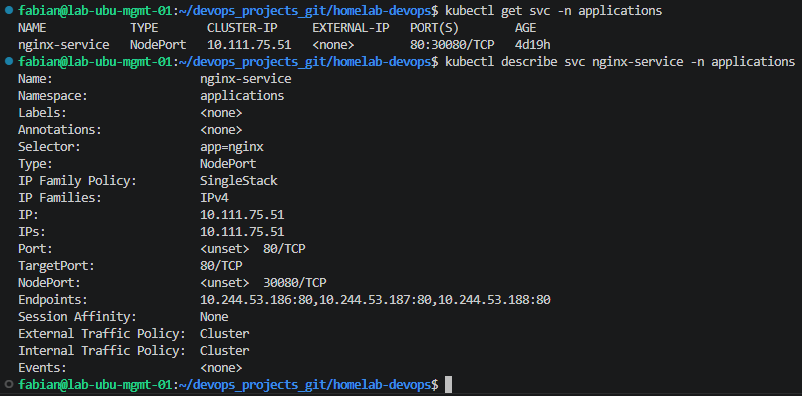
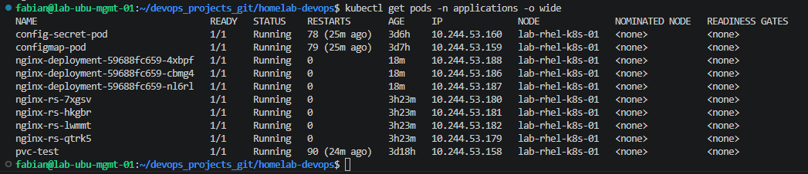
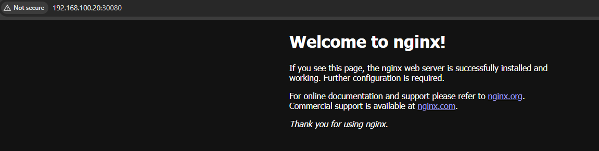
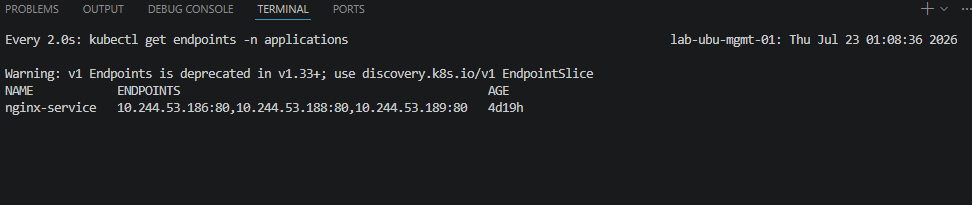

# 04 - Services

## Overview

A Service provides a stable network endpoint for a group of Pods.

Even if Pods are recreated or their IP addresses change, the Service continues routing traffic to healthy Pods.

---

# Service Manifest

File:

```text
kubernetes/services/nginx-service.yaml
```

```yaml
apiVersion: v1
kind: Service
metadata:
  name: nginx-service
  namespace: applications
spec:
  type: NodePort
  selector:
    app: nginx
  ports:
  - port: 80
    targetPort: 80
    nodePort: 30080
```

---

# Deploy the Service

Validate the manifest.

```bash
kubectl apply --dry-run=client -f kubernetes/services/nginx-service.yaml
```

Create the Service.

```bash
kubectl apply -f kubernetes/services/nginx-service.yaml
```

---

# Verify the Service

```bash
kubectl get svc -n applications

kubectl describe svc nginx-service -n applications

kubectl get endpoints -n applications
```

---

## Service Created



---

# Verify the Endpoints

Compare the Service endpoints with the Pod IP addresses.

```bash
kubectl get endpoints -n applications

kubectl get pods -n applications -o wide
```

---

## Service Endpoints



---

# Test the Service

Access the application through the NodePort.

```bash
curl http://192.168.100.20:30080
```

Or open a browser:

```text
http://192.168.100.20:30080
```

---

## NodePort Access



---

# Service Self-Healing

Delete one Pod managed by the Deployment.

```bash
kubectl delete pod <pod-name> -n applications
```

Watch the Pods.

```bash
kubectl get pods -n applications -w
```

Watch the Service endpoints.

```bash
watch kubectl get endpoints -n applications
```

Verify that the Service continues routing traffic to the new Pod automatically.

---

## Service Self-Healing



---

# Lessons Learned

- Services provide a stable endpoint for applications.
- Services route traffic using Pod labels.
- Pod IP addresses can change without affecting clients.
- NodePort exposes an application outside the cluster.
- Services automatically update their endpoints when Pods are recreated.