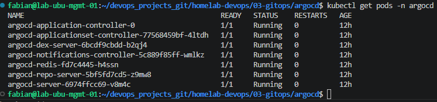
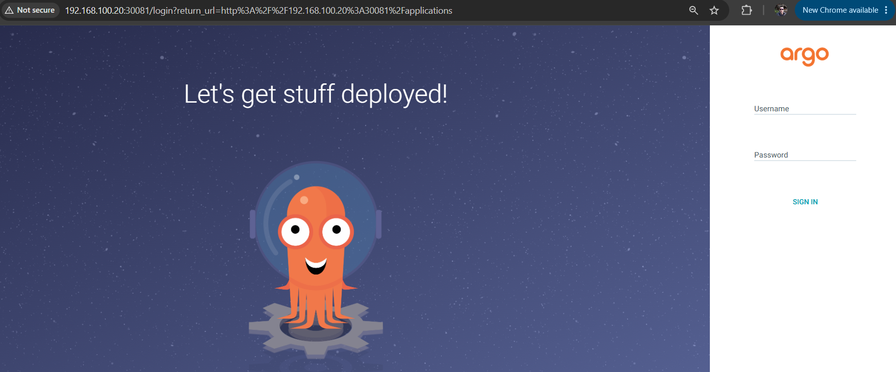

# 01 — Installing ArgoCD

## Objective

Install ArgoCD on the cluster and confirm it is reachable, both from
the web UI and from the command line, so that later steps can register
a repository and deploy an application through it.

## What ArgoCD needs to run

ArgoCD is installed as a set of Kubernetes workloads, not as a single
binary. Each component has a distinct responsibility:

| Component | Responsibility |
|---|---|
| `argocd-server` | Serves the web UI and the API used by the CLI. |
| `argocd-repo-server` | Clones/caches the Git repositories and renders manifests (plain YAML, Helm, Kustomize). |
| `argocd-application-controller` | Runs the reconciliation loop: compares desired vs. live state for every `Application`. |
| `argocd-applicationset-controller` | Generates `Application` resources automatically from templates (not used in this basic setup). |
| `argocd-dex-server` | Handles authentication (local users by default, SSO optional). |
| `argocd-redis` | Caching layer used internally by the other components. |

## Where each component runs

ArgoCD has two separate parts that live on two different machines.
Confusing the two is a common source of `connection refused` /
`server address unspecified` errors later on:

```
ArgoCD server (the components in the table above)
   → Runs as Pods inside the Kubernetes cluster

argocd CLI
   → Installed on the management host used to operate the cluster
     (the same machine kubectl, Helm, Terraform, and Ansible run on)
```

The Helm install in this document targets the cluster. The CLI install
in [Step 9](#step-9--install-the-argocd-cli) targets the management
host — it is a separate, additional install, not something the Helm
chart provides.

## File locations

`values.yaml` and `custom-values.yaml` for this module are kept inside
the Git repository, not in a separate untracked directory — this keeps
every change to the ArgoCD configuration reviewable through Git the
same way the ArgoCD-managed applications will be:

```
homelab-devops/
└── 03-gitops/
    └── argocd/
        ├── values.yaml
        ├── custom-values.yaml
        ├── README.md
        └── images/
```

Installing via Helm follows the same workflow already used for other
applications on this cluster: find the official chart, download the
default values, customize only what's needed, install, verify.

## Step 1 — Create the namespace

```bash
kubectl create namespace argocd
```

## Step 2 — Add the Argo Helm repository

```bash
helm repo add argo https://argoproj.github.io/argo-helm
helm repo update
helm search repo argo/argo-cd
```

## Step 3 — Download the default values

```bash
cd ~/homelab-devops/03-gitops/argocd

helm show values argo/argo-cd > values.yaml
```

## Step 4 — Verify the required NodePorts are available

This module exposes ArgoCD on fixed NodePorts (`30081`/`30444`, set in
the next step). Before installing, confirm nothing else in the cluster
is already using them:

```bash
kubectl get svc -A \
  -o custom-columns='NAMESPACE:.metadata.namespace,NAME:.metadata.name,NODEPORTS:.spec.ports[*].nodePort' \
  | grep -E '30081|30444'
```

No output means both ports are free. If either one appears, pick a
different value in `custom-values.yaml` before continuing — reusing a
port already bound to another Service causes the Helm release to fail.

## Step 5 — Customize `custom-values.yaml`

The main settings worth overriding for a lab/homelab environment are
the service type (to reach the UI without `port-forward`), fixed
NodePorts (so the URL doesn't change between installs), and running the
server in insecure mode. The built-in TLS certificate is self-signed
and only adds browser warnings in a lab — in production this would
instead be replaced with a valid certificate rather than disabled.

```yaml
server:
  extraArgs:
    - --insecure

  service:
    type: NodePort
    nodePortHttp: 30081
    nodePortHttps: 30444
```

## Step 6 — Install

```bash
helm upgrade --install argocd argo/argo-cd \
  --namespace argocd \
  --create-namespace \
  -f custom-values.yaml
```

`helm upgrade --install` is used instead of `helm install`: it
installs the release if it doesn't exist yet, or upgrades it in place
if it does. This makes the command safe to re-run any time
`custom-values.yaml` changes, without needing a separate repair step.

## Step 7 — Verify the Helm release status

```bash
helm status argocd -n argocd
```

Expected:

```
STATUS: deployed
```

`STATUS: failed` at this point means the release did not finish
applying — see
[06-troubleshooting.md](06-troubleshooting.md#1-helm-release-stuck-in-failed-status)
before continuing to the next step.

## Step 8 — Verify the installation

```bash
kubectl get pods -n argocd
kubectl get svc -n argocd
```

Expected pods, all `Running`:

- `argocd-server`
- `argocd-repo-server`
- `argocd-application-controller`
- `argocd-applicationset-controller`
- `argocd-dex-server`
- `argocd-redis`
- `argocd-notifications-controller`

Expected `argocd-server` Service:

```
argocd-server   NodePort   ...   80:30081/TCP,443:30444/TCP
```

> 📸 **Screenshot: `images/argocd-pods-running.png`**

> Command to capture: `kubectl get pods -n argocd`
>
> 

## Step 9 — Retrieve the initial admin password

```bash
kubectl -n argocd get secret argocd-initial-admin-secret \
  -o jsonpath="{.data.password}" | base64 -d
```

Username: `admin`.

This is a one-time bootstrap password. It should be changed after the
first login:

```bash
argocd account update-password
```

## Step 10 — Access the UI

Since `custom-values.yaml` sets `extraArgs: [--insecure]` and a fixed
HTTP NodePort, the UI is reachable over plain HTTP:

```
http://<node-ip>:30081
```

> 📸 **Screenshot: `images/argocd-ui-login.png`**
> Command to capture: none — open the URL above in a browser and
> screenshot the login page.
>
> 

## Step 11 — Install the ArgoCD CLI

Run these commands on the **management host**, not on the Kubernetes
node — the CLI is a client that talks to the `argocd-server` Pod over
the network, it does not need to run inside the cluster.

Confirm the CPU architecture first, since the correct binary depends on
it:

```bash
dpkg --print-architecture
```

For a standard Intel/AMD machine, this returns:

```
amd64
```

Download and install the CLI:

```bash
curl -sSL -o argocd-linux-amd64 \
  https://github.com/argoproj/argo-cd/releases/latest/download/argocd-linux-amd64

sudo install -m 555 argocd-linux-amd64 /usr/local/bin/argocd

rm argocd-linux-amd64
```

Verify:

```bash
argocd version --client
```

The CLI is required for commands such as `argocd login`,
`argocd app sync`, and `argocd account update-password` used throughout
the rest of this module.

## Step 12 — Log in via CLI

```bash
argocd login <node-ip>:30081 --insecure
```

Provide `admin` and the password retrieved in Step 9.

`Argo CD server address unspecified` on this or later CLI commands
means this login step was skipped or the session expired — see
[06-troubleshooting.md](06-troubleshooting.md#3-argo-cd-server-address-unspecified).

## Command reference

```bash
# Namespace
kubectl create namespace argocd

# Repo
helm repo add argo https://argoproj.github.io/argo-helm
helm repo update

# Values
helm show values argo/argo-cd > values.yaml

# Check ports are free
kubectl get svc -A \
  -o custom-columns='NAMESPACE:.metadata.namespace,NAME:.metadata.name,NODEPORTS:.spec.ports[*].nodePort' \
  | grep -E '30081|30444'

# Install / repair (idempotent)
helm upgrade --install argocd argo/argo-cd \
  --namespace argocd \
  --create-namespace \
  -f custom-values.yaml

# Verify
helm status argocd -n argocd
kubectl get pods -n argocd
kubectl get svc -n argocd

# Admin password
kubectl -n argocd get secret argocd-initial-admin-secret \
  -o jsonpath="{.data.password}" | base64 -d

# CLI (on the management host)
dpkg --print-architecture
curl -sSL -o argocd-linux-amd64 \
  https://github.com/argoproj/argo-cd/releases/latest/download/argocd-linux-amd64
sudo install -m 555 argocd-linux-amd64 /usr/local/bin/argocd
rm argocd-linux-amd64
argocd version --client

# CLI login
argocd login <node-ip>:30081 --insecure
```