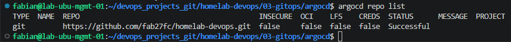

# 02 — Connecting ArgoCD to a Git Repository

## Objective

Register a Git repository with ArgoCD so it becomes a valid source for
`Application` manifests, and confirm the connection succeeds before
depending on it in later steps.

## What this step is for

ArgoCD cannot read a repository unless it is explicitly registered.
Registration stores the repository URL together with the credentials
ArgoCD should use to clone it, so that the `argocd-repo-server`
component (see [01-installing-argocd.md](01-installing-argocd.md)) can
pull manifests without prompting for credentials on every operation.

## What ArgoCD does once a repository is registered

Once registered, ArgoCD continuously compares the manifests in the
repository (the **desired state**) against what is actually running in
the cluster (the **current state**):

```
Git repository
      │
      ▼
 Read the manifest
      │
      ▼
Compare with the live cluster resource
      │
      ▼
   Are they equal?
```

Example, using a Deployment with `replicas: 3` committed to Git:

| Scenario | Git (desired) | Cluster (live) | Result |
|---|---|---|---|
| No drift | `replicas: 3` | `replicas: 3` | `Synced` / `Healthy` — no action taken. |
| Drift (e.g. someone runs `kubectl scale deployment nginx --replicas=10`) | `replicas: 3` | `replicas: 10` | `OutOfSync` — if automated sync is enabled, ArgoCD re-applies the manifest and returns the Deployment to `replicas: 3`. |

This is the mechanism that makes Git the enforced source of truth
instead of just a place changes happen to be recorded. The repository
registered in this step is what ArgoCD uses to know what "desired"
means. A hands-on demonstration of this drift/correction cycle is
covered in
[05-sync-policies.md](05-sync-policies.md#self-healing).

## Key concept: authentication method

Git repositories can be registered with ArgoCD using different
credential types — HTTPS with a username/token, or SSH with a deploy
key. HTTPS with a Personal Access Token (PAT) is used here because it
is the simplest to set up and works identically whether the repository
is public or private. The token is the credential ArgoCD presents to
GitHub in place of a password when it runs `git clone` / `git fetch`
against the repository.

## Step 1 — Create a GitHub Personal Access Token (PAT)

Using a token is the standard approach even for public repositories:
it avoids GitHub's unauthenticated rate limits and is required for
private repositories.

1. On GitHub, open the profile menu (top right) → **Settings**.
2. In the left-hand menu, scroll down to **Developer settings**.
3. Open **Personal access tokens → Fine-grained tokens**.
4. Click **Generate new token**.

Recommended configuration:

| Field | Value |
|---|---|
| Token name | A descriptive name, e.g. `ArgoCD Homelab` |
| Expiration | 90 days (or shorter, per rotation policy) |
| Repository access | `Only select repositories` |
| Selected repository | The specific repository being registered |
| Repository permissions | `Contents: Read-only` |

`Contents: Read-only` is sufficient for GitOps — ArgoCD only needs to
read manifests, never write to the repository.

5. Click **Generate token**.
6. Copy the token immediately. GitHub displays it only once; it cannot
   be retrieved again after leaving the page (a new token would need
   to be generated).

## Step 2 — Register the repository

Load the token into a variable instead of typing it directly into the
command, so it never appears in shell history or process listings:

```bash
read -s -p "GitHub token: " GITHUB_TOKEN
echo
```

Nothing is displayed while pasting or typing — this is expected.

Register the repository via CLI:

```bash
argocd repo add https://github.com/<user>/<repo>.git \
  --username <user> \
  --password "$GITHUB_TOKEN"
```

Or via the UI: **Settings → Repositories → Connect Repo → HTTPS**.

## Step 3 — Verify the connection

```bash
argocd repo list
```

Expected: a `Successful` connection status for the registered
repository.

> 📸 **Screenshot: `images/argocd-repo-connected.png`**
> Command to capture: `argocd repo list` (CLI output), or navigate to
> **Settings → Repositories** in the UI and screenshot the connection
> status.
>
> 

## Notes

The same PAT-based flow works identically for public and private
repositories, which is why it is used here even though the source
repository may currently be public.

## What's next

With the repository registered, manual `kubectl apply` is no longer
the way changes reach the cluster. The workflow becomes:

```
Edit manifest
   │
   ▼
git add / commit / push
   │
   ▼
ArgoCD detects the change in the repository
   │
   ▼
Cluster is synced to match
```

[03-first-application.md](03-first-application.md) creates the first
`Application` resource that puts this workflow into practice.

## Command reference

```bash
read -s -p "GitHub token: " GITHUB_TOKEN
echo

argocd repo add https://github.com/<user>/<repo>.git \
  --username <user> \
  --password "$GITHUB_TOKEN"

argocd repo list
```