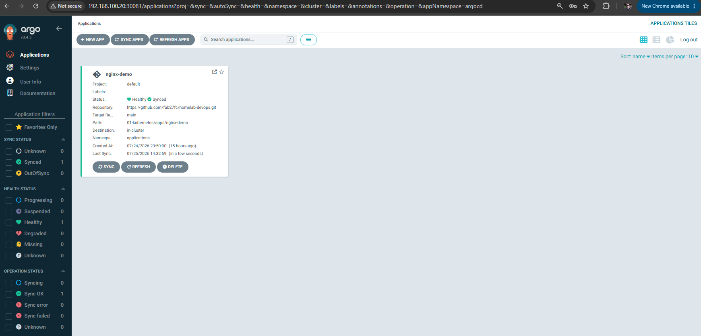

# 03 — First ArgoCD Application

## Objective

Take a Deployment that already exists (`nginx-deployment`) and put it
under ArgoCD's control, so its setup lives in Git and ArgoCD keeps the
cluster matching it. This shows how to bring existing work into GitOps,
instead of starting with a brand-new demo app.

## Logging in

Everything below assumes you're already logged in, in both the browser
and the CLI. This is a quick reminder for coming back to this module —
the full first-time setup (installing ArgoCD, getting the first
password, installing the CLI) is in
[01-installing-argocd.md](01-installing-argocd.md).

**Web UI**, from a browser on your local machine:

```
http://<node-ip>:30081
```

Log in with `admin` and the current password (the permanent one set in
[01-installing-argocd.md, Step 13](01-installing-argocd.md#step-13--change-the-admin-password),
not the temporary one).

**CLI**, from the management machine:

```bash
argocd login <node-ip>:30081 --insecure
```

If this shows `Argo CD server address unspecified` or a similar error,
see
[06-troubleshooting.md, entry 3](06-troubleshooting.md#3-argo-cd-server-address-unspecified).

## What is an `Application`

An `Application` is ArgoCD's own type of resource. It tells ArgoCD
three things:

- **Source**: which Git repo, branch, and folder hold the files to
  deploy.
- **Destination**: which cluster and namespace to deploy them to.
- **Sync policy**: manual or automatic syncing, and whether ArgoCD
  should remove deleted resources or fix drifted ones (covered in
  [05-sync-policies.md](05-sync-policies.md)).

Once an `Application` exists, ArgoCD keeps checking its source against
its destination, and reports `Synced` or `OutOfSync`.

The screenshot saved for [Step 5](#step-5--check-it-worked) shows this in
practice: the ArgoCD UI's tree view for `nginx-demo` shows the
`Application` on the left, and everything it manages branching out to
the right — the Service, the Deployment, its ReplicaSets, and the
Pods. This is what "an Application manages a tree of resources" really
means — not just the one resource that was adopted.

## Step 1 — Make sure the manifest is in Git

If `01-kubernetes/apps/nginx-demo/deployment.yaml` isn't already
committed with the same setup running in the cluster, export it and
commit it:

```bash
kubectl get deployment nginx-deployment -n applications -o yaml \
  > 01-kubernetes/apps/nginx-demo/deployment.yaml
```

Edit the file and remove the fields Kubernetes adds automatically —
they shouldn't be tracked in Git (`resourceVersion`, `uid`,
`creationTimestamp`, `status`, etc.). Keep only `apiVersion`, `kind`,
`metadata.name`, `metadata.namespace`, `metadata.labels`, and `spec`.

Do the same for the matching Service, if there is one, then commit:

```bash
git add 01-kubernetes/apps/nginx-demo/deployment.yaml
git commit -m "gitops: adopt nginx-deployment into Git"
git push
```

## Step 2 — Create the ArgoCD `Application` file

Create `03-gitops/argocd-apps/nginx-demo-app.yaml`:

```yaml
apiVersion: argoproj.io/v1alpha1
kind: Application
metadata:
  name: nginx-demo
  namespace: argocd
spec:
  project: default
  source:
    repoURL: https://github.com/<user>/<repo>.git
    targetRevision: main
    path: 01-kubernetes/apps/nginx-demo
  destination:
    server: https://kubernetes.default.svc
    namespace: applications
  syncPolicy:
    syncOptions:
      - CreateNamespace=true
```

There's no `automated:` block here, so the Application starts in
**manual sync mode**: the first sync has to be triggered on purpose,
it won't happen by itself.

## Step 3 — Apply the Application (one-time step)

```bash
kubectl apply -f 03-gitops/argocd-apps/nginx-demo-app.yaml
```

This command does not deploy `nginx-demo`. It only creates an
`Application` object inside the `argocd` namespace. This confuses a
lot of people, since the command looks just like applying a Deployment
directly. ArgoCD then finds this object and reads its `source` to find
out what it should manage:

```
kubectl apply
     │
     ▼
Application object created (namespace: argocd)
     │
     ▼
ArgoCD finds it
     │
     ▼
Reads spec.source → knows which repo/branch/folder to manage
```

`nginx-demo` is actually deployed only in the next step, when it's
synced.

## Step 4 — Sync

```bash
argocd app list
argocd app get nginx-demo
argocd app sync nginx-demo
```

Or from the UI: open the `nginx-demo` tile → **Sync**.

## Step 5 — Check it worked

```bash
argocd app get nginx-demo
kubectl get deployment nginx-deployment -n applications
```

Expected: `Healthy` and `Synced` in ArgoCD, with the Deployment running
the same as before. The difference is that Git is now the source of
truth, instead of whatever commands were typed in the terminal.

> 📸 **Screenshot: `images/argocd-app-synced.png`** ✅ *already saved*
> Command to capture: `argocd app get nginx-demo`, or open the app in
> the ArgoCD web UI — the top panel showing `APP HEALTH: Healthy` and
> `SYNC STATUS: Synced` is what this screenshot should show.
>
> 

## Hands-on labs

With `nginx-demo` adopted and syncing, the same change — going from 3
to 6 replicas — is made two different ways below: once directly on the
cluster, once through Git. Doing both, in this order, makes the
difference clear: both reach the same result, but only one leaves Git
as an accurate record of what's actually running.

Recommended order: **Lab 1 first, then Lab 2.** Lab 1 shows ArgoCD
undoing a manual change to match Git. Lab 2 shows the normal way that
change should have been made.

### Lab 1 — Drift: fixing a manual change

Shows ArgoCD noticing and undoing a change made directly on the
cluster, outside of Git.

1. Scale the Deployment directly with `kubectl`:

   ```bash
   kubectl scale deployment nginx-deployment -n applications --replicas=6
   ```

2. Check the app's status:

   ```bash
   argocd app get nginx-demo
   ```

   Expected: `OutOfSync` — Git still says `replicas: 3`, but the
   cluster now has `6`.

   > 📸 **Screenshot: `images/argocd-app-outofsync.png`**
   > Place here, right after this step.
   > Command to capture: `argocd app get nginx-demo` right after the
   > `kubectl scale` above.
   >
   > 

3. Sync the app back to what Git says:

   ```bash
   argocd app sync nginx-demo
   ```

4. Confirm the Deployment went back to normal:

   ```bash
   kubectl get deployment nginx-deployment -n applications
   ```

   Expected: back to `3/3` replicas. The manual change didn't stick,
   because Git — not the cluster — decides what's correct.

### Lab 2 — GitOps flow: making the same change through Git

Makes the same change (3 → 6 replicas) the way it's supposed to be
done with GitOps: through a commit, not a `kubectl` command.

1. Edit `01-kubernetes/apps/nginx-demo/deployment.yaml` and change:

   ```yaml
   replicas: 3
   ```

   to:

   ```yaml
   replicas: 6
   ```

2. Commit and push:

   ```bash
   git add .
   git commit -m "nginx-demo: scale to 6 replicas"
   git push origin main
   ```

3. Sync the app (or wait for auto-sync, if it's turned on — see
   [05-sync-policies.md](05-sync-policies.md)):

   ```bash
   argocd app sync nginx-demo
   ```

4. Confirm the Deployment now has 6 replicas:

   ```bash
   kubectl get deployment nginx-deployment -n applications
   ```

   Expected: `6/6` replicas. This time, Git and the cluster actually
   match, since the change started in Git.

## Checking a change before syncing

The commands below are useful during Lab 2's Step 3, to see exactly
what ArgoCD found before syncing.

```bash
argocd app diff nginx-demo
```

The output uses this notation:

- `<` — the value in Git (what ArgoCD read from the repo).
- `>` — the value currently running in the cluster.

For example, right after pushing the replica change in Lab 2:

```
< replicas: 6
---
> replicas: 3
```

This reads as: Git now wants `6`, but the cluster still has `3`
running — the change was pushed, but hasn't been synced yet.

If the diff looks wrong (it shows neither the old nor the new value),
force ArgoCD to re-read the repo instead of trusting its cache:

```bash
argocd app get nginx-demo --refresh
argocd app diff nginx-demo
```

If it's still wrong after refreshing, see
[06-troubleshooting.md, entry 7](06-troubleshooting.md#7-argocd-still-shows-an-outdated-value-after-a-git-push).

Instead of checking `argocd app get` over and over after a sync, wait
for a specific result:

```bash
argocd app sync nginx-demo
argocd app wait nginx-demo --sync --health --timeout 120
```

`argocd app wait` pauses until the app reaches the state asked for, or
until the timeout runs out.

## Command reference

```bash
# Logging in
argocd login <node-ip>:30081 --insecure

# One-time setup
kubectl apply -f 03-gitops/argocd-apps/nginx-demo-app.yaml
argocd app list
argocd app get nginx-demo
argocd app sync nginx-demo

# Lab 1 — Drift
kubectl scale deployment nginx-deployment -n applications --replicas=6
argocd app get nginx-demo
argocd app sync nginx-demo
kubectl get deployment nginx-deployment -n applications

# Lab 2 — GitOps flow
git add .
git commit -m "nginx-demo: scale to 6 replicas"
git push origin main
argocd app diff nginx-demo
argocd app get nginx-demo --refresh
argocd app sync nginx-demo
argocd app wait nginx-demo --sync --health --timeout 120
kubectl get deployment nginx-deployment -n applications
```