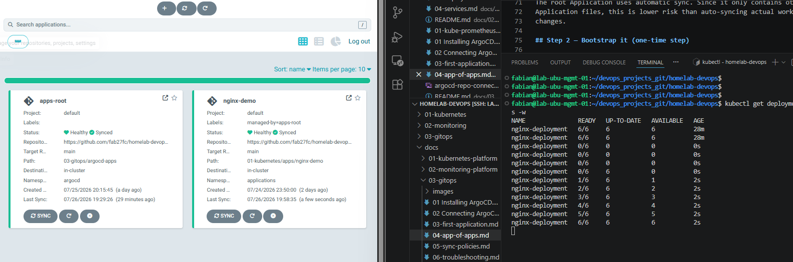

# 05 — Sync Policies, Self-Healing, and Pruning

## Objective

Learn how ArgoCD keeps a Kubernetes cluster synchronized with Git by configuring automatic synchronization, self-healing, and pruning.

By the end of this lab you will understand how Git becomes the single source of truth and how ArgoCD continuously reconciles the cluster with the desired state stored in Git.

---

# What you will learn

After completing this lab you should understand:

- Manual vs Automatic Sync
- What Self-Healing does
- What Pruning does
- How ArgoCD continuously reconciles the cluster
- Why Git becomes the desired state
- How to verify that Self-Healing is actually working

---

# Prerequisites

Before starting this lab you should already have:

- Kubernetes cluster running
- ArgoCD installed
- Git repository connected to ArgoCD
- App of Apps configured
- nginx-demo Application already deployed

Current structure:

Git
│
├── apps-root
│
└── nginx-demo
      │
      ▼
 Kubernetes

---

# Understanding ArgoCD Reconciliation

ArgoCD constantly compares two states.

Desired State

Stored in Git.

Actual State

Running inside Kubernetes.

```

Git
          │
          ▼
 Desired State
          │
          ▼
      ArgoCD
          │
 compares continuously
          │
          ▼
 Kubernetes Cluster
      Actual State

```

If both states match:

- ArgoCD does nothing.

If they are different:

- ArgoCD reports OutOfSync.

Depending on the Sync Policy, ArgoCD may automatically correct the difference.

---

# Manual Sync

Default behavior.

```

Git changes
       │
       ▼

ArgoCD detects the change

       │

OutOfSync

       │

Waits for a user

       │

Sync

```

The cluster is never modified automatically.

A user must manually execute:

```bash
argocd app sync nginx-demo
```

or press **Sync** in the Web UI.

---

# Automatic Sync

When automatic synchronization is enabled:

```yaml
syncPolicy:
  automated:
```

ArgoCD no longer waits for manual intervention.

Any change committed to Git is automatically applied to Kubernetes.

```
Git

Deployment changes

        │

        ▼

ArgoCD

        │

Automatically Syncs

        ▼

Kubernetes
```

---

# Self-Healing

Self-Healing allows ArgoCD to repair changes made directly inside the cluster.

Configuration:

```yaml
syncPolicy:
  automated:
    selfHeal: true
```

Suppose someone executes:

```bash
kubectl delete deployment nginx-deployment -n applications
```

The Deployment disappears.

Git still says it should exist.

ArgoCD detects the drift.

```
Git

Deployment exists

       │

       ▼

Kubernetes

Deployment deleted

       │

ArgoCD detects drift

       │

Automatically recreates Deployment
```

No manual Sync is required.

---

# Pruning

Pruning removes resources that no longer exist in Git.

Configuration:

```yaml
syncPolicy:
  automated:
    prune: true
```

Suppose Git originally contains:

```
Deployment
Service
```

Then Service is deleted from Git.

ArgoCD automatically executes the equivalent of:

```bash
kubectl delete service nginx-service
```

The cluster becomes an exact copy of Git.

---

# Update the Application

Edit:

```
03-gitops/argocd-apps/nginx-demo-app.yaml
```

Configure:

```yaml
syncPolicy:
  automated:
    prune: true
    selfHeal: true
  syncOptions:
    - CreateNamespace=true
```

Commit and push.

```bash
git add .
git commit -m "Enable automated sync"
git push origin main
```

apps-root will detect the change automatically.

---

# Verify the Sync Policy

```bash
argocd app get nginx-demo
```

Expected:

```
Sync Policy: Automated (Prune)
```

---

# Verify Self-Healing

Delete the Deployment.

```bash
kubectl delete deployment nginx-deployment -n applications
```

Watch the namespace.

```bash
kubectl get deployments -n applications -w
```

Expected output:

```
0/6

1/6

2/6

3/6

...

6/6
```

No manual sync should be executed.

---

# Verify Pruning

Delete a manifest from Git.

Commit.

Push.

Wait for ArgoCD.

The resource should disappear automatically from Kubernetes.

---

# Expected Result

At the end of this lab:

- apps-root is Synced
- nginx-demo is Synced
- Automatic Sync is enabled
- Self-Healing recreates deleted resources
- Pruning removes resources deleted from Git
- Git becomes the Single Source of Truth

---

# Screenshot



The image above shows:

- apps-root synchronized
- nginx-demo synchronized
- Deployment automatically recreated after deletion
- Kubernetes converging back to the desired state stored in Git

---

# Key Takeaways

Git is the desired state.

ArgoCD continuously compares Git with Kubernetes.

Automatic Sync applies Git changes automatically.

Self-Healing repairs manual changes made inside the cluster.

Pruning removes resources that no longer exist in Git.

GitOps guarantees that Kubernetes always converges back to the desired state defined in Git.