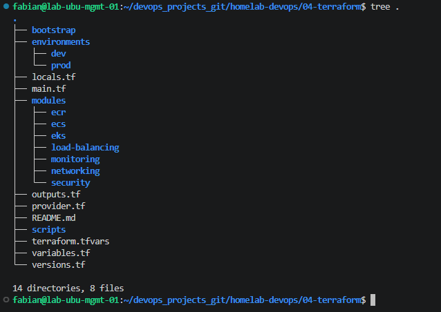
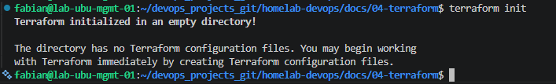
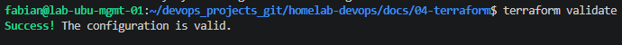

# Lab 01 - Terraform Project Bootstrap

## Overview

This lab establishes the foundation of the Terraform project that will be used throughout the AWS Container Platform series.

The objective is to create a clean, maintainable, and production-style project structure while configuring Terraform to communicate with AWS.

At the end of this lab, the project will be initialized, validated, and ready for deploying AWS infrastructure in the following labs.

---

# Objectives

- Install and verify Terraform.
- Configure the AWS Provider.
- Create the initial Terraform project structure.
- Define project variables.
- Configure local values.
- Create reusable outputs.
- Initialize Terraform.
- Validate the Terraform configuration.
- Generate the first execution plan.

---

# Prerequisites

Before starting this lab, the following requirements must be met.

- AWS Account
- AWS CLI configured
- Terraform installed
- Git installed
- Visual Studio Code
- Ubuntu Management Server

---

# Environment

| Component | Value |
|-----------|-------|
| Operating System | Ubuntu Server |
| Terraform Version | 1.15.7 |
| AWS CLI Version | 2.x |
| AWS Region | us-east-1 |

---

# Project Structure

The following project structure was created.

```text
04-terraform/
│
├── bootstrap/
├── environments/
├── modules/
├── scripts/
│
├── docs/
│   └── images/
│
├── versions.tf
├── provider.tf
├── variables.tf
├── terraform.tfvars
├── locals.tf
├── outputs.tf
├── main.tf
│
├── .gitignore
├── README.md
└── .terraform.lock.hcl
```



---

# Terraform Configuration Files

## versions.tf

Defines the required Terraform version and the AWS Provider version.

```hcl
terraform {
  required_version = ">= 1.15.0"

  required_providers {
    aws = {
      source  = "hashicorp/aws"
      version = "~> 6.0"
    }
  }
}
```

---

## provider.tf

Configures the AWS Provider and automatically applies common tags to supported resources.

```hcl
provider "aws" {
  region = var.aws_region

  default_tags {
    tags = local.common_tags
  }
}
```

---

## variables.tf

Defines the input variables used throughout the project.

```hcl
variable "aws_region" {
  description = "AWS region where resources will be deployed."
  type        = string
}

variable "project_name" {
  description = "Project name used for resource naming."
  type        = string
}
```

---

## terraform.tfvars

Assigns values to the variables defined in `variables.tf`.

```hcl
aws_region   = "us-east-1"
project_name = "aws-container-platform"
```

---

## locals.tf

Defines reusable local values.

```hcl
locals {
  name_prefix = var.project_name

  common_tags = {
    Project   = var.project_name
    ManagedBy = "Terraform"
    Owner     = "Fabian"
  }
}
```

---

## outputs.tf

Defines the outputs that Terraform will display after an apply operation.

```hcl
output "aws_region" {
  description = "AWS region configured for this project."
  value       = var.aws_region
}

output "project_name" {
  description = "Project name."
  value       = var.project_name
}
```

---

## main.tf

Main Terraform configuration file.

Terraform resources will be added in future labs.

```hcl
# Main Terraform configuration
#
# AWS resources will be added in the following labs.
```

---

# Format Terraform Files

All Terraform files were formatted using:

```bash
terraform fmt -recursive
```

---

# Initialize Terraform

Terraform downloads the required providers and prepares the working directory.

```bash
terraform init
```



---

# Validate the Configuration

The configuration was validated before creating any infrastructure.

```bash
terraform validate
```

Expected output:

```text
Success! The configuration is valid.
```



---

# Generate an Execution Plan

Terraform compares the configuration with the current state.

```bash
terraform plan
```


---

# Apply the Configuration

The first apply creates the Terraform state file and stores the configured outputs.

```bash
terraform apply
```


---

# Generated Files

After initialization, Terraform creates the following files.

```text
.terraform/
.terraform.lock.hcl
terraform.tfstate
```

---

# Best Practices

- Keep Terraform files organized by purpose.
- Use variables instead of hardcoded values.
- Define reusable local values.
- Format code before committing changes.
- Validate the configuration before applying changes.
- Store the Terraform state remotely (implemented in the next lab).

---

# Lessons Learned

During this lab, the following concepts were learned.

- Terraform project organization.
- AWS Provider configuration.
- Variables and local values.
- Outputs.
- Terraform initialization.
- Terraform validation.
- Terraform execution plans.
- Terraform state creation.

---

# Conclusion

The Terraform project has been successfully initialized and is now ready to provision AWS infrastructure.

The next lab will migrate the local Terraform state to an Amazon S3 backend, following Infrastructure as Code (IaC) best practices used in production environments.