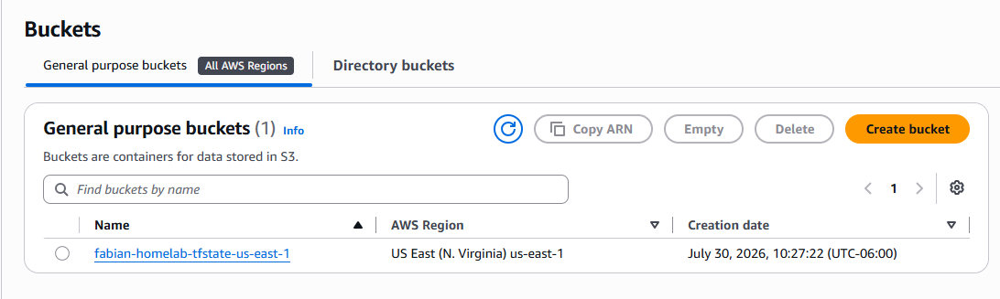
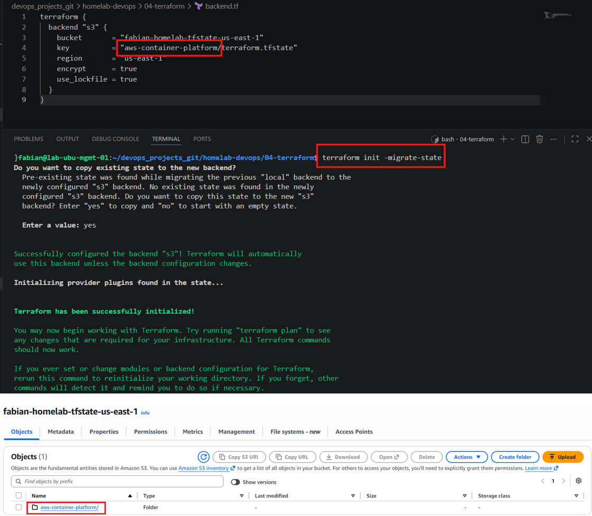
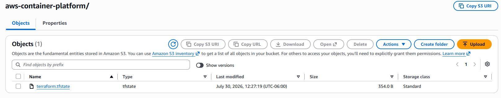
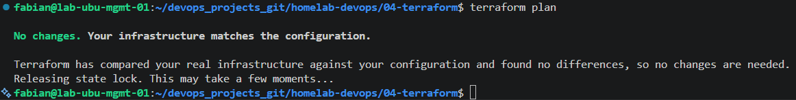

# Terraform Remote State with Amazon S3

## Overview

In this lab, Terraform was configured to store its state file remotely using an Amazon S3 bucket instead of the local filesystem.

Using a remote backend is a best practice because it centralizes the Terraform state, enables collaboration between multiple engineers, and prevents accidental loss of the infrastructure state file.

---

# Objectives

After completing this lab, you will be able to:

- Configure an Amazon S3 bucket as a Terraform backend.
- Migrate the local Terraform state to a remote backend.
- Verify that Terraform stores the state remotely.
- Inspect the Terraform state file.
- Understand the advantages of remote state management.

---

# Prerequisites

Before starting this lab, the following requirements must already be completed:

- AWS CLI configured
- Terraform installed
- AWS credentials configured
- Lab 01 completed successfully

---

# Environment

| Component | Value |
|-----------|-------|
| Terraform | 1.15.x |
| AWS Region | us-east-1 |
| Backend | Amazon S3 |
| State Locking | S3 Lockfile |
| Encryption | Enabled |

---

# Architecture

```
Developer
     │
     │ terraform plan/apply
     ▼
Terraform CLI
     │
     ▼
Amazon S3 Backend
(terraform.tfstate)
```

---

# Creating the S3 Bucket

An S3 bucket was manually created to store the Terraform state.

Bucket Name:

```text
fabian-homelab-tfstate-us-east-1
```

Versioning and server-side encryption were enabled to improve reliability and protect the state file.

## Result



---

# Configuring the Backend

## File: `backend.tf`

The Terraform backend was configured to use Amazon S3.

```hcl
terraform {
  backend "s3" {
    bucket       = "fabian-homelab-tfstate-us-east-1"
    key          = "aws-container-platform/terraform.tfstate"
    region       = "us-east-1"
    encrypt      = true
    use_lockfile = true
  }
}
```

### Explanation

| Parameter | Description |
|-----------|-------------|
| bucket | S3 bucket that stores the Terraform state |
| key | Object path inside the bucket |
| region | AWS Region where the bucket exists |
| encrypt | Enables server-side encryption |
| use_lockfile | Prevents concurrent state modifications |

---

# Initializing the Backend

## Command

```bash
terraform init -migrate-state
```

Terraform detected the new backend configuration and migrated the local state to Amazon S3.

## Result



---

# Verifying the Remote State

After the migration, the Terraform state file was stored inside the S3 bucket.

```
fabian-homelab-tfstate-us-east-1
└── aws-container-platform
    └── terraform.tfstate
```

## Result



---

# Inspecting the State File

Terraform can retrieve the remote state using:

## Command

```bash
terraform state pull
```

This command downloads and displays the current remote state without modifying any infrastructure.

Important fields include:

| Field | Description |
|--------|-------------|
| version | State file format version |
| terraform_version | Terraform version used |
| serial | State revision number |
| lineage | Unique identifier of the state |
| resources | Managed infrastructure resources |

---

# Verifying Backend Connectivity

Terraform successfully communicated with the remote backend.

## Command

```bash
terraform plan
```

The plan executed successfully while using the remote state stored in Amazon S3.

## Result



---

# Generated Files

During this lab, the following file was added:

```
backend.tf
```

The following files were updated:

- terraform.tfvars
- .gitignore

---

# Best Practices

- Store Terraform state remotely.
- Enable bucket versioning.
- Enable server-side encryption.
- Commit `.terraform.lock.hcl` to Git.
- Never commit `.tfstate` files.
- Use remote state for team collaboration.
- Protect the backend with IAM permissions.

---

# Lessons Learned

During this lab, the following concepts were learned:

- Local vs Remote Terraform State
- Amazon S3 Backend
- State Migration
- Terraform Backend Initialization
- Remote State Inspection
- Backend Verification
- State Locking using S3 Lockfile

---

# Conclusion

The Terraform project is now configured to use a remote backend hosted in Amazon S3.

This provides a secure and centralized location for the infrastructure state while preparing the project for future collaboration and CI/CD pipelines.

The project is now ready to begin provisioning AWS infrastructure in the next lab.