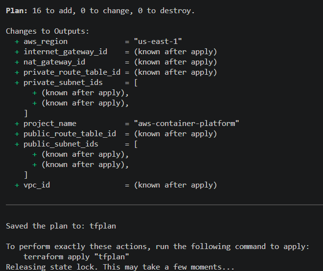
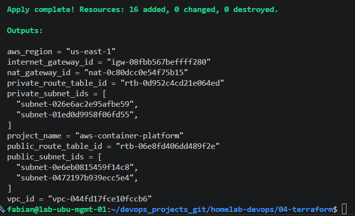
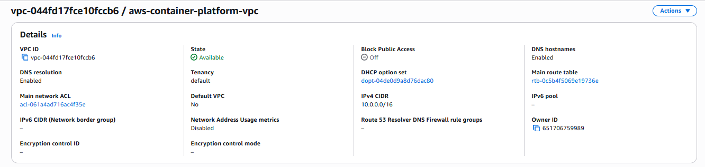
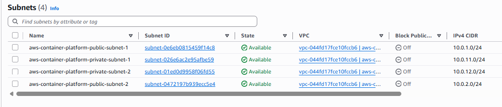
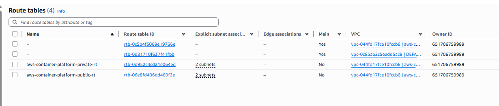
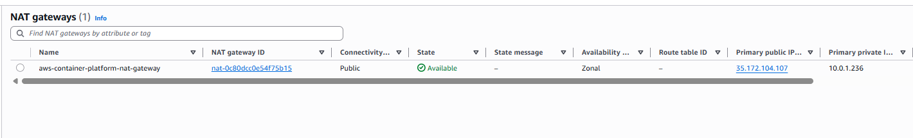

# AWS Networking with Terraform

## Overview

This lab provisions the foundational AWS networking infrastructure required for the AWS Container Platform project using Terraform.

The networking layer includes a Virtual Private Cloud (VPC), public and private subnets, an Internet Gateway, a NAT Gateway, route tables, and route table associations. These resources provide secure connectivity and establish the networking foundation that will be used by Amazon ECS, Amazon EKS, Application Load Balancers, and future infrastructure components.

At the end of this lab, Terraform successfully deploys a complete networking architecture following AWS and Infrastructure as Code (IaC) best practices.

---

# Objectives

After completing this lab, you will be able to:

- Create a production-style VPC using Terraform.
- Deploy public and private subnets across multiple Availability Zones.
- Configure an Internet Gateway.
- Configure a NAT Gateway.
- Configure public and private route tables.
- Associate route tables with subnets.
- Validate the infrastructure using Terraform.
- Verify the infrastructure from the AWS Console.

---

# Environment

| Component | Value |
|-----------|-------|
| Cloud Provider | AWS |
| Region | us-east-1 |
| Terraform | 1.15.x |
| Backend | Amazon S3 |
| Availability Zones | us-east-1a, us-east-1b |

---

# Architecture

```text
                     AWS Region (us-east-1)

                  VPC (10.0.0.0/16)

                           │
        ┌──────────────────┴──────────────────┐
        │                                     │
 Public Subnet 1                      Public Subnet 2
 10.0.1.0/24                          10.0.2.0/24
        │                                     │
        └────────── Internet Gateway ─────────┘
                         │
                     Internet
                         │
                    NAT Gateway
                         │
        ┌────────────────┴────────────────┐
        │                                 │
 Private Subnet 1                 Private Subnet 2
 10.0.11.0/24                     10.0.12.0/24
```

---

# Network Design

| Resource | CIDR | Availability Zone |
|----------|------|-------------------|
| VPC | 10.0.0.0/16 | us-east-1 |
| Public Subnet 1 | 10.0.1.0/24 | us-east-1a |
| Public Subnet 2 | 10.0.2.0/24 | us-east-1b |
| Private Subnet 1 | 10.0.11.0/24 | us-east-1a |
| Private Subnet 2 | 10.0.12.0/24 | us-east-1b |

---

# Terraform Files

## File: `01-network-vpc.tf`

Creates the primary Virtual Private Cloud.

```hcl
resource "aws_vpc" "main" {
  cidr_block           = var.vpc_cidr
  enable_dns_support   = true
  enable_dns_hostnames = true

  tags = {
    Name = "${local.name_prefix}-vpc"
  }
}
```

---

## File: `02-network-subnets.tf`

Creates two public and two private subnets.

```hcl
###############################################
# Public Subnets
###############################################


resource "aws_subnet" "public" {
  count = length(var.public_subnet_cidrs)

  vpc_id                  = aws_vpc.main.id
  cidr_block              = var.public_subnet_cidrs[count.index]
  availability_zone       = var.availability_zones[count.index]
  map_public_ip_on_launch = true

  tags = {
    Name = "${local.name_prefix}-public-subnet-${count.index + 1}"
    Type = "Public"
  }
}


###############################################
# Private Subnets
###############################################

resource "aws_subnet" "private" {
  count = length(var.private_subnet_cidrs)

  vpc_id            = aws_vpc.main.id
  cidr_block        = var.private_subnet_cidrs[count.index]
  availability_zone = var.availability_zones[count.index]

  tags = {
    Name = "${local.name_prefix}-private-subnet-${count.index + 1}"
    Type = "Private"
  }
}
```

---

## File: `03-network-internet-gateway.tf`

Creates the Internet Gateway and attaches it to the VPC.

```hcl
###############################################
# Internet Gateway
###############################################


resource "aws_internet_gateway" "main" {
  vpc_id = aws_vpc.main.id

  tags = {
    Name = "${local.name_prefix}-igw"
  }

```

---

## File: `04-network-nat-gateway.tf`

Creates the Elastic IP and NAT Gateway.

```hcl
###############################################
# Elastic IP for NAT Gateway
###############################################

resource "aws_eip" "nat" {
  domain = "vpc"

  tags = {
    Name = "${local.name_prefix}-nat-eip"
  }
}


###############################################
# NAT Gateway
###############################################

resource "aws_nat_gateway" "main" {
  allocation_id = aws_eip.nat.id
  subnet_id     = aws_subnet.public[0].id

  tags = {
    Name = "${local.name_prefix}-nat-gateway"
  }

  depends_on = [
    aws_internet_gateway.main
  ]
```

---

## File: `05-network-route-tables.tf`

Creates:

- Public Route Table
- Private Route Table
- Default Routes
- Route Table Associations

```hcl
###############################################
# Public Route Table
###############################################

resource "aws_route_table" "public" {
  vpc_id = aws_vpc.main.id

  tags = {
    Name = "${local.name_prefix}-public-rt"
  }
}

###############################################
# Public Internet Route
###############################################

resource "aws_route" "public_internet_access" {
  route_table_id         = aws_route_table.public.id
  destination_cidr_block = "0.0.0.0/0"
  gateway_id             = aws_internet_gateway.main.id
}

###############################################
# Public Subnet Associations
###############################################

resource "aws_route_table_association" "public" {
  count = length(aws_subnet.public)

  subnet_id      = aws_subnet.public[count.index].id
  route_table_id = aws_route_table.public.id
}

###############################################
# Private Route Table
###############################################

resource "aws_route_table" "private" {
  vpc_id = aws_vpc.main.id

  tags = {
    Name = "${local.name_prefix}-private-rt"
  }
}

###############################################
# Private NAT Route
###############################################

resource "aws_route" "private_nat_access" {
  route_table_id         = aws_route_table.private.id
  destination_cidr_block = "0.0.0.0/0"
  nat_gateway_id         = aws_nat_gateway.main.id
}

###############################################
# Private Subnet Associations
###############################################

resource "aws_route_table_association" "private" {
  count = length(aws_subnet.private)

  subnet_id      = aws_subnet.private[count.index].id
  route_table_id = aws_route_table.private.id
}
```
---

## File: `06-network-outputs.tf`

Displays the IDs of all networking resources after deployment.
```hcl
###############################################
# Project Outputs
###############################################

output "aws_region" {
  description = "AWS region configured for this project."
  value       = var.aws_region
}

output "project_name" {
  description = "Project name."
  value       = var.project_name
}

###############################################
# Networking Outputs
###############################################

output "vpc_id" {
  description = "ID of the main VPC."
  value       = aws_vpc.main.id
}

output "public_subnet_ids" {
  description = "IDs of the public subnets."
  value       = aws_subnet.public[*].id
}

output "private_subnet_ids" {
  description = "IDs of the private subnets."
  value       = aws_subnet.private[*].id
}

output "internet_gateway_id" {
  description = "ID of the Internet Gateway."
  value       = aws_internet_gateway.main.id
}

output "nat_gateway_id" {
  description = "ID of the NAT Gateway."
  value       = aws_nat_gateway.main.id
}

output "public_route_table_id" {
  description = "ID of the public route table."
  value       = aws_route_table.public.id
}

output "private_route_table_id" {
  description = "ID of the private route table."
  value       = aws_route_table.private.id
}
```
---

# Terraform Workflow

## Format

```bash
terraform fmt
```

## Validate

```bash
terraform validate
```

## Plan

```bash
terraform plan -out=tfplan
```

Result



---

## Apply

```bash
terraform apply tfplan
```

Result



---

# AWS Console Verification

## VPC



---

## Subnets



---

## Route Tables



---

## NAT Gateway



---

# Generated Resources

- 1 VPC
- 2 Public Subnets
- 2 Private Subnets
- 1 Internet Gateway
- 1 Elastic IP
- 1 NAT Gateway
- 2 Route Tables
- 2 Routes
- 4 Route Table Associations

---

# Best Practices

- Use Infrastructure as Code.
- Deploy resources across multiple Availability Zones.
- Keep private resources isolated.
- Use a NAT Gateway for outbound traffic.
- Store Terraform state remotely.
- Apply consistent resource tagging.

---

# Troubleshooting

## Error

VpcLimitExceeded

Cause

AWS account reached the VPC service quota.

Resolution

Removed unused VPCs and executed:

```bash
terraform plan -out=tfplan
terraform apply tfplan
```

---

## Error

Saved plan is stale

Cause

Terraform state changed after a failed deployment.

Resolution

Generate a new execution plan.

---

# Lessons Learned

During this lab, the following concepts were learned:

- Amazon VPC
- Public vs Private Subnets
- Internet Gateway
- NAT Gateway
- Route Tables
- Route Table Associations
- Terraform Outputs
- AWS Networking Best Practices

---

# Conclusion

A complete AWS networking foundation was successfully deployed using Terraform.

This networking architecture will be reused in the following labs to deploy Amazon ECR, Amazon ECS, Amazon EKS, and the remaining AWS infrastructure for the platform.