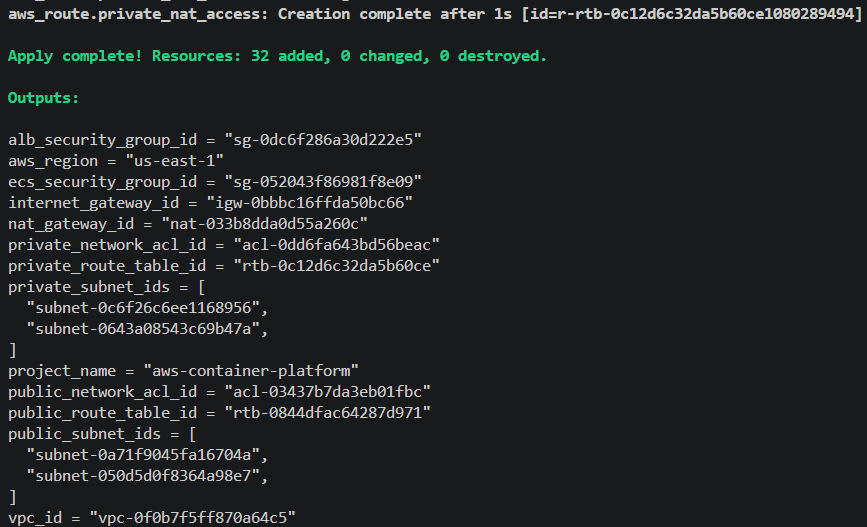
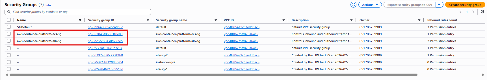
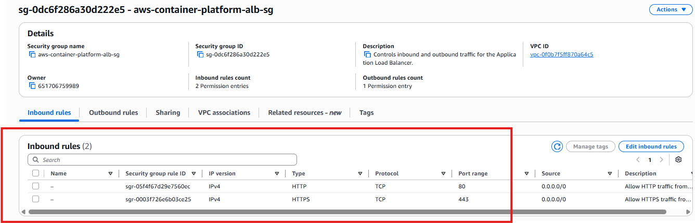
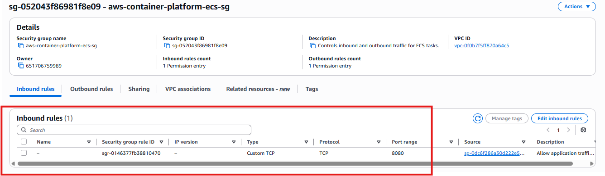
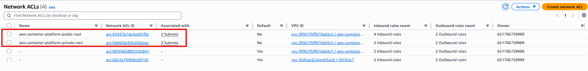

# Lab 04 - AWS Security

## Overview

This lab builds the security foundation for the AWS Container Platform using Terraform.

The objective is to implement network security following AWS best practices before deploying any workloads. During this lab, Security Groups and Network ACLs are created to control traffic between the Internet, the Application Load Balancer (ALB), Amazon ECS, and the private network.

This security model will be reused throughout the following labs, including Amazon ECS, Amazon EKS, GitHub Actions, and Argo CD deployments.

---

# Objectives

After completing this lab, you will be able to:

- Create Security Groups using Terraform.
- Configure inbound and outbound rules.
- Restrict ECS traffic to the Application Load Balancer.
- Create Public and Private Network ACLs.
- Validate security resources using Terraform.
- Verify resources from the AWS Console.
- Apply AWS networking security best practices.

---

# Prerequisites

Before starting this lab, the following labs must be completed:

- Lab 01 - Terraform Project Bootstrap
- Lab 02 - Terraform Remote State
- Lab 03 - AWS Networking

---

# Environment

| Component | Value |
|-----------|-------|
| Cloud Provider | AWS |
| Region | us-east-1 |
| Terraform | 1.15.x |
| Backend | Amazon S3 |
| VPC | 10.0.0.0/16 |

---

# Architecture

```text
                    Internet
                        │
                        ▼
            Application Load Balancer
                        │
                ALB Security Group
                        │
                        ▼
                ECS Security Group
                        │
                Private Subnets
                        │
               Network ACL Protection
```

---

# Security Design

## Security Groups

### ALB Security Group

Purpose:

Accepts traffic from the Internet.

Inbound Rules

| Protocol | Port | Source |
|----------|------|--------|
| TCP | 80 | 0.0.0.0/0 |
| TCP | 443 | 0.0.0.0/0 |

Outbound Rules

| Protocol | Destination |
|----------|-------------|
| All Traffic | 0.0.0.0/0 |

---

### ECS Security Group

Purpose:

Protects ECS tasks from direct Internet access.

Inbound Rules

| Protocol | Port | Source |
|----------|------|--------|
| TCP | 8080 | ALB Security Group |

Outbound Rules

| Protocol | Destination |
|----------|-------------|
| All Traffic | 0.0.0.0/0 |

---

# Network ACLs

Two Network ACLs are deployed.

## Public Network ACL

Allows:

- HTTP
- HTTPS
- Ephemeral ports
- All outbound traffic

Associated with:

- Public Subnet 1
- Public Subnet 2

---

## Private Network ACL

Allows:

- Internal VPC communication
- Ephemeral ports
- Outbound traffic through the NAT Gateway

Associated with:

- Private Subnet 1
- Private Subnet 2

---

# Terraform Files

## 07-security-groups.tf

Creates:

- ALB Security Group
- ECS Security Group
- Ingress Rules
- Egress Rules

```hcl
###############################################
# File:
# 07-security-groups.tf
#
# Description:
# Creates the security groups used by the
# AWS Container Platform.
#
# Lab:
# Lab 04 - AWS Security
###############################################

###############################################
# Application Load Balancer Security Group
###############################################

resource "aws_security_group" "alb" {
  name        = "${local.name_prefix}-alb-sg"
  description = "Controls inbound and outbound traffic for the Application Load Balancer."
  vpc_id      = aws_vpc.main.id

  tags = {
    Name = "${local.name_prefix}-alb-sg"
  }

  lifecycle {
    create_before_destroy = true
  }
}

###############################################
# ALB HTTP Ingress Rule
###############################################

resource "aws_vpc_security_group_ingress_rule" "alb_http" {
  security_group_id = aws_security_group.alb.id

  description = "Allow HTTP traffic from the Internet."
  cidr_ipv4   = "0.0.0.0/0"

  from_port   = 80
  to_port     = 80
  ip_protocol = "tcp"
}

###############################################
# ALB HTTPS Ingress Rule
###############################################

resource "aws_vpc_security_group_ingress_rule" "alb_https" {
  security_group_id = aws_security_group.alb.id

  description = "Allow HTTPS traffic from the Internet."
  cidr_ipv4   = "0.0.0.0/0"

  from_port   = 443
  to_port     = 443
  ip_protocol = "tcp"
}

###############################################
# ALB Outbound Rule
###############################################

resource "aws_vpc_security_group_egress_rule" "alb_all_outbound" {
  security_group_id = aws_security_group.alb.id

  description = "Allow all outbound traffic."
  cidr_ipv4   = "0.0.0.0/0"

  ip_protocol = "-1"
}

###############################################
# ECS Service Security Group
###############################################

resource "aws_security_group" "ecs" {
  name        = "${local.name_prefix}-ecs-sg"
  description = "Controls inbound and outbound traffic for ECS tasks."
  vpc_id      = aws_vpc.main.id

  tags = {
    Name = "${local.name_prefix}-ecs-sg"
  }

  lifecycle {
    create_before_destroy = true
  }
}

###############################################
# ECS Ingress Rule
###############################################

resource "aws_vpc_security_group_ingress_rule" "ecs_from_alb" {
  security_group_id = aws_security_group.ecs.id

  description                  = "Allow application traffic from the ALB."
  referenced_security_group_id = aws_security_group.alb.id

  from_port   = 8080
  to_port     = 8080
  ip_protocol = "tcp"
}

###############################################
# ECS Outbound Rule
###############################################

resource "aws_vpc_security_group_egress_rule" "ecs_all_outbound" {
  security_group_id = aws_security_group.ecs.id

  description = "Allow all outbound traffic."
  cidr_ipv4   = "0.0.0.0/0"

  ip_protocol = "-1"
}

```

---

## 08-security-network-acls.tf

Creates:

- Public Network ACL
- Private Network ACL
- Inbound Rules
- Outbound Rules

```hcl

###############################################
# File:
# 08-security-network-acls.tf
#
# Description:
# Creates public and private Network ACLs
# for the AWS Container Platform.
#
# Lab:
# Lab 04 - AWS Security
###############################################

###############################################
# Public Network ACL
###############################################

resource "aws_network_acl" "public" {
  vpc_id     = aws_vpc.main.id
  subnet_ids = aws_subnet.public[*].id

  tags = {
    Name = "${local.name_prefix}-public-nacl"
  }
}

###############################################
# Public NACL Inbound HTTP
###############################################

resource "aws_network_acl_rule" "public_http_inbound" {
  network_acl_id = aws_network_acl.public.id
  rule_number    = 100
  egress         = false
  protocol       = "6"
  rule_action    = "allow"
  cidr_block     = "0.0.0.0/0"
  from_port      = 80
  to_port        = 80
}

###############################################
# Public NACL Inbound HTTPS
###############################################

resource "aws_network_acl_rule" "public_https_inbound" {
  network_acl_id = aws_network_acl.public.id
  rule_number    = 110
  egress         = false
  protocol       = "6"
  rule_action    = "allow"
  cidr_block     = "0.0.0.0/0"
  from_port      = 443
  to_port        = 443
}

###############################################
# Public NACL Inbound Ephemeral Ports
###############################################

resource "aws_network_acl_rule" "public_ephemeral_inbound" {
  network_acl_id = aws_network_acl.public.id
  rule_number    = 120
  egress         = false
  protocol       = "6"
  rule_action    = "allow"
  cidr_block     = "0.0.0.0/0"
  from_port      = 1024
  to_port        = 65535
}

###############################################
# Public NACL Outbound Traffic
###############################################

resource "aws_network_acl_rule" "public_all_outbound" {
  network_acl_id = aws_network_acl.public.id
  rule_number    = 100
  egress         = true
  protocol       = "-1"
  rule_action    = "allow"
  cidr_block     = "0.0.0.0/0"
}

###############################################
# Private Network ACL
###############################################

resource "aws_network_acl" "private" {
  vpc_id     = aws_vpc.main.id
  subnet_ids = aws_subnet.private[*].id

  tags = {
    Name = "${local.name_prefix}-private-nacl"
  }
}

###############################################
# Private NACL Inbound from VPC
###############################################

resource "aws_network_acl_rule" "private_vpc_inbound" {
  network_acl_id = aws_network_acl.private.id
  rule_number    = 100
  egress         = false
  protocol       = "-1"
  rule_action    = "allow"
  cidr_block     = var.vpc_cidr
}

###############################################
# Private NACL Inbound Ephemeral Ports
###############################################

resource "aws_network_acl_rule" "private_ephemeral_inbound" {
  network_acl_id = aws_network_acl.private.id
  rule_number    = 110
  egress         = false
  protocol       = "6"
  rule_action    = "allow"
  cidr_block     = "0.0.0.0/0"
  from_port      = 1024
  to_port        = 65535
}

###############################################
# Private NACL Outbound Traffic
###############################################

resource "aws_network_acl_rule" "private_all_outbound" {
  network_acl_id = aws_network_acl.private.id
  rule_number    = 100
  egress         = true
  protocol       = "-1"
  rule_action    = "allow"
  cidr_block     = "0.0.0.0/0"
}
```

---

## 09-security-outputs.tf

Displays the IDs of:

- ALB Security Group
- ECS Security Group
- Public Network ACL
- Private Network ACL

```hcl

###############################################
# File:
# 09-security-outputs.tf
#
# Description:
# Exposes the IDs of security resources created
# for the AWS Container Platform.
#
# Lab:
# Lab 04 - AWS Security
###############################################

###############################################
# Security Group Outputs
###############################################

output "alb_security_group_id" {
  description = "ID of the Application Load Balancer security group."
  value       = aws_security_group.alb.id
}

output "ecs_security_group_id" {
  description = "ID of the ECS service security group."
  value       = aws_security_group.ecs.id
}

###############################################
# Network ACL Outputs
###############################################

output "public_network_acl_id" {
  description = "ID of the public Network ACL."
  value       = aws_network_acl.public.id
}

output "private_network_acl_id" {
  description = "ID of the private Network ACL."
  value       = aws_network_acl.private.id
}

```

---

# Terraform Workflow

## Format

```bash
terraform fmt
```

---

## Validate

```bash
terraform validate
```

---

## Plan

```bash
terraform plan -out=tfplan
```

Screenshot


---

## Apply

```bash
terraform apply tfplan
```

Screenshot



---

# AWS Console Verification

## Security Groups

Verify:

- ALB Security Group
- ECS Security Group

Screenshot



---

## ALB Security Group Rules

Verify:

- HTTP (80)
- HTTPS (443)

Screenshot



---

## ECS Security Group Rules

Verify:

- TCP 8080
- Source = ALB Security Group

Screenshot



---

## Network ACLs

Verify:

- Public Network ACL
- Private Network ACL

Screenshot



---

# Resources Created

## Security Groups

- Application Load Balancer Security Group
- ECS Security Group

## Network ACLs

- Public Network ACL
- Private Network ACL

## Security Group Rules

- HTTP
- HTTPS
- ECS Application Port (8080)
- Outbound Rules

---

# Outputs

Terraform exposes:

- alb_security_group_id
- ecs_security_group_id
- public_network_acl_id
- private_network_acl_id

---

# Best Practices

- Apply the Principle of Least Privilege.
- Never expose ECS services directly to the Internet.
- Allow inbound traffic only through the Application Load Balancer.
- Separate public and private resources.
- Use Network ACLs as an additional layer of protection.
- Keep Terraform state stored remotely.

---

# Troubleshooting

## State Lock

### Error

```text
Error acquiring the state lock
```

### Cause

A previous Terraform operation left the remote state locked.

### Resolution

Verify that no Terraform process is running:

```bash
ps -ef | grep '[t]erraform'
```

Release the lock:

```bash
terraform force-unlock <LOCK_ID>
```

Retry the operation:

```bash
terraform apply
```

---

# Lessons Learned

During this lab the following concepts were practiced:

- AWS Security Groups
- Ingress Rules
- Egress Rules
- Network ACLs
- Layered Network Security
- Terraform Security Resources
- Remote State Locking
- Terraform Force Unlock

---

# Next Steps

The security layer is now complete.

The next lab will focus on building a Docker application that will later be:

- Containerized with Docker
- Stored in Amazon ECR
- Deployed to Amazon ECS
- Deployed to Amazon EKS

---

# Conclusion

A complete security foundation for the AWS Container Platform was successfully implemented using Terraform.

This layer provides secure communication between the Internet, the Application Load Balancer, ECS services, and private network resources while following AWS security best practices. The infrastructure is now ready for deploying containerized applications in the next labs.