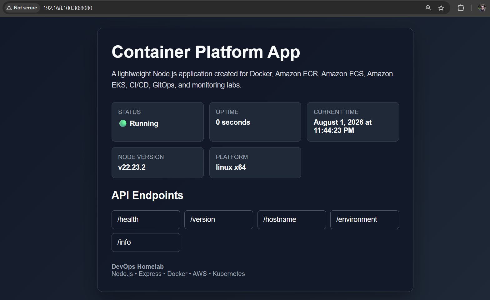
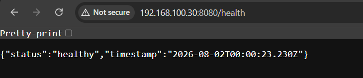
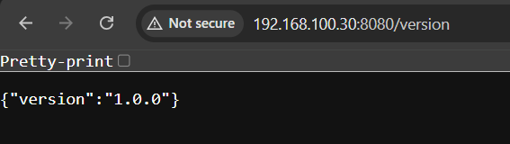
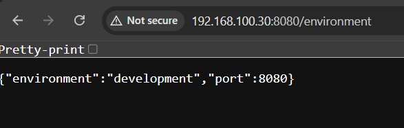
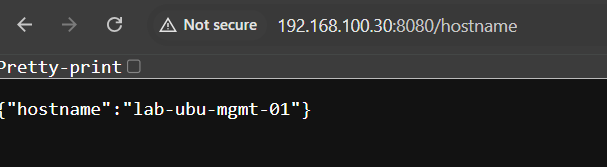
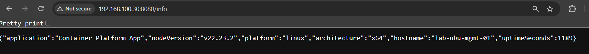

# Lab 01 - Build Containerized Application

## Overview

In this lab, a lightweight Node.js and Express application was developed as the foundation for the Container Platform section of the homelab.

Rather than focusing on application development, the goal is to build a simple, production-ready service that can later be packaged with Docker, stored in Amazon ECR, deployed to Amazon ECS and Amazon EKS, and integrated into CI/CD and GitOps workflows.

The application exposes several REST API endpoints for operational information, including health status, version, hostname, environment, and runtime details. It also provides a simple web interface for validating deployments from a browser.

This application will be reused throughout the remaining Container Platform labs.

---

# Objectives

After completing this lab, you will be able to:

- Build a lightweight Node.js application using Express.
- Organize a simple production-ready project structure.
- Create REST API endpoints for operational information.
- Validate application functionality using a web browser and curl.
- Prepare the application for Docker containerization.
- Build a reusable application for future AWS and Kubernetes deployments.

---

# Prerequisites

Before starting this lab, the following software should already be installed:

- Ubuntu Server
- Node.js
- npm
- Git
- Visual Studio Code
- Docker (installed but not yet used)

Basic knowledge of the following topics is recommended:

- Linux command line
- Git
- HTTP
- REST APIs
- JSON
- JavaScript fundamentals

---

# Environment

| Component | Value |
|-----------|-------|
| Operating System | Ubuntu Server 24.04 LTS |
| Runtime | Node.js |
| Framework | Express.js |
| Package Manager | npm |
| IDE | Visual Studio Code |
| Hostname | LAB-UBU-MGMT-01 |
| Default Port | 8080 |
| Protocol | HTTP |

---

# Project Structure

The application follows a simple and organized directory structure designed for learning, maintainability, and future scalability.

```text
container-platform-app/
├── node_modules/
├── src/
│   ├── app.js
│   ├── config/
│   ├── controllers/
│   ├── middleware/
│   ├── routes/
│   └── utils/
├── .dockerignore
├── .gitignore
├── package.json
├── package-lock.json
└── README.md
```

## Directory Description

| Directory / File | Description |
|------------------|-------------|
| **src/** | Contains the application source code. |
| **app.js** | Main application entry point. Initializes the Express server and API endpoints. |
| **config/** | Configuration files for future application settings. |
| **controllers/** | Placeholder for future business logic. |
| **middleware/** | Reserved for Express middleware components. |
| **routes/** | Reserved for route definitions as the application grows. |
| **utils/** | Utility functions shared across the application. |
| **package.json** | Project metadata, dependencies, and npm scripts. |
| **package-lock.json** | Locks dependency versions for consistent builds. |
| **.gitignore** | Prevents unnecessary files from being committed to Git. |
| **.dockerignore** | Prevents unnecessary files from being copied into Docker images. |

---

# Application Overview

The Container Platform Application is intentionally lightweight.

Its primary purpose is to serve as the deployment target for the remaining DevOps labs rather than demonstrating backend application development.

The application exposes several operational endpoints that are commonly used in modern container platforms for monitoring, health checks, troubleshooting, and deployment validation.

During later labs, the same application will be:

- Containerized using Docker.
- Stored in Amazon Elastic Container Registry (Amazon ECR).
- Deployed to Amazon Elastic Container Service (Amazon ECS).
- Deployed to Amazon Elastic Kubernetes Service (Amazon EKS).
- Managed through GitHub Actions CI/CD pipelines.
- Deployed using GitOps with Argo CD.
- Monitored using Prometheus and Grafana.

Because the application remains unchanged throughout the remaining labs, it becomes an ideal workload for validating infrastructure and deployment workflows.

---

# Application Architecture

```text
                    Client
                       │
                       ▼
              Container Platform App
                 (Node.js + Express)
                       │
        ┌──────────────┼──────────────┐
        │              │              │
        ▼              ▼              ▼
     Web UI        REST API      Health Check
                       │
      ┌────────────────┼─────────────────┐
      │                │                 │
      ▼                ▼                 ▼
   /version        /hostname        /environment
      │
      ▼
     /info
```

The application consists of a single Express web server exposing a lightweight HTML interface and multiple REST API endpoints.

The HTML interface provides deployment information for quick visual validation, while the REST endpoints provide operational data used by monitoring systems, health probes, and infrastructure services.

# REST API Endpoints

The application exposes several REST API endpoints that provide operational information commonly used in containerized environments.

These endpoints are intentionally lightweight and are designed to support monitoring, troubleshooting, health checks, and deployment validation throughout the remaining labs.

| Endpoint | Method | Description |
|----------|--------|-------------|
| `/` | GET | Displays the application home page with deployment information and available endpoints. |
| `/health` | GET | Returns the application health status. |
| `/version` | GET | Displays the current application version. |
| `/hostname` | GET | Returns the hostname of the running server, container, or Kubernetes Pod. |
| `/environment` | GET | Displays the current runtime environment and listening port. |
| `/info` | GET | Returns runtime information including Node.js version, platform, architecture, hostname, and uptime. |

---

# Endpoint Details

## GET /

Displays the application's home page.

The page provides deployment information including:

- Application version
- Runtime environment
- Hostname
- Listening port
- Current status
- Node.js version
- Platform
- Current UTC time
- Available REST API endpoints

This page is intended for quick visual validation after deployments.

---

## GET /health

Returns the application health status.

Example response:

```json
{
    "status": "healthy",
    "timestamp": "2026-08-02T00:00:23.230Z"
}
```

This endpoint will later be used by:

- Docker Health Checks
- Amazon ECS Health Checks
- Kubernetes Liveness Probes
- Kubernetes Readiness Probes
- Application Load Balancer Health Checks

---

## GET /version

Returns the application version.

Example response:

```json
{
    "version": "1.0.0"
}
```

---

## GET /hostname

Returns the hostname where the application is currently running.

Example response:

```json
{
    "hostname": "LAB-UBU-MGMT-01"
}
```

Later in the project this value will automatically change depending on where the application is deployed.

Examples:

- Local Server
- Docker Container
- Amazon ECS Task
- Kubernetes Pod

---

## GET /environment

Returns runtime environment information.

Example response:

```json
{
    "environment": "development",
    "port": 8080
}
```

---

## GET /info

Returns general runtime information.

Example response:

```json
{
    "application": "Container Platform App",
    "nodeVersion": "v22.x",
    "platform": "linux",
    "architecture": "x64",
    "hostname": "LAB-UBU-MGMT-01",
    "uptimeSeconds": 325
}
```

This endpoint is useful for troubleshooting deployments and validating runtime environments.

---

# Implementation Summary

The application was implemented using the following process:

1. Initialize a new Node.js project using npm.
2. Install Express.js as the web framework.
3. Create the project directory structure.
4. Configure Git ignore rules.
5. Configure Docker ignore rules.
6. Implement the Express web server.
7. Create REST API endpoints.
8. Build a simple HTML dashboard.
9. Validate all endpoints locally.
10. Prepare the project for Docker containerization.

---

# Validation

After implementing the application, verify that the server starts successfully.

Start the application:

```bash
npm start
```

Open a browser and navigate to:

```text
http://192.168.100.30:8080
```

Verify the following endpoints:

```text
GET /
GET /health
GET /version
GET /hostname
GET /environment
GET /info
```

Each endpoint should return a successful HTTP 200 response.

# Screenshots

The following screenshots were captured to validate the successful implementation of the application.

---

## Application Home Page

The following screenshot shows the main application interface running in a web browser.



---

## Health Endpoint

The following screenshot shows the health endpoint returning the current application status.



---

## Version Endpoint

The following screenshot displays the current version of the application.



---

## Environment Endpoint

The following screenshot shows the runtime environment where the application is running.



---

## Hostname Endpoint

The following screenshot displays the hostname of the running application instance.



---

## Information Endpoint

The following screenshot displays runtime information including the Node.js version, operating system, architecture, and application uptime.



---

# Best Practices

The following best practices were applied during the implementation of this application:

- Keep the application lightweight and focused on infrastructure validation.
- Organize the source code using a scalable directory structure.
- Separate source code from configuration files.
- Ignore unnecessary files using `.gitignore`.
- Optimize future Docker images using `.dockerignore`.
- Build reusable API endpoints for monitoring and troubleshooting.
- Keep application configuration external whenever possible.
- Design the application to run consistently across local, Docker, ECS, and Kubernetes environments.

---

# Lessons Learned

During this lab, the following concepts were practiced:

- Node.js project initialization
- Express.js application development
- REST API design
- HTTP request handling
- JSON responses
- Environment variables
- Runtime information
- Health check implementation
- Project organization
- Preparing applications for containerization

---

# Next Steps

In the next lab, this application will be containerized using Docker.

The following topics will be covered:

- Docker fundamentals
- Dockerfile creation
- Building container images
- Running containers locally
- Docker networking
- Image optimization
- Docker image validation

The Docker image created in the next lab will later be pushed to Amazon Elastic Container Registry (Amazon ECR) and deployed to Amazon Elastic Container Service (Amazon ECS) and Amazon Elastic Kubernetes Service (Amazon EKS).

---

# Conclusion

A lightweight Node.js and Express application was successfully developed as the foundation for the Container Platform section of the homelab.

The application provides a web interface and multiple operational REST API endpoints that will be reused throughout the remaining labs.

By keeping the application simple and portable, the focus of the project remains on DevOps practices, infrastructure automation, containerization, cloud deployments, CI/CD, GitOps, and observability rather than application development itself.

This application now serves as the primary workload for the remainder of the Container Platform learning path.