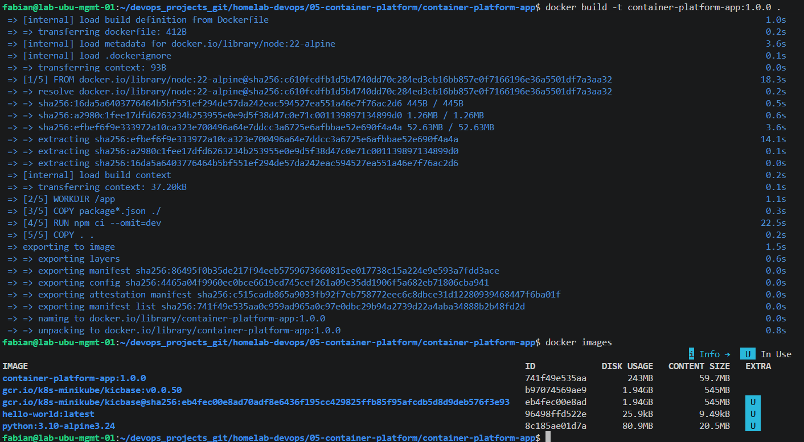
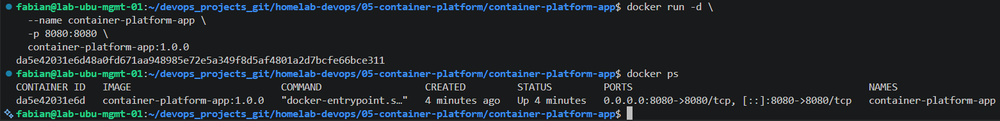
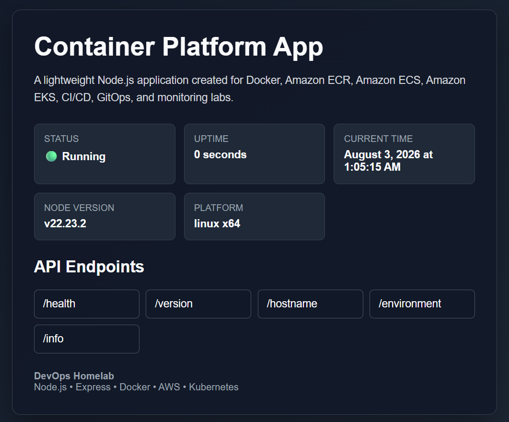
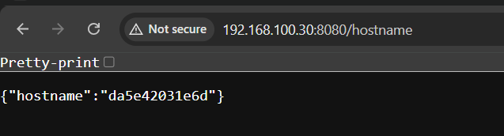

# Lab 02 - Docker Fundamentals

## Overview

In this lab, the Container Platform application was containerized using Docker.

A Docker image was built from the Node.js application, allowing the application to run consistently across different environments without requiring manual dependency installation.

This lab introduces the core Docker concepts required before deploying containerized workloads to Amazon Elastic Container Registry (Amazon ECR), Amazon Elastic Container Service (Amazon ECS), and Amazon Elastic Kubernetes Service (Amazon EKS).

---

# Objectives

After completing this lab, you will be able to:

- Understand Docker architecture.
- Create a Dockerfile.
- Build Docker images.
- Run Docker containers.
- Inspect Docker images and containers.
- Understand Docker layers and cache.
- Optimize Docker image builds.
- Prepare applications for cloud deployments.

---

# Prerequisites

Before starting this lab, the following components should already be available:

- Ubuntu Server
- Docker Engine
- Docker CLI
- Node.js Application (Lab 01)

---

# Environment

| Component | Value |
|-----------|-------|
| Operating System | Ubuntu Server 24.04 LTS |
| Container Runtime | Docker Engine |
| Docker Image | container-platform-app:1.0.0 |
| Application | Node.js + Express |
| Default Port | 8080 |

---

# Docker Architecture

Docker follows a client-server architecture.

The Docker Client communicates with the Docker Engine (Docker Daemon), which is responsible for building images, creating containers, managing networks, and handling storage.

```text
                Docker Client
             (docker command)
                     │
                     ▼
             Docker Engine (Daemon)
                     │
        ┌────────────┼────────────┐
        │            │            │
        ▼            ▼            ▼
     Images     Containers     Networks
```

The Docker CLI sends commands such as `docker build`, `docker run`, and `docker ps` to the Docker Engine, which performs the requested operations.

---

# Docker Image Lifecycle

The following workflow illustrates how a containerized application is built and executed.

```text
Application Source Code
          │
          ▼
      Dockerfile
          │
          ▼
     docker build
          │
          ▼
     Docker Image
          │
          ▼
      docker run
          │
          ▼
 Running Container
          │
          ▼
 HTTP Requests
```

This same Docker image will later be:

- Stored in Amazon Elastic Container Registry (Amazon ECR)
- Deployed to Amazon Elastic Container Service (Amazon ECS)
- Deployed to Amazon Elastic Kubernetes Service (Amazon EKS)

---

# Docker Images and Containers

A Docker Image is a read-only template that contains everything required to run an application.

A Docker Container is a running instance of a Docker Image.

One Docker Image can be used to create multiple containers.

```text
           Docker Image
                 │
      ┌──────────┼──────────┐
      ▼          ▼          ▼
 Container 1  Container 2  Container 3
```

Each container runs independently while sharing the same image.

---

# Dockerfile

The Dockerfile defines the instructions used to build the application image.

```dockerfile
FROM node:22-alpine

WORKDIR /app

COPY package*.json ./

RUN npm ci --omit=dev

COPY . .

EXPOSE 8080

CMD ["npm", "start"]
```

Each instruction is executed sequentially during the image build process.

---

# Dockerfile Breakdown

| Instruction | Description |
|------------|-------------|
| **FROM** | Specifies the base image used to build the application. |
| **WORKDIR** | Sets the working directory inside the container. |
| **COPY** | Copies project files into the image. |
| **RUN** | Executes commands during the image build process. |
| **EXPOSE** | Documents the application listening port. |
| **CMD** | Defines the default command executed when the container starts. |

---

# Docker Layers

Docker images are built in layers.

Each Dockerfile instruction creates a new immutable layer.

```text
Layer 7
CMD

──────────────

Layer 6
EXPOSE

──────────────

Layer 5
COPY .

──────────────

Layer 4
RUN npm ci

──────────────

Layer 3
COPY package*.json

──────────────

Layer 2
WORKDIR

──────────────

Layer 1
FROM node:22-alpine
```

Docker reuses unchanged layers during future builds, significantly reducing build times.

---

# Docker Cache

Docker automatically caches image layers.

If only the application source code changes, Docker can reuse previously built layers instead of rebuilding the entire image.

This optimization improves build performance and reduces unnecessary dependency installation.

For this reason, the Dockerfile copies `package.json` before the application source code.

This allows the dependency installation layer to remain cached unless project dependencies change.

# Building the Docker Image

The application was packaged into a Docker image using the Dockerfile created during this lab.

The image was built from the project root directory using the following command:

```bash
docker build -t container-platform-app:1.0.0 .
```

The image tag identifies both the application name and its version.

After a successful build, the image became available in the local Docker image repository.

The following command was used to verify the image:

```bash
docker images
```

---

# Running the Container

Once the image was created, a container was started using the following command:

```bash
docker run -d \
  --name container-platform-app \
  -p 8080:8080 \
  container-platform-app:1.0.0
```

Command explanation:

| Option | Description |
|---------|-------------|
| `-d` | Runs the container in detached mode. |
| `--name` | Assigns a friendly name to the container. |
| `-p` | Maps the host port to the container port. |

After deployment, the running container was verified using:

```bash
docker ps
```

---

# Container Lifecycle Management

During this lab, the following Docker commands were used to manage the application container.

Start container

```bash
docker start container-platform-app
```

Stop container

```bash
docker stop container-platform-app
```

Restart container

```bash
docker restart container-platform-app
```

Remove container

```bash
docker rm container-platform-app
```

Display running containers

```bash
docker ps
```

Display all containers

```bash
docker ps -a
```

View container logs

```bash
docker logs container-platform-app
```

Follow container logs

```bash
docker logs -f container-platform-app
```

Execute a shell inside the container

```bash
docker exec -it container-platform-app sh
```

These commands provide the basic operational workflow required for container administration.

---

# Validation

After starting the container, the application was validated from a web browser.

Application Home Page

```text
http://<SERVER-IP>:8080
```

REST API Endpoints

```text
http://<SERVER-IP>:8080/health
```

```text
http://<SERVER-IP>:8080/version
```

```text
http://<SERVER-IP>:8080/environment
```

```text
http://<SERVER-IP>:8080/hostname
```

```text
http://<SERVER-IP>:8080/info
```

All endpoints returned successful HTTP 200 responses.

---

# Docker Image Optimization

Several optimization techniques were implemented during the image creation process.

## Lightweight Base Image

The application uses:

```dockerfile
FROM node:22-alpine
```

The Alpine variant significantly reduces image size compared to standard Linux distributions.

---

## Docker Layer Caching

The Dockerfile copies dependency files before copying the application source code.

```dockerfile
COPY package*.json ./

RUN npm ci --omit=dev

COPY . .
```

This allows Docker to reuse cached dependency layers whenever only the application source code changes.

---

## Production Dependency Installation

Dependencies are installed using:

```dockerfile
RUN npm ci --omit=dev
```

Benefits include:

- Faster installations
- Reproducible builds
- Production-only dependencies
- Smaller images

---

## Docker Ignore

The following files are excluded from the build context:

- node_modules
- .git
- README.md
- npm-debug.log*

Reducing the build context decreases image build time and prevents unnecessary files from being copied into the image.

# Screenshots

The following screenshots were captured during the successful completion of this lab to validate the Docker image build process, container execution, and application functionality.

---

## 1. Docker Image Build

The following screenshot shows the successful creation of the Docker image using the `docker build` command.



---

## 2. Docker Images

The following screenshot displays the local Docker image repository after the Docker image was successfully created.


---

## 3. Running Container

The following screenshot shows the Container Platform application running successfully as a Docker container.



---

## 4. Application Home Page

The following screenshot shows the Container Platform application successfully running inside a Docker container and accessed through a web browser.



---

## 5. Health Endpoint

The following screenshot shows the `/health` endpoint returning an HTTP 200 response, confirming that the application is healthy and running correctly.



---

## 6. Docker Container Inspection

The following screenshot displays the output of the `docker inspect` command, providing detailed information about the running container, including its state, configuration, networking, and runtime settings.


---

# Best Practices

The following best practices were implemented during this lab:

- Use lightweight base images whenever possible.
- Minimize the number of Docker image layers.
- Copy dependency files before application source code.
- Use Docker layer caching efficiently.
- Exclude unnecessary files using `.dockerignore`.
- Install production dependencies only.
- Tag Docker images using semantic versioning.
- Keep containers stateless.
- Run a single application process per container.
- Keep Dockerfiles simple and maintainable.

---

# Lessons Learned

This lab introduced the fundamental concepts required to work with containerized applications.

Topics covered include:

- Docker architecture
- Docker Engine
- Docker Images
- Docker Containers
- Dockerfile creation
- Docker image builds
- Docker layer caching
- Docker networking basics
- Container lifecycle management
- Container validation
- Docker image optimization

These concepts provide the foundation for all remaining Container Platform labs.

---

# Next Steps

In the next lab, the Docker image created during this lab will be published to Amazon Elastic Container Registry (Amazon ECR).

Topics covered in the next lab include:

- Amazon ECR repositories
- Docker authentication with AWS
- Creating private image repositories
- Image tagging strategies
- Docker image push operations
- Docker image pull operations
- Image version management

The Amazon ECR repository will later serve as the image source for Amazon Elastic Container Service (Amazon ECS) and Amazon Elastic Kubernetes Service (Amazon EKS) deployments.

---

# Conclusion

The Container Platform application was successfully containerized using Docker.

A production-ready Docker image was built, validated, and optimized using Docker best practices, including layer caching, lightweight base images, and production dependency installation.

The application can now run consistently across development, testing, and cloud environments without requiring manual dependency installation.

The resulting Docker image is ready to be published to Amazon Elastic Container Registry (Amazon ECR), where it will become the deployment artifact for future Amazon ECS and Amazon EKS workloads.