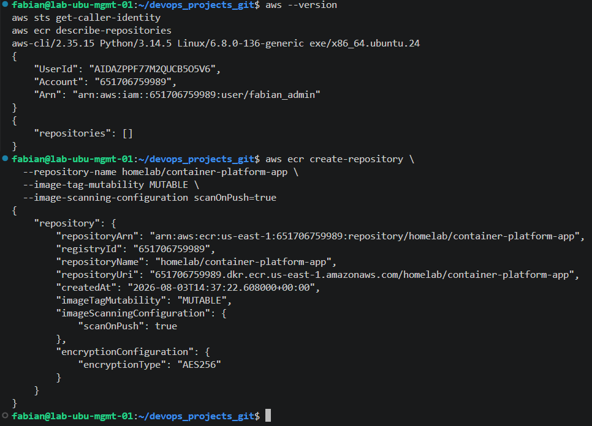
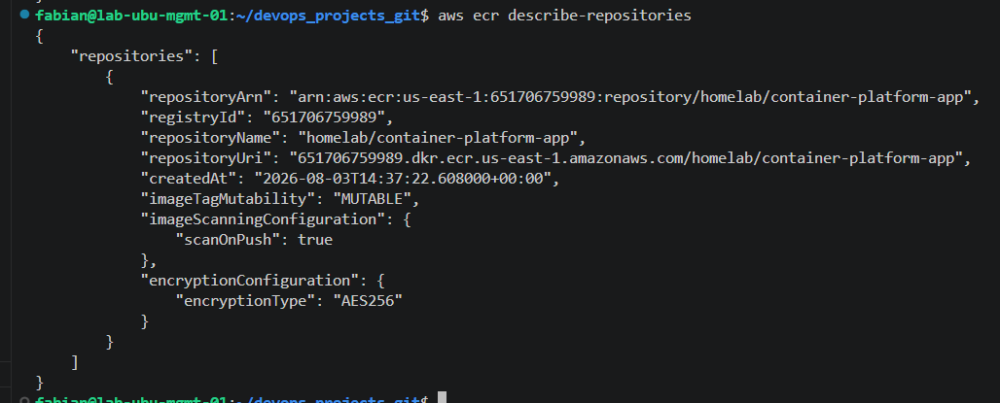
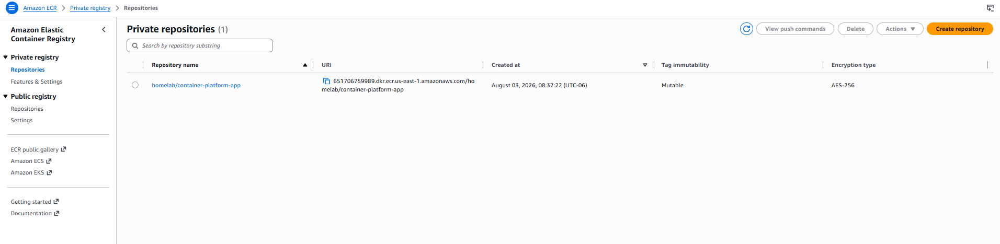
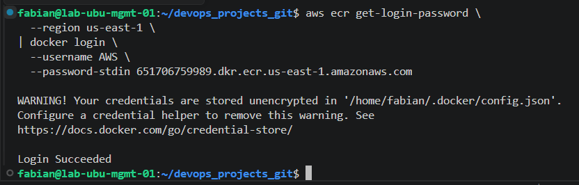
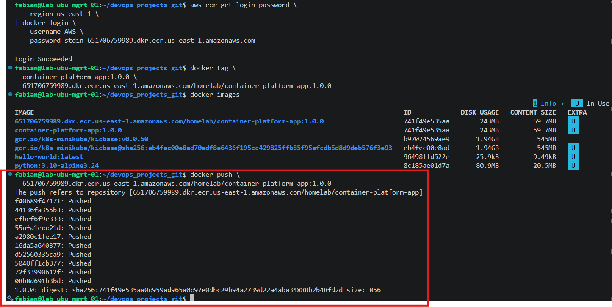
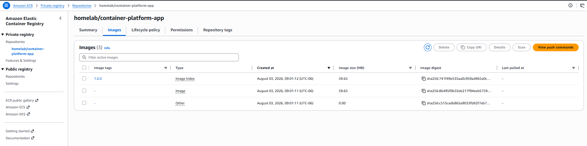
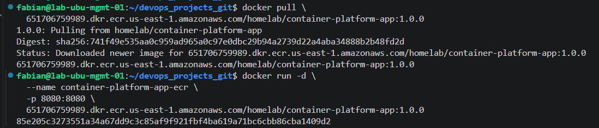
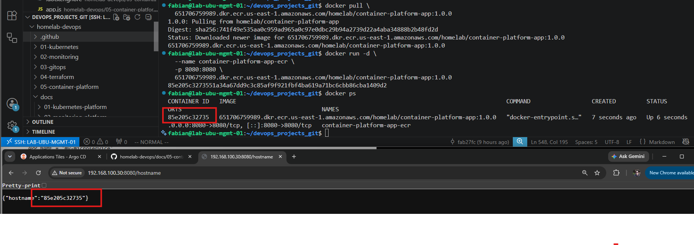

# Amazon Elastic Container Registry (Amazon ECR)

## Overview

This lab demonstrates how to publish Docker images to Amazon Elastic Container Registry (Amazon ECR).

Amazon ECR is a fully managed private container registry service that securely stores, manages, and distributes Docker container images. It integrates natively with Amazon ECS, Amazon EKS, and other container platforms.

During this lab, the Container Platform application was tagged, uploaded to Amazon ECR, downloaded back to the local environment, and executed successfully, validating the complete image lifecycle.

---

# Objectives

After completing this lab, the following objectives were achieved:

- Create a private Amazon ECR repository.
- Configure Docker authentication with Amazon ECR.
- Tag Docker images using an ECR repository URI.
- Push Docker images to Amazon ECR.
- Verify images through the AWS Console.
- Pull Docker images from Amazon ECR.
- Run containers using images stored in Amazon ECR.
- Validate the complete container image lifecycle.

---

# Prerequisites

The following requirements were completed before starting this lab:

- AWS CLI installed and configured.
- Docker Engine installed.
- AWS IAM user with Amazon ECR permissions.
- Container Platform application built successfully.
- Docker image `container-platform-app:1.0.0` available locally.

---

# Architecture

The following workflow was implemented during this lab.

```text
Container Platform Application
            │
            ▼
Docker Image
            │
            ▼
Amazon Elastic Container Registry (ECR)
            │
            ▼
Docker Pull
            │
            ▼
Running Container
```

---

# Creating the ECR Repository

A private Amazon ECR repository was created using the AWS CLI.

Repository configuration:

- Repository name: `homelab/container-platform-app`
- Tag mutability: Mutable
- Scan on push: Enabled

This repository stores the application images that will later be deployed to Amazon ECS and Amazon EKS.

---

# Verifying the Repository

The repository was verified using both the AWS CLI and the AWS Management Console.

Verification confirmed:

- Repository creation
- Repository URI
- Encryption configuration
- Image scanning configuration

---

# Docker Authentication

Docker was authenticated against Amazon ECR using temporary authentication credentials generated by AWS CLI.

This authentication allows Docker to push and pull images securely without storing permanent credentials.

---

# Tagging the Docker Image

The local Docker image was tagged using the Amazon ECR repository URI.

This created an additional image reference without duplicating the image itself.

The original local image remained available while the new ECR tag was prepared for upload.

---

# Pushing the Image

The Docker image was uploaded successfully to Amazon ECR.

After the upload completed, the image became available within the private repository and was ready for deployment.

The uploaded image version was:

`container-platform-app:1.0.0`

---

# Verifying the Image in AWS

The uploaded image was verified using the AWS Management Console.

The following information was confirmed:

- Image tag
- Image digest
- Image size
- Push timestamp

This verification confirms that the upload process completed successfully.

---

# Pulling the Image

The image was successfully downloaded from Amazon ECR using Docker.

This validation confirmed that the image stored in Amazon ECR could be retrieved and executed from any Docker host with the appropriate permissions.

The pull operation also verified that the image layers were correctly stored inside the repository.

---

# Running the Container from ECR

After downloading the image, a new Docker container was created directly from the Amazon ECR repository.

The application started successfully and all REST API endpoints responded correctly.

Validation included:

- Home page
- Health endpoint
- Version endpoint
- Environment endpoint
- Hostname endpoint

The hostname endpoint confirmed that the application was running inside a Docker container downloaded from Amazon ECR.

---

# Screenshots

The following screenshots were captured during the successful completion of this lab.

---

## Create Repository

The following screenshot shows the successful creation of the Amazon ECR private repository using AWS CLI.



---

## Repository Verification (AWS CLI)

The following screenshot verifies that the repository was successfully created using the AWS CLI.



---

## Repository Verification (AWS Console)

The following screenshot shows the private repository inside the AWS Management Console.



---

## Docker Login

The following screenshot shows Docker successfully authenticated against Amazon Elastic Container Registry.



---

## Docker Push

The following screenshot shows the Docker image being pushed successfully to Amazon ECR.



---

## Image Available in Amazon ECR

The following screenshot verifies that the Docker image is available inside the Amazon ECR repository.



---

## Docker Pull

The following screenshot shows the Docker image being downloaded successfully from Amazon ECR.



---

## Container Running from Amazon ECR

The following screenshot verifies that the container is running successfully using the image pulled from Amazon ECR.



---

# Best Practices

The following best practices were implemented during this lab:

- Store container images in private repositories.
- Enable image scanning on push.
- Use semantic version tags.
- Keep repositories organized by project.
- Authenticate Docker using temporary AWS credentials.
- Verify pushed images before deployment.
- Avoid using the `latest` tag in production environments.
- Keep repository permissions restricted using IAM.
- Reuse the same image across multiple environments.
- Validate images before deploying to production.

---

# Lessons Learned

This lab introduced the complete lifecycle of storing Docker images in Amazon Elastic Container Registry.

Topics covered include:

- Amazon ECR fundamentals
- Private container registries
- Repository creation
- Docker authentication
- Docker image tagging
- Docker push
- Docker pull
- Image verification
- Image lifecycle
- Integration between Docker and AWS

These concepts provide the foundation required for deploying containerized applications on Amazon ECS and Amazon EKS.

---

# Next Steps

In the next lab, the Docker image stored in Amazon ECR will be deployed using Amazon Elastic Container Service (Amazon ECS).

Topics covered in the next lab include:

- Amazon ECS clusters
- Task Definitions
- ECS Services
- AWS Fargate
- Application Load Balancer
- Container networking
- Automatic container management

The image stored in Amazon ECR will become the deployment artifact used by Amazon ECS.

---

# Conclusion

The Container Platform application was successfully published to Amazon Elastic Container Registry (Amazon ECR).

The image lifecycle was validated from local Docker image creation through repository upload, image download, and successful container execution.

The application is now stored in a secure, private container registry and is ready to be deployed on Amazon ECS and Amazon EKS in the following labs.