# Lab 04 - Amazon Elastic Container Service (ECS)

## Lab Overview

In this lab, a Dockerized Node.js application stored in Amazon Elastic Container Registry (ECR) was deployed to Amazon Elastic Container Service (ECS) using AWS Fargate.

The deployment demonstrates a production-style container platform where AWS manages the underlying infrastructure while the application runs inside serverless containers.

The lab also validates:

- ECS Cluster creation
- ECS Task Definition
- ECS Service deployment
- Amazon ECR image integration
- AWS Fargate
- CloudWatch Logs
- Application validation
- ECS self-healing capability

---

# Architecture

```
Developer
     │
     ▼
Amazon ECR
     │
     ▼
ECS Task Definition
     │
     ▼
Amazon ECS Service
     │
     ▼
AWS Fargate
     │
     ▼
Running Container
     │
     ├────────► CloudWatch Logs
     │
     └────────► Public IP
                     │
                     ▼
            Node.js Application
```

---

# Technologies Used

- Amazon ECS
- AWS Fargate
- Amazon ECR
- Amazon CloudWatch Logs
- Docker
- Node.js
- IAM
- Amazon VPC
- Security Groups

---

# Objectives

The objectives of this lab were:

- Create an Amazon ECS Cluster.
- Configure an ECS Task Definition.
- Deploy a container from Amazon ECR.
- Create an ECS Service.
- Validate application endpoints.
- Configure centralized logging with CloudWatch.
- Demonstrate ECS self-healing capabilities.

---

# Deployment Process

## Step 1

Create the ECS Cluster using AWS Fargate.

---

## Step 2

Create the Task Definition.

Configuration included:

- CPU allocation
- Memory allocation
- Execution Role
- Container Image
- Port Mapping
- CloudWatch Logging

---

## Step 3

Deploy the ECS Service.

The service continuously maintains the desired number of running tasks.

---

## Step 4

Validate the application.

The application became accessible through its public IP address.

---

## Step 5

Validate CloudWatch Logs.

Container logs were successfully collected and centralized in Amazon CloudWatch Logs.

---

## Step 6

Test ECS Self-Healing.

The running task was manually stopped.

Amazon ECS automatically detected the failure and launched a replacement task, ensuring the desired service state remained available.

---

# Validation

The following application endpoints were successfully tested.

## Home Page

```
/
```

---

## Health Endpoint

```
/health
```

Example Response

```json
{
    "status":"healthy",
    "timestamp":"..."
}
```

---

## Version Endpoint

```
/version
```

Example Response

```json
{
    "version":"1.0.0"
}
```

---

## Hostname Endpoint

```
/hostname
```

Example Response

```json
{
    "hostname":"ip-10-0-x-xxx.ec2.internal"
}
```

---

## Environment Endpoint

```
/environment
```

Example Response

```json
{
    "environment":"development",
    "port":8080
}
```

---

# Self-Healing Test

The following procedure was performed:

1. Verify the running ECS Task.
2. Manually stop the running task.
3. Observe the task entering the stopped state.
4. Wait for Amazon ECS to detect the failure.
5. Verify that ECS automatically launches a replacement task.
6. Confirm the application remains available.

Result:

- Service availability maintained.
- Desired task count restored automatically.
- No manual intervention required.

---

# CloudWatch Logging

The application was configured to send logs directly to Amazon CloudWatch Logs.

The following startup logs were successfully collected:

- Application startup
- Node.js execution
- Listening port

This provides centralized logging for monitoring and troubleshooting.

---

# Screenshots

## ecs-create-cluster.png

The Amazon ECS Cluster creation wizard was configured to use AWS Fargate as the compute platform. Enhanced Container Insights were enabled to provide detailed monitoring and observability.

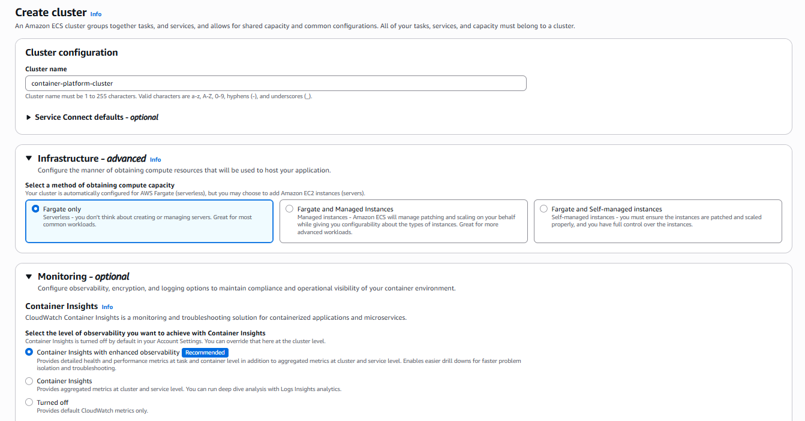

---

## ecs-cluster-created.png

The ECS Cluster was successfully created and is ready to host Task Definitions and Services.

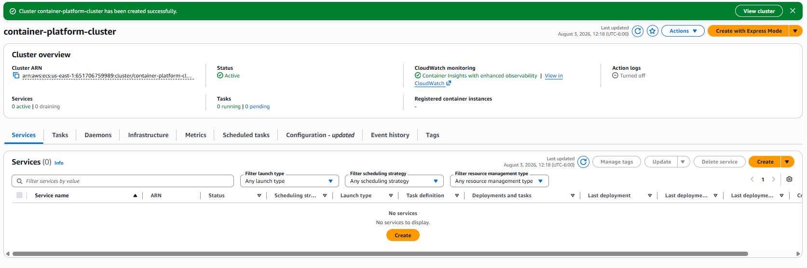

---

## ecs-task-definition-created.png

The Task Definition was successfully created, defining the container image, CPU allocation, memory allocation, networking mode, execution role, and logging configuration.

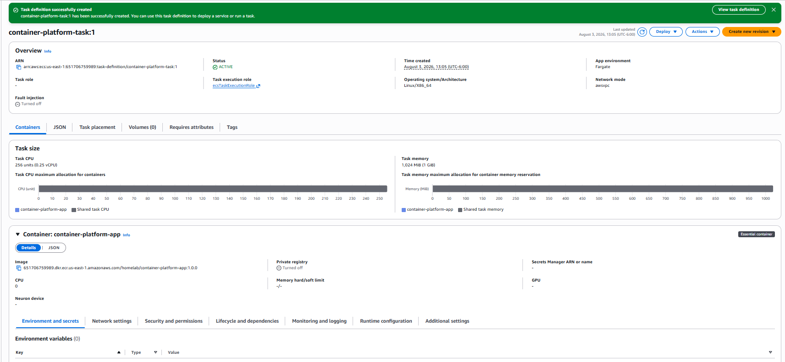

---

## ecs-task-definition-configuration.png

The Task Definition configuration shows the container image stored in Amazon ECR, resource allocation, runtime configuration, and environment settings used by the application.

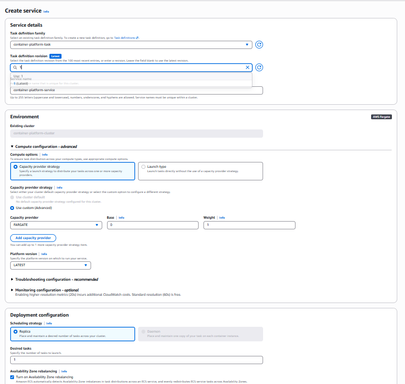

---

## ecs-service-deploying.png

The ECS Service deployment was initiated. During this stage, Amazon ECS launched the first Fargate task using the configured Task Definition.

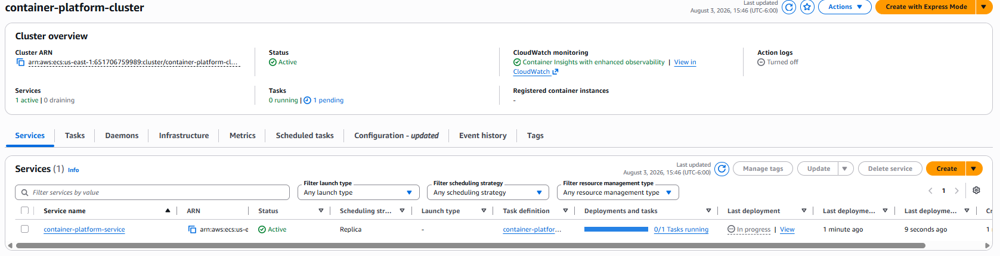

---

## ecs-service-running.png

The ECS Service successfully reached the desired state with one healthy running task managed by AWS Fargate.

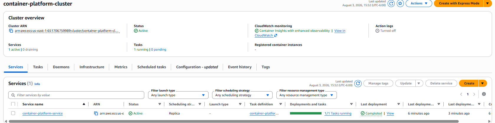

---

## ecs-application-home-page.png

The web application was successfully deployed and became publicly accessible through the public IP assigned to the running Fargate task.

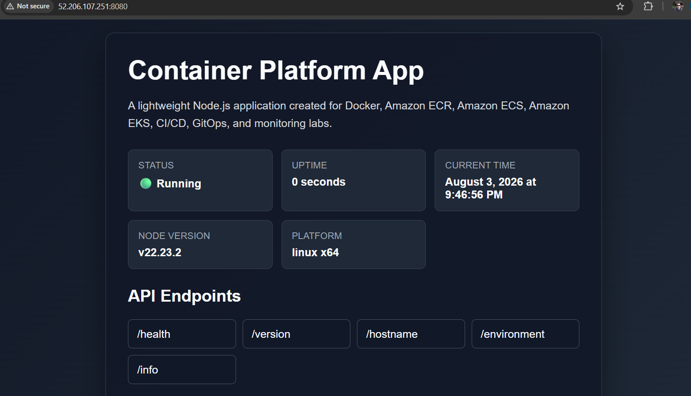

---

## ecs-application-health-endpoint.png

The `/health` endpoint confirmed that the application was running correctly and responding to health check requests.

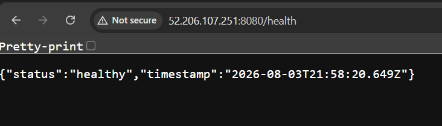

---

## ecs-application-version-endpoint.png

The `/version` endpoint verified that version **1.0.0** of the application was successfully deployed.

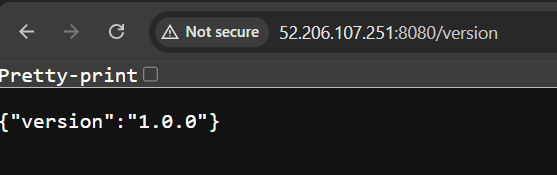

---

## ecs-application-hostname-endpoint.png

The `/hostname` endpoint displayed the internal hostname assigned to the running container, confirming that the request was being served by the active ECS task.

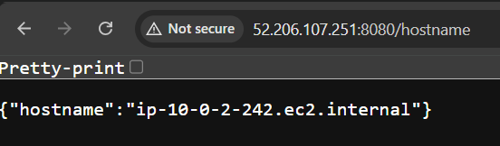

---

## ecs-application-environment-endpoint.png

The `/environment` endpoint returned the runtime environment variables configured for the application, including the deployment environment and listening port.

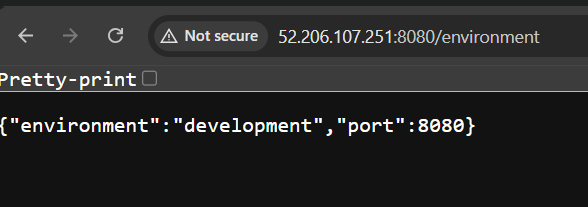

---

## ecs-cloudwatch-logs.png

Container logs were automatically forwarded to Amazon CloudWatch Logs, allowing centralized log collection, troubleshooting, and monitoring.

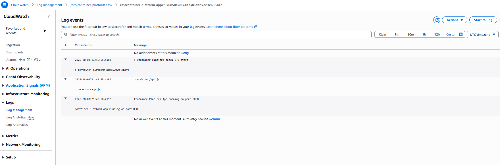

---

## ecs-self-healing-before.png

The ECS Service was operating normally with one running task before initiating the self-healing validation test.

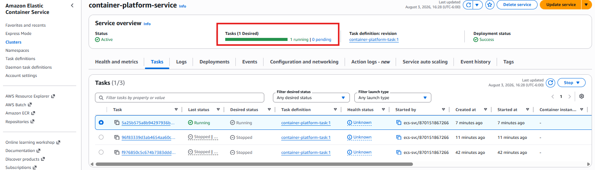

---

## ecs-task-stopped.png

The running ECS task was manually stopped to simulate an unexpected application failure.

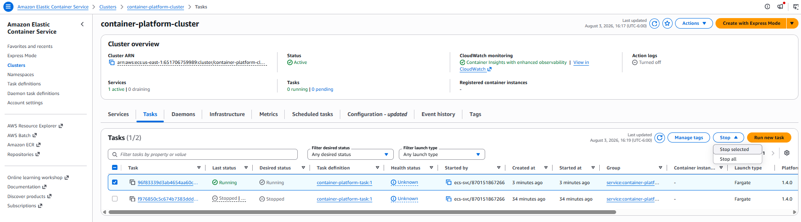

---

## ecs-task-recreated.png

Amazon ECS automatically detected the stopped task and launched a replacement task to restore the desired service state, demonstrating the platform's built-in self-healing capability.

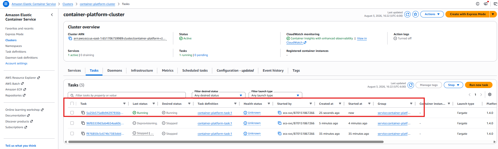

---

# Best Practices

The following best practices were implemented during this lab:

- Store container images in Amazon ECR.
- Use AWS Fargate to avoid managing EC2 instances.
- Use Task Definitions to version container deployments.
- Configure centralized logging using CloudWatch Logs.
- Assign IAM Execution Roles following the principle of least privilege.
- Validate application health using dedicated endpoints.
- Deploy services instead of standalone tasks for automatic recovery.
- Keep container images versioned for future rolling deployments.

---

# Skills Demonstrated

- Amazon ECS
- AWS Fargate
- Amazon ECR
- CloudWatch Logs
- Docker
- Container orchestration
- Task Definitions
- ECS Services
- IAM Roles
- VPC Networking
- Security Groups
- Self-Healing Containers
- Application Validation

---

# Key Takeaways

Throughout this lab, Amazon ECS demonstrated how containerized applications can be deployed without managing the underlying infrastructure by using AWS Fargate.

Using Task Definitions and ECS Services simplifies container lifecycle management while providing built-in capabilities such as automatic recovery, centralized logging, and seamless integration with other AWS services.

The integration with Amazon ECR allowed the application image to be securely stored and deployed, while Amazon CloudWatch Logs provided centralized visibility into the application's runtime behavior.

The self-healing validation confirmed that ECS continuously monitors running tasks and automatically replaces failed containers to maintain the desired service state.

This lab provides a strong foundation for building scalable, highly available, and production-ready containerized workloads on AWS.

---

# Conclusion

In this lab, a complete container deployment workflow was implemented using Amazon ECS and AWS Fargate.

The application image was built with Docker, stored in Amazon ECR, deployed through an ECS Task Definition, and managed by an ECS Service running on AWS Fargate.

CloudWatch Logs successfully centralized application logs, and multiple application endpoints were validated to confirm correct functionality.

Finally, the self-healing capabilities of Amazon ECS were verified by intentionally stopping a running task and observing how ECS automatically launched a replacement task to restore the desired service state.

This lab demonstrates the core concepts required to deploy, manage, monitor, and maintain containerized applications using Amazon ECS in a production-oriented environment.