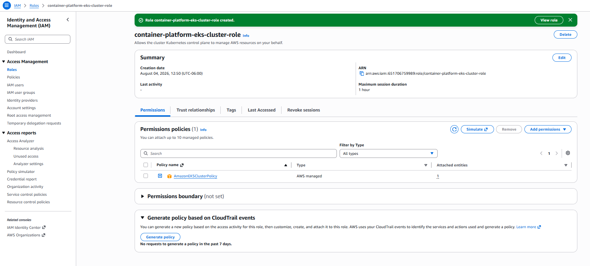
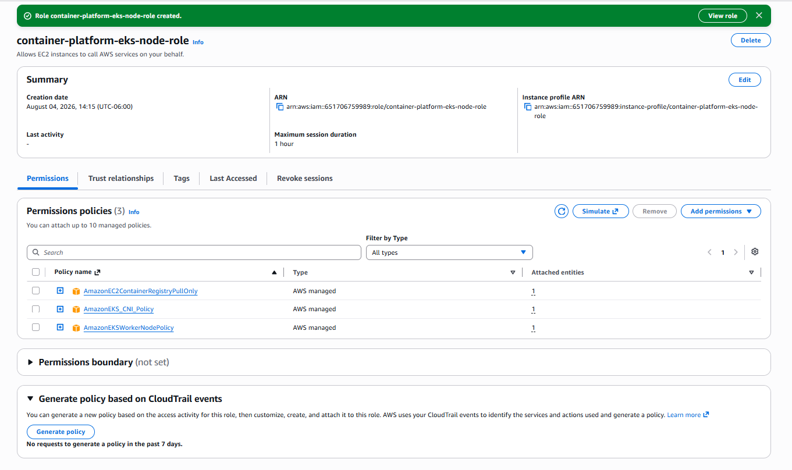
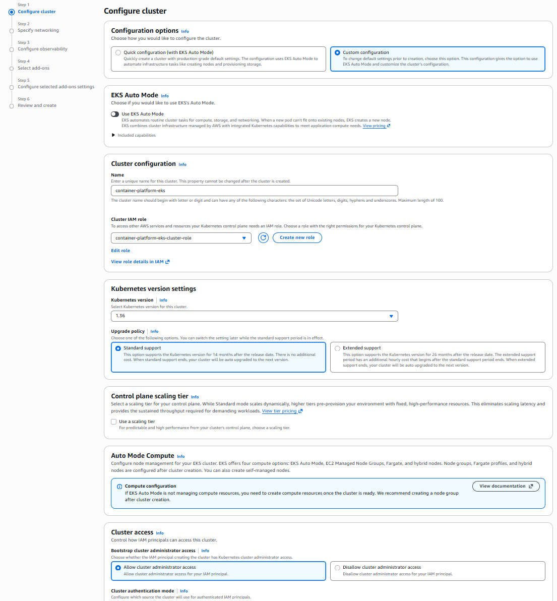
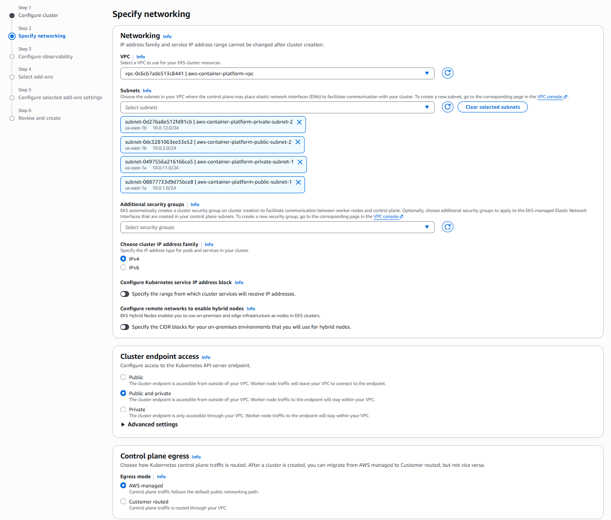
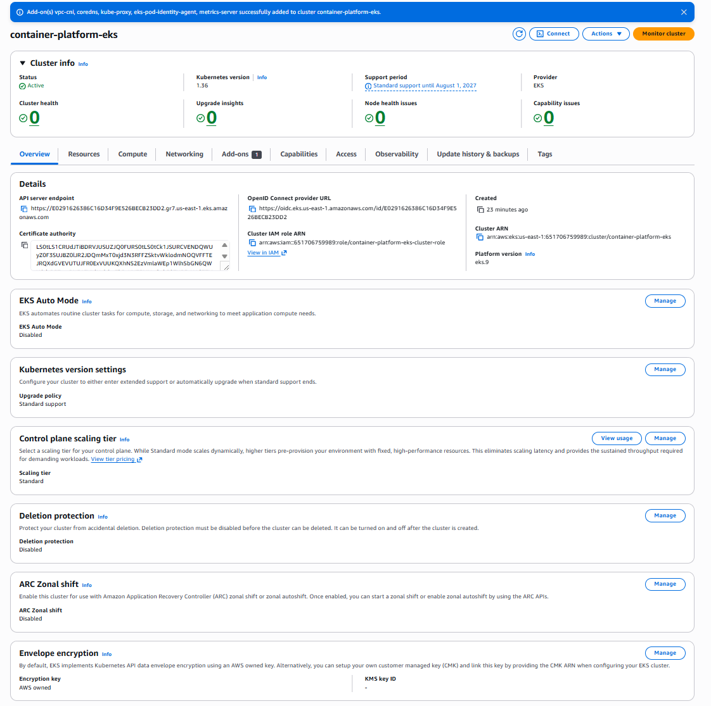

# Amazon Elastic Kubernetes Service (EKS)

## Objective

Deploy a managed Kubernetes control plane using Amazon Elastic Kubernetes Service (EKS). Configure networking, IAM roles, cluster logging, Kubernetes add-ons, and create a production-ready Kubernetes cluster that will be used in the following labs.

---

# Architecture

Client
↓

Amazon EKS Control Plane
↓

Amazon VPC

• Public Subnets
• Private Subnets

↓

Worker Nodes (Next Lab)

↓

Pods
Services
Ingress

---

# Technologies Used

- Amazon EKS
- Kubernetes 1.36
- Amazon VPC
- IAM
- CloudWatch Logs
- CoreDNS
- kube-proxy
- Amazon VPC CNI
- Metrics Server
- Pod Identity Agent

---

# Creating the Cluster IAM Role

A dedicated IAM Role was created for the Kubernetes Control Plane.

The role allows Amazon EKS to manage AWS resources required by the cluster.

Policy attached:

- AmazonEKSClusterPolicy

---

# Creating the Worker Node IAM Role

A separate IAM Role was created for the worker nodes.

Policies attached:

- AmazonEKSWorkerNodePolicy
- AmazonEC2ContainerRegistryPullOnly
- AmazonEKS_CNI_Policy

---

# Configuring the EKS Cluster

The cluster was created using the custom configuration wizard.

Configuration:

- Kubernetes Version 1.36
- Standard Support
- EKS Auto Mode Disabled
- Authentication Mode: EKS API
- Bootstrap Cluster Administrator Access Enabled

---

# Networking Configuration

The cluster was deployed inside the existing AWS networking infrastructure.

Configuration:

- Existing VPC
- Two Public Subnets
- Two Private Subnets
- IPv4
- Public and Private API Endpoint
- AWS Managed Control Plane Egress

---

# Observability

Control Plane Logs enabled:

- API Server
- Audit
- Authenticator
- Controller Manager
- Scheduler

Network Observability:

Disabled

---

# Kubernetes Add-ons

The following managed add-ons were installed:

- Amazon VPC CNI
- CoreDNS
- kube-proxy
- Metrics Server
- Amazon EKS Pod Identity Agent

---

# Creating the Cluster

After reviewing the configuration, the cluster was created.

The provisioning process automatically deployed:

- Kubernetes Control Plane
- Networking
- IAM Integration
- Add-ons
- API Endpoint

---

# Cluster Validation

After several minutes, the cluster reached the Active state.

The following items were validated:

- Cluster Status: Active
- Kubernetes Version
- API Endpoint
- Cluster ARN
- Cluster IAM Role
- Certificate Authority
- OpenID Connect Provider

---

# Screenshots

## eks-cluster-role-created.png

---

## eks-node-role-created.png

---

## eks-cluster-basic-configuration.png

---

## eks-network-configuration.png

---

## eks-create-cluster-1.png

---

## eks-create-cluster-2.png

---

## eks-cluster-active.png

---

# Best Practices

The following best practices were implemented during this lab:

- Separate the Control Plane IAM Role from the Worker Node IAM Role.
- Deploy the cluster inside an existing production VPC.
- Use both Public and Private Subnets.
- Enable Control Plane logging.
- Use AWS managed Kubernetes add-ons.
- Keep Kubernetes versions under standard support.
- Use managed IAM policies instead of custom permissions whenever possible.

---

# Skills Demonstrated

- Amazon EKS
- Kubernetes
- IAM Roles
- Amazon VPC
- Private Networking
- Public Networking
- Kubernetes Control Plane
- CloudWatch Logging
- CoreDNS
- kube-proxy
- Amazon VPC CNI
- Metrics Server
- Pod Identity
- Production Cluster Deployment

---

# Conclusion

A fully managed Amazon EKS cluster was successfully deployed using AWS best practices.

The cluster is now operational and ready for the next phase of the container platform, where worker nodes, Kubernetes workloads, Deployments, Services, Ingress resources, and application deployments will be configured.