# Lab 07 — Helm Package Manager

## Introduction

Helm is the official package manager for Kubernetes.

Instead of manually creating multiple Kubernetes YAML manifests, Helm allows engineers to package, install, upgrade, rollback, and manage applications using reusable templates called Charts.

In production environments, Helm is widely used because it simplifies application deployment, version control, upgrades, and rollback operations while keeping Kubernetes resources organized.

During this lab, Helm was installed, configured, and used to deploy an NGINX application into an existing Amazon EKS cluster.

---

# Lab Objectives

At the end of this lab the following objectives were completed:

- Verify the Helm installation.
- Configure Helm repositories.
- Search available application charts.
- Install an NGINX Helm Chart.
- Inspect the deployed release.
- Export default chart values.
- Create custom values.
- Upgrade an existing release.
- Review release history.
- Perform a rollback.
- Remove a release from the cluster.

---

# Environment

Platform:

- AWS
- Amazon EKS
- Kubernetes v1.36
- Helm v3
- Ubuntu Management Server

Application:

- Bitnami NGINX Chart

---

# Verify Helm Installation

The Helm client was verified before installing any application.

```bash
helm version
```

Expected output:

- Helm Version
- Build information
- Go version

---

# Add Helm Repository

The Bitnami repository was already configured and updated.

```bash
helm repo update
```

The configured repositories were verified.

```bash
helm repo list
```

---

# Search Available Charts

Available NGINX charts were searched.

```bash
helm search repo nginx
```

The Bitnami NGINX chart was selected for deployment.

---

# Install the Helm Chart

A dedicated namespace was created.

```bash
kubectl create namespace helm-demo
```

The application was deployed.

```bash
helm install nginx-demo bitnami/nginx \
--namespace helm-demo
```

Helm generated Release information including:

- Release Name
- Chart Version
- Application Version
- Deployment Status

---

# Verify the Release

The installed releases were listed.

```bash
helm list -A
```

The release status was inspected.

```bash
helm status nginx-demo -n helm-demo
```

Finally all Kubernetes resources were verified.

```bash
kubectl get all -n helm-demo
```

Resources created by Helm included:

- Deployment
- ReplicaSet
- Pod
- Service

---

# Export Default Values

The complete configuration of the Bitnami chart was exported.

```bash
helm show values bitnami/nginx > values-default.yaml
```

The file was inspected.

```bash
head -40 values-default.yaml
```

This file contains hundreds of configurable options used by the chart.

---

# Create Custom Values

A simplified configuration file was created.

Example:

```yaml
replicaCount: 2

service:
  type: LoadBalancer

resources:
  requests:
    cpu: 100m
    memory: 128Mi

  limits:
    cpu: 250m
    memory: 256Mi
```

Using a separate values file makes deployments reproducible and easier to maintain.

---

# Upgrade the Release

The release was upgraded using the custom configuration.

```bash
helm upgrade nginx-demo bitnami/nginx \
-f custom-values.yaml \
-n helm-demo
```

Helm updated the release without recreating the namespace.

---

# Verify the Upgrade

The deployment was verified after the upgrade.

```bash
kubectl get all -n helm-demo
```

The application continued running successfully using the updated configuration.

---

# Review Release History

Helm stores every deployment revision.

The history was displayed using:

```bash
helm history nginx-demo -n helm-demo
```

Each revision contains:

- Revision number
- Deployment date
- Status
- Description

---

# Rollback the Release

The previous revision was restored.

```bash
helm rollback nginx-demo 1 -n helm-demo
```

After the rollback, the release history was verified again.

```bash
helm history nginx-demo -n helm-demo
```

Helm marked the rollback as a new deployment revision.

---

# Remove the Release

The application can be removed completely.

```bash
helm uninstall nginx-demo -n helm-demo
```

After uninstalling, all Kubernetes resources created by the release are automatically deleted.

Verification:

```bash
kubectl get all -n helm-demo
```

---

# Helm Workflow

```
Helm Repository

        │

        ▼

Search Chart

        │

        ▼

Install Chart

        │

        ▼

Release

        │

        ▼

Deployment

        │

        ▼

Pods + Services

        │

        ▼

Upgrade

        │

        ▼

History

        │

        ▼

Rollback

        │

        ▼

Uninstall
```

---

# Screenshots

## helm-version.png

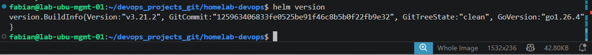

---

## helm-repo-list.png

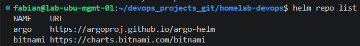

---

## helm-repo-update.png

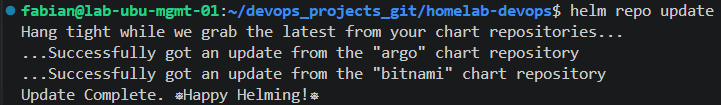

---

## helm-search-nginx.png

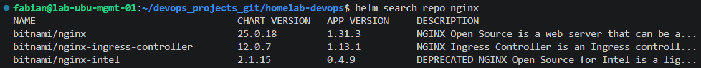

---

## helm-install-nginx.png

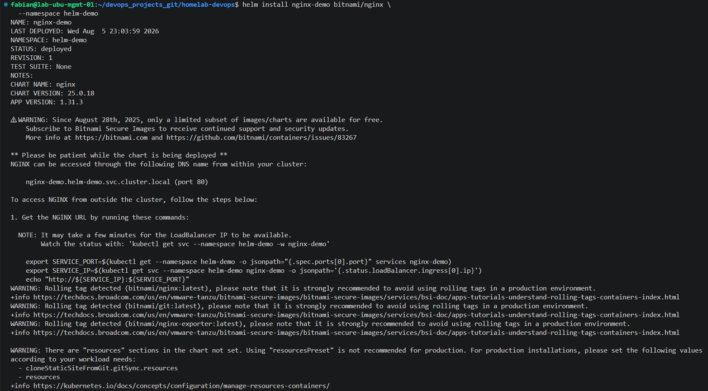

---

## helm-list-releases.png

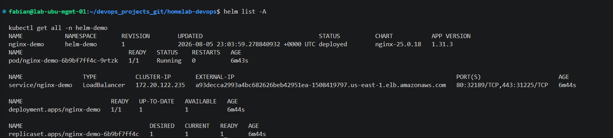

---

## helm-status.png

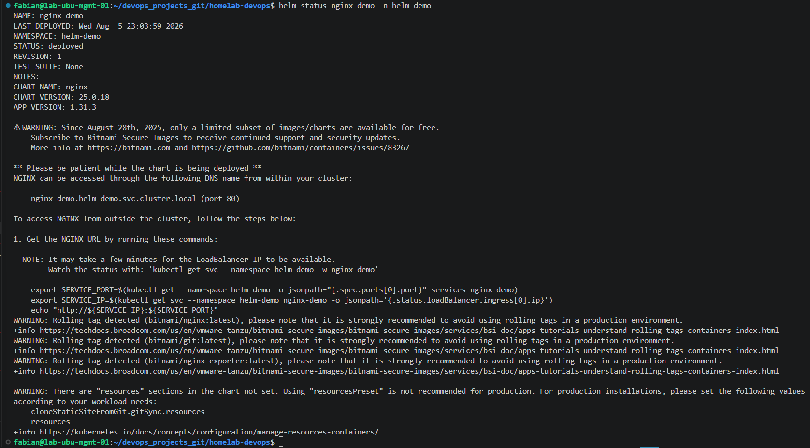

---

## helm-get-all.png

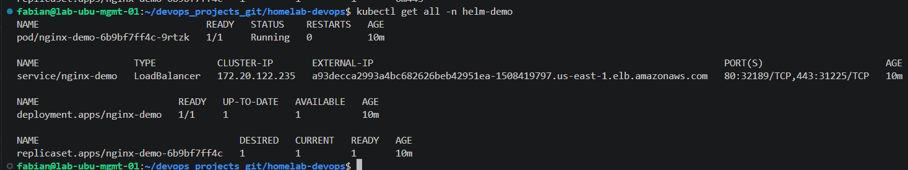

---

## helm-default-values-file.png

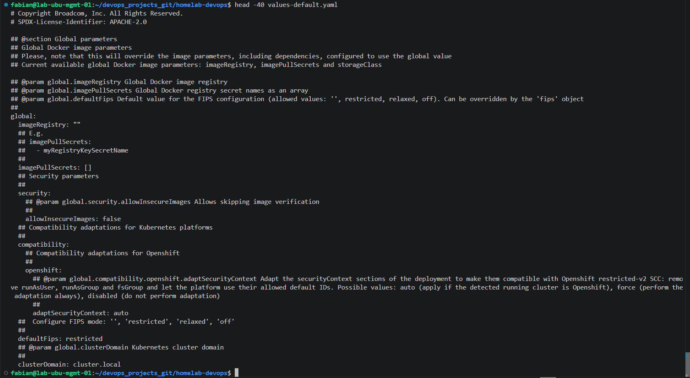

---

## helm-show-values.png

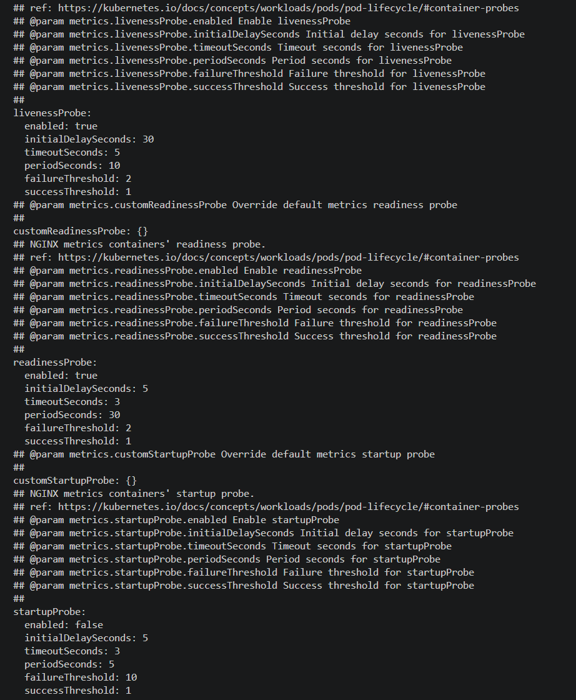

---

## helm-custom-values.png

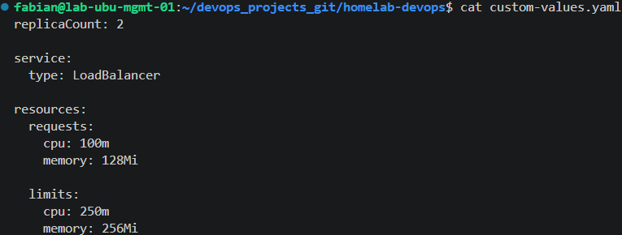

---

## helm-history.png

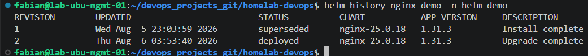

---

## helm-rollback-success.png

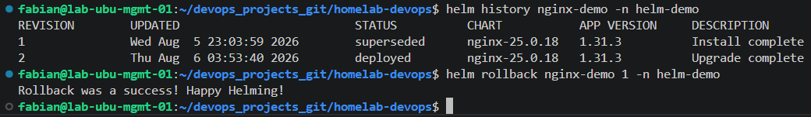

---

## helm-history-after-rollback.png

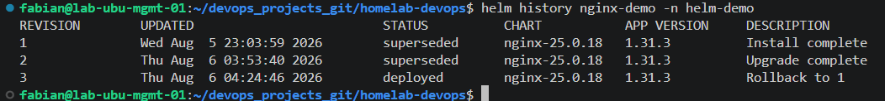

---

## helm-uninstall-release.png

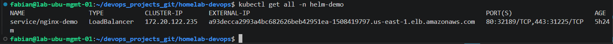

---

# Best Practices

The following best practices were implemented during this lab:

- Use Helm instead of manually managing large collections of YAML manifests.
- Store application configuration inside dedicated values files.
- Keep release history to simplify rollback operations.
- Upgrade applications using immutable Helm revisions.
- Verify deployments after every installation or upgrade.
- Keep Helm repositories updated before deploying new versions.
- Separate application configuration from chart templates.

---

# Skills Demonstrated

- Helm
- Kubernetes
- Amazon EKS
- Helm Repositories
- Helm Charts
- Helm Releases
- Values Files
- Release Upgrades
- Rollbacks
- Kubernetes Deployments
- Kubernetes Services
- Package Management

---

# Conclusion

Helm was successfully integrated with the existing Amazon EKS cluster to simplify Kubernetes application deployment and lifecycle management.

The Bitnami NGINX chart was installed, customized, upgraded, rolled back, and removed, demonstrating how Helm manages Kubernetes applications using reusable charts and versioned releases.

This lab establishes the foundation for deploying more complex applications, implementing GitOps workflows, and managing production-ready Kubernetes environments using Helm.