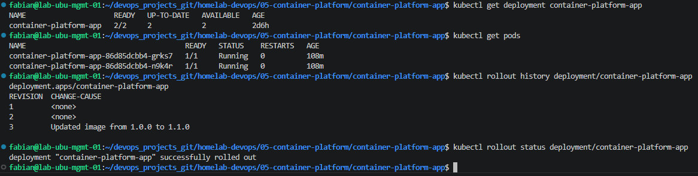
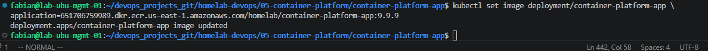
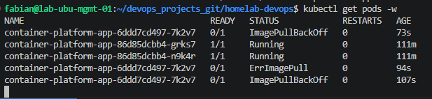
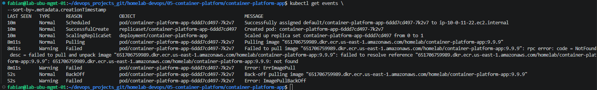
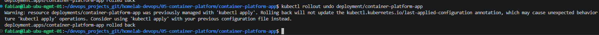
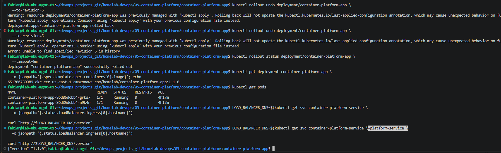

# Lab 11 - Kubernetes Rollbacks

## Introduction

Kubernetes Deployments maintain a revision history that allows applications to be restored after an unsuccessful update.

During a Rolling Update, Kubernetes creates a new ReplicaSet for the updated Pod template. If the new Pods cannot start successfully, the existing healthy Pods continue serving traffic while Kubernetes attempts to complete the deployment.

In this lab, an invalid container image is intentionally assigned to the `container-platform-app` Deployment. The new Pods fail with `ErrImagePull` and `ImagePullBackOff`, and the application is restored to the stable version using Kubernetes rollback functionality.

This lab demonstrates how Kubernetes supports safe application recovery without rebuilding the image, recreating the Deployment, or manually replacing Pods.

---

# Learning Objectives

After completing this lab, you will be able to:

- Understand how Kubernetes stores Deployment revisions.
- Review the rollout history of a Deployment.
- Simulate a failed application deployment.
- Identify `ErrImagePull` and `ImagePullBackOff`.
- Troubleshoot an invalid container image.
- Inspect the image associated with previous revisions.
- Roll back to a specific stable revision.
- Verify that the Deployment and Pods are healthy after recovery.
- Confirm the restored application version through the LoadBalancer.
- Explain how ReplicaSets support Kubernetes rollback operations.

---

# Architecture

```text
Developer
    │
    ▼
Update Deployment Image
    │
    ▼
Invalid ECR Image: 9.9.9
    │
    ▼
Kubernetes Deployment
    │
    ├── Stable ReplicaSet
    │      └── Image 1.1.0
    │          └── Running Pods
    │
    └── Failed ReplicaSet
           └── Image 9.9.9
               └── ImagePullBackOff
    │
    ▼
kubectl rollout undo
    │
    ▼
Stable Revision Restored
    │
    ▼
Application Version 1.1.0
```

---

# Prerequisites

Before starting this lab, the following resources must already exist:

- An active Amazon EKS cluster.
- A functional EKS Managed Node Group.
- `kubectl` configured to access the cluster.
- The `container-platform-app` Deployment.
- Two healthy application Pods.
- A Kubernetes Service named `container-platform-service`.
- An AWS Load Balancer assigned to the Service.
- Amazon ECR repository:
  - `homelab/container-platform-app`
- Stable container image:
  - `1.1.0`
- A successfully completed Rolling Update from Lab 10.

---

# Environment

The following environment was used during this lab:

| Component | Configuration |
|---|---|
| Cloud Provider | AWS |
| Kubernetes Platform | Amazon EKS |
| Deployment | `container-platform-app` |
| Container Name | `application` |
| Stable Image | `container-platform-app:1.1.0` |
| Invalid Image | `container-platform-app:9.9.9` |
| Service | `container-platform-service` |
| Service Type | `LoadBalancer` |
| Namespace | `default` |
| Desired Replicas | `2` |

---

# How Kubernetes Rollbacks Work

Every time the Pod template inside a Deployment changes, Kubernetes creates a new ReplicaSet.

Examples of Pod template changes include:

- Updating the container image.
- Adding environment variables.
- Changing resource requests or limits.
- Modifying labels or annotations.
- Updating container ports.
- Changing readiness or liveness probes.

Kubernetes preserves older ReplicaSets with zero active replicas. These ReplicaSets contain previous Pod templates and make it possible to restore earlier application versions.

The rollback command does not restore an existing Pod. Instead, Kubernetes creates a new Deployment revision based on a previously stored ReplicaSet configuration.

```text
Deployment Revision 5
Image: 1.1.0
        │
        ▼
Deployment Revision 6
Image: 9.9.9
        │
        ▼
Failed Rollout
        │
        ▼
Rollback to Revision 5
        │
        ▼
New Revision Using Image 1.1.0
```

---

# Step 1 - Verify the Initial Deployment State

Before introducing a failure, verify that the Deployment is healthy and that the application is using the stable image.

Run:

```bash
kubectl get deployment container-platform-app
```

Verify the Pods:

```bash
kubectl get pods
```

Review the rollout history:

```bash
kubectl rollout history deployment/container-platform-app
```

Confirm that the Deployment completed its previous rollout:

```bash
kubectl rollout status deployment/container-platform-app
```

Verify the active image:

```bash
kubectl get deployment container-platform-app \
  -o jsonpath='{.spec.template.spec.containers[0].image}'; echo
```

Expected image:

```text
651706759989.dkr.ecr.us-east-1.amazonaws.com/homelab/container-platform-app:1.1.0
```

Expected Deployment condition:

```text
READY: 2/2
UP-TO-DATE: 2
AVAILABLE: 2
```

Both application Pods should appear as:

```text
READY: 1/1
STATUS: Running
```

This establishes a known healthy state before simulating the failed deployment.

## Screenshot



---

# Step 2 - Simulate a Failed Deployment

To simulate an unsuccessful production release, update the Deployment to reference an image tag that does not exist in Amazon ECR.

The invalid image version used in this lab is:

```text
9.9.9
```

Run:

```bash
kubectl set image deployment/container-platform-app \
  application=651706759989.dkr.ecr.us-east-1.amazonaws.com/homelab/container-platform-app:9.9.9
```

Expected output:

```text
deployment.apps/container-platform-app image updated
```

Verify the new image configured in the Deployment:

```bash
kubectl get deployment container-platform-app \
  -o jsonpath='{.spec.template.spec.containers[0].image}'; echo
```

Expected output:

```text
651706759989.dkr.ecr.us-east-1.amazonaws.com/homelab/container-platform-app:9.9.9
```

The `kubectl set image` command updates the Deployment specification immediately. However, Kubernetes can only determine whether the image exists when the worker nodes attempt to pull it.

At this point:

- The Deployment configuration contains version `9.9.9`.
- Kubernetes creates a new ReplicaSet.
- The new ReplicaSet begins creating replacement Pods.
- The previous healthy Pods remain available during the rollout.

## Screenshot



---

# Step 3 - Observe the Failed Rollout

Watch the Pods while Kubernetes attempts to start containers from the invalid image:

```bash
kubectl get pods -w
```

The newly created Pod progresses through several states:

```text
Pending
ContainerCreating
ErrImagePull
ImagePullBackOff
```

The important states are:

### ErrImagePull

Kubernetes attempted to download the container image, but the operation failed.

Possible causes include:

- The image tag does not exist.
- The repository name is incorrect.
- The registry cannot be reached.
- The worker node lacks permissions to pull the image.
- Authentication with the registry failed.

### ImagePullBackOff

Kubernetes continues retrying the image pull but increases the delay between attempts.

The term `BackOff` means Kubernetes temporarily waits before attempting the operation again.

During this failure:

- The new ReplicaSet cannot provide healthy Pods.
- Kubernetes does not complete the Rolling Update.
- The previous stable Pods continue running.
- The Service continues routing traffic to healthy endpoints.

This behavior helps prevent complete application downtime during a failed update.

## Screenshot



---

# Step 4 - Verify the Failed Rollout

Check the rollout status:

```bash
kubectl rollout status deployment/container-platform-app \
  --timeout=2m
```

Because the new Pods cannot start, the rollout eventually fails or exceeds its progress deadline.

Possible output:

```text
error: deployment "container-platform-app" exceeded its progress deadline
```

Verify the current Deployment state:

```bash
kubectl get deployment container-platform-app
```

Verify the Pods:

```bash
kubectl get pods
```

The output should show:

- Existing stable Pods in `Running`.
- A new Pod in `ImagePullBackOff`.
- The Deployment unable to reach the desired updated replica count.

To inspect the failure in more detail, obtain the name of the failed Pod:

```bash
kubectl get pods
```

Then describe it:

```bash
kubectl describe pod <FAILED_POD_NAME>
```

Review the `Events` section at the bottom of the output.

Typical messages include:

```text
Failed to pull image
ErrImagePull
ImagePullBackOff
manifest unknown
not found
```

You can also display recent events in chronological order:

```bash
kubectl get events \
  --sort-by=.metadata.creationTimestamp
```

These events confirm that the failed rollout was caused by the nonexistent `9.9.9` image.

## Screenshot



---
# Step 5 - Review Deployment History

Kubernetes Deployments automatically maintain a revision history every time the Pod template changes.

Each revision is stored as a ReplicaSet, allowing administrators to restore previous application versions without rebuilding container images or modifying Kubernetes manifests.

Display the Deployment history.

```bash
kubectl rollout history deployment/container-platform-app
```

Example output:

```text
REVISION  CHANGE-CAUSE
1         <none>
2         <none>
5         <none>
6         <none>
```

Review the configuration stored in each revision.

```bash
kubectl rollout history deployment/container-platform-app --revision=2

kubectl rollout history deployment/container-platform-app --revision=5

kubectl rollout history deployment/container-platform-app --revision=6
```

During this lab, the revisions represented the following application versions.

| Revision | Container Image | Status |
|----------|-----------------|--------|
| 2 | container-platform-app:1.0.0 | Previous Stable Release |
| 5 | container-platform-app:1.1.0 | Stable Release |
| 6 | container-platform-app:9.9.9 | Failed Deployment |

Revision **6** references the invalid image that caused the rollout failure.

Revision **5** contains the last healthy application version and will be restored during the rollback.

Understanding Deployment revisions is critical because Kubernetes Rollbacks simply restore one of these previously stored ReplicaSets.

## Screenshot


---

# Step 6 - Perform the Rollback

Restore the previous working Deployment.

```bash
kubectl rollout undo deployment/container-platform-app
```

If multiple revisions exist, Kubernetes also allows restoring a specific revision.

Example:

```bash
kubectl rollout undo deployment/container-platform-app \
  --to-revision=5
```

Monitor the rollback progress.

```bash
kubectl rollout status deployment/container-platform-app \
  --timeout=5m
```

Expected output:

```text
deployment "container-platform-app" successfully rolled out
```

Kubernetes immediately creates a new ReplicaSet using the Pod template stored in Revision 5.

Unlike manually editing the Deployment, the rollback process restores the previous application configuration automatically.

No Docker image needs to be rebuilt and no YAML files need to be modified.

## Screenshot



---

# Step 7 - Verify the Restored Deployment

Verify that the Deployment now references the previous stable image.

```bash
kubectl get deployment container-platform-app \
  -o jsonpath='{.spec.template.spec.containers[0].image}'; echo
```

Expected output:

```text
651706759989.dkr.ecr.us-east-1.amazonaws.com/homelab/container-platform-app:1.1.0
```

Verify the Pods.

```bash
kubectl get pods
```

Expected output:

```text
NAME                                    READY   STATUS    RESTARTS

container-platform-app-xxxxx            1/1     Running   0

container-platform-app-yyyyy            1/1     Running   0
```

Verify that the Deployment has completed successfully.

```bash
kubectl rollout status deployment/container-platform-app
```

Expected output:

```text
deployment "container-platform-app" successfully rolled out
```

The failed ReplicaSet has now been abandoned and Kubernetes has restored the stable version of the application.

## Screenshot



---

# Step 8 - Verify the Application

Retrieve the LoadBalancer hostname.

```bash
LOAD_BALANCER_DNS=$(kubectl get svc container-platform-service \
-o jsonpath='{.status.loadBalancer.ingress[0].hostname}')
```

Display the endpoint.

```bash
echo $LOAD_BALANCER_DNS
```

Verify the application version.

```bash
curl http://$LOAD_BALANCER_DNS/version
```

Expected output:

```json
{
    "version":"1.1.0"
}
```

Verify the application homepage.

```bash
curl http://$LOAD_BALANCER_DNS
```

The application should now be fully operational and serving version **1.1.0**.

This confirms that Kubernetes successfully restored the previous Deployment revision after the failed rollout.

## Screenshot


---
# Kubernetes Concepts Learned

## Kubernetes Deployment

A Deployment is a Kubernetes object responsible for managing the desired state of an application.

Deployments provide several production features including:

- Rolling Updates
- Rollbacks
- ReplicaSet management
- Self-healing
- Desired state reconciliation

Unlike creating Pods directly, Deployments continuously monitor the application and automatically replace failed Pods.

---

## ReplicaSets

Every Deployment revision creates a ReplicaSet.

ReplicaSets are responsible for maintaining the desired number of Pods.

During this lab, Kubernetes maintained multiple ReplicaSets.

```text
Revision 2

Image 1.0.0

↓

ReplicaSet

↓

Pods
```

```text
Revision 5

Image 1.1.0

↓

ReplicaSet

↓

Pods
```

```text
Revision 6

Image 9.9.9

↓

ReplicaSet

↓

ImagePullBackOff
```

The rollback operation restored the ReplicaSet associated with Revision 5.

---

## Rollbacks

A Rollback restores a previous Deployment revision.

Instead of rebuilding containers or editing YAML manifests, Kubernetes simply activates a previously stored ReplicaSet.

Rollback operations are extremely fast because all Deployment revisions are already stored inside the cluster.

Rollback command:

```bash
kubectl rollout undo deployment/container-platform-app
```

Rollback to a specific revision:

```bash
kubectl rollout undo deployment/container-platform-app \
--to-revision=5
```

---

## ErrImagePull

ErrImagePull occurs when Kubernetes attempts to download a container image but fails.

Common causes include:

- Invalid image name
- Invalid image tag
- Repository not found
- Registry unavailable
- Authentication failure

During this lab, the error was intentionally caused by referencing the image:

```text
container-platform-app:9.9.9
```

---

## ImagePullBackOff

ImagePullBackOff is the retry state that follows ErrImagePull.

Instead of continuously requesting the image, Kubernetes waits progressively longer before retrying.

This prevents unnecessary load on the container registry.

---

## Deployment History

Deployment history can be displayed with:

```bash
kubectl rollout history deployment/container-platform-app
```

Each Deployment revision stores:

- Container image
- Environment variables
- Labels
- Annotations
- Resource requests
- Resource limits
- Container ports

This history enables rapid application recovery.

---

# Commands Summary

```bash
kubectl get deployment container-platform-app

kubectl get pods

kubectl rollout history deployment/container-platform-app

kubectl rollout history deployment/container-platform-app --revision=2

kubectl rollout history deployment/container-platform-app --revision=5

kubectl rollout history deployment/container-platform-app --revision=6

kubectl set image deployment/container-platform-app \
application=651706759989.dkr.ecr.us-east-1.amazonaws.com/homelab/container-platform-app:9.9.9

kubectl get pods -w

kubectl get events \
--sort-by=.metadata.creationTimestamp

kubectl describe pod <FAILED_POD_NAME>

kubectl rollout undo deployment/container-platform-app

kubectl rollout undo deployment/container-platform-app \
--to-revision=5

kubectl rollout status deployment/container-platform-app

kubectl get deployment container-platform-app \
-o jsonpath='{.spec.template.spec.containers[0].image}'; echo

kubectl get pods

LOAD_BALANCER_DNS=$(kubectl get svc container-platform-service \
-o jsonpath='{.status.loadBalancer.ingress[0].hostname}')

curl http://$LOAD_BALANCER_DNS/version
```

---

# Troubleshooting

| Problem | Solution |
|----------|----------|
| ErrImagePull | Verify the image name and tag. |
| ImagePullBackOff | Check the image exists in Amazon ECR. |
| Rollout timeout | Inspect Deployment events and Pod logs. |
| Deployment unavailable | Verify ReplicaSets and Pod status. |
| Rollback failed | Restore a specific revision using `--to-revision`. |

---

# Best Practices

During this lab, the following best practices were applied:

- Use semantic image versioning.
- Never deploy using the `latest` tag.
- Verify new images exist before updating Deployments.
- Review Deployment history before performing a rollback.
- Keep ReplicaSets available for recovery.
- Validate application availability after every deployment.
- Monitor rollout progress.
- Investigate Kubernetes events before reverting changes.
- Use Rollbacks instead of manually recreating Deployments.
- Test every application version before promoting it to production.

---

# Skills Demonstrated

This lab demonstrates practical experience with:

- Amazon EKS
- Kubernetes Deployments
- ReplicaSets
- Rolling Updates
- Rollbacks
- Amazon ECR
- Container Image Versioning
- Deployment History
- Kubernetes Events
- ImagePullBackOff Troubleshooting
- ErrImagePull Analysis
- kubectl
- Production Recovery Procedures
- Zero Downtime Deployment Recovery

---

# Conclusion

In this lab, a deployment failure was intentionally introduced by updating the Deployment to a non-existent container image stored in Amazon ECR.

Kubernetes attempted to create a new ReplicaSet but failed to pull the container image, causing the new Pods to enter the `ErrImagePull` and `ImagePullBackOff` states.

Rather than deleting the Deployment or modifying the application configuration manually, Kubernetes restored the previous stable version using the Deployment rollback mechanism.

The rollback successfully recovered the application, restored the original container image (`1.1.0`), and returned all Pods to the `Running` state.

This lab demonstrates one of the most important production capabilities of Kubernetes Deployments and highlights how ReplicaSets enable rapid recovery after unsuccessful application updates.

With this lab completed, the next step is to implement automatic scaling using the Kubernetes Horizontal Pod Autoscaler (HPA).


