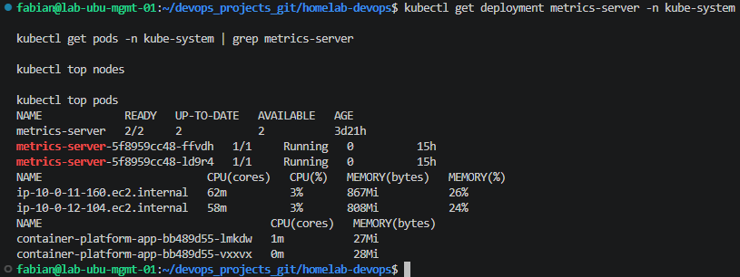
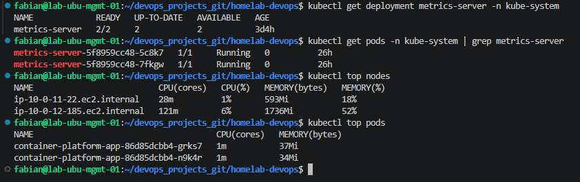
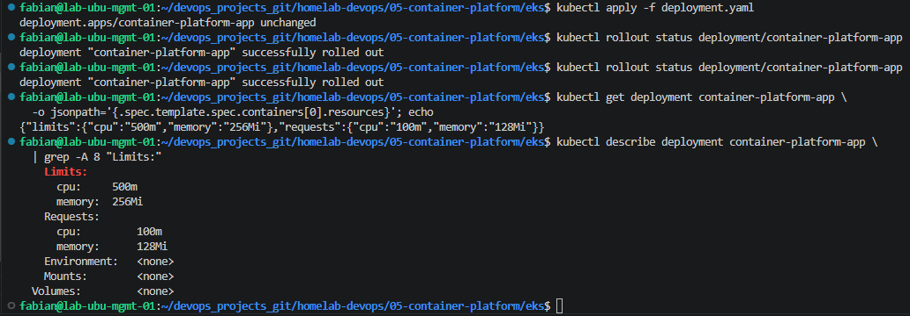
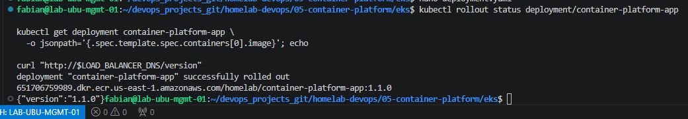

# Lab 12 - Horizontal Pod Autoscaler

## Introduction

The Kubernetes Horizontal Pod Autoscaler automatically adjusts the number of running Pods according to observed resource utilization.

Instead of manually increasing or decreasing replicas, the HPA continuously evaluates application metrics and updates the Deployment replica count when the configured target is exceeded.

In this lab, the `container-platform-app` Deployment is configured with CPU requests and limits. A Horizontal Pod Autoscaler is then created with a minimum of two replicas, a maximum of five replicas, and a CPU utilization target.

Application traffic is generated to increase CPU consumption. Kubernetes automatically scales the application from two Pods to five Pods. After the load is stopped, the HPA waits for the scale-down stabilization period and reduces the Deployment back to two replicas.

---

# Objective

The objective of this lab is to configure and validate automatic Pod scaling in Amazon EKS using the Kubernetes Horizontal Pod Autoscaler.

During this lab, the following tasks are completed:

- Verify that Metrics Server is running.
- Confirm that Node and Pod metrics are available.
- Configure CPU and memory requests.
- Configure CPU and memory limits.
- Create a Horizontal Pod Autoscaler.
- Define minimum and maximum replicas.
- Define a CPU utilization target.
- Generate concurrent application traffic.
- Observe automatic scale-up.
- Observe new Pods being scheduled.
- Stop the application load.
- Observe automatic scale-down.
- Verify the final Deployment state.

---

# Learning Objectives

After completing this lab, you will be able to:

- Explain how the Horizontal Pod Autoscaler works.
- Understand the role of Metrics Server.
- Use `kubectl top` to inspect resource utilization.
- Configure Kubernetes resource requests and limits.
- Create an HPA for an existing Deployment.
- Understand CPU utilization targets.
- Monitor HPA conditions and events.
- Generate application traffic for testing.
- Observe automatic Pod scale-up.
- Observe automatic Pod scale-down.
- Explain the HPA stabilization window.
- Troubleshoot unavailable resource metrics.

---

# Architecture

```text
                         User Traffic
                              |
                              v
                    AWS Load Balancer
                              |
                              v
                  Kubernetes LoadBalancer
                           Service
                              |
                              v
                  container-platform-app
                         Deployment
                              |
                +-------------+-------------+
                |                           |
                v                           v
              Pod 1                       Pod 2
                |                           |
                +-------------+-------------+
                              |
                              v
                       CPU Utilization
                              |
                              v
                       Metrics Server
                              |
                              v
              Horizontal Pod Autoscaler
                              |
                +-------------+-------------+
                |                           |
                v                           v
          Increase Replicas           Decrease Replicas
                |                           |
                v                           v
             Up to 5                    Back to 2
```

---

# Prerequisites

Before starting this lab, the following components must already exist:

- An active Amazon EKS cluster.
- An active EKS Managed Node Group.
- Two Kubernetes Worker Nodes.
- `kubectl` configured for the EKS cluster.
- AWS CLI configured.
- Metrics Server installed.
- The `container-platform-app` Deployment.
- A Kubernetes Service named `container-platform-service`.
- An AWS Load Balancer assigned to the Service.
- Application image version `1.1.0`.
- Prometheus and Grafana deployed in the `monitoring` namespace.

---

# Environment

| Component | Configuration |
|---|---|
| Cloud Provider | AWS |
| Kubernetes Platform | Amazon EKS |
| Namespace | `default` |
| Deployment | `container-platform-app` |
| Container | `application` |
| Service | `container-platform-service` |
| Service Type | `LoadBalancer` |
| Initial Replicas | `2` |
| Minimum Replicas | `2` |
| Maximum Replicas | `5` |
| Initial CPU Target | `50%` |
| Test CPU Target | `10%` |
| CPU Request | `100m` |
| CPU Limit | `500m` |
| Memory Request | `128Mi` |
| Memory Limit | `256Mi` |

---

# How the Horizontal Pod Autoscaler Works

The Horizontal Pod Autoscaler periodically evaluates resource metrics for the Pods managed by a Deployment.

For CPU-based autoscaling, Kubernetes compares actual CPU consumption against the CPU request configured for each container.

Example:

```text
CPU Request:       100m
Current CPU Usage: 20m
CPU Utilization:   20%
```

If the configured HPA target is `10%`, a Pod using `20%` is above the target.

Kubernetes calculates a new desired replica count and updates the Deployment.

```text
Current Replicas: 2
Current CPU:      20%
Target CPU:       10%
Desired Replicas: 4
```

The Deployment then creates new Pods through its ReplicaSet.

When CPU usage later falls below the target, Kubernetes waits for the scale-down stabilization period before reducing replicas. This delay prevents constant scaling up and down during short utilization changes.

---

# Step 1 - Verify Metrics Server

The Horizontal Pod Autoscaler requires resource metrics from Metrics Server.

Verify the Metrics Server Deployment:

```bash
kubectl get deployment metrics-server -n kube-system
```

Expected output:

```text
NAME             READY   UP-TO-DATE   AVAILABLE
metrics-server   2/2     2            2
```

Verify the Metrics Server Pods:

```bash
kubectl get pods -n kube-system | grep metrics-server
```

Expected result:

```text
metrics-server-xxxxxxxxxx-xxxxx   1/1   Running
metrics-server-xxxxxxxxxx-yyyyy   1/1   Running
```

The two running replicas provide availability for the Kubernetes resource metrics API.

## Screenshot



---

# Step 2 - Verify Node and Pod Metrics

Verify that Metrics Server is collecting metrics from the EKS Worker Nodes.

```bash
kubectl top nodes
```

Example output:

```text
NAME                          CPU(cores)   CPU(%)   MEMORY(bytes)   MEMORY(%)
ip-10-0-11-160.ec2.internal   62m          3%       867Mi           26%
ip-10-0-12-104.ec2.internal   58m          3%       808Mi           24%
```

Verify the application Pod metrics:

```bash
kubectl top pods
```

Example output:

```text
NAME                                         CPU(cores)   MEMORY(bytes)
container-platform-app-xxxxxxxxxx-xxxxx      1m           27Mi
container-platform-app-xxxxxxxxxx-yyyyy      1m           28Mi
```

These commands confirm that the Resource Metrics API is operational and that CPU and memory metrics are available for the HPA.

## Screenshot



---

# Step 3 - Configure Resource Requests and Limits

The HPA requires CPU requests to calculate CPU utilization as a percentage.

Update the Deployment manifest:

```bash
cd ~/devops_projects_git/homelab-devops/05-container-platform/eks
```

Open the Deployment file:

```bash
vim deployment.yaml
```

Add the following resources section to the `application` container:

```yaml
resources:
  requests:
    cpu: "100m"
    memory: "128Mi"
  limits:
    cpu: "500m"
    memory: "256Mi"
```

The container configuration should include:

```yaml
containers:
  - name: application
    image: 651706759989.dkr.ecr.us-east-1.amazonaws.com/homelab/container-platform-app:1.1.0

    ports:
      - containerPort: 8080

    resources:
      requests:
        cpu: "100m"
        memory: "128Mi"
      limits:
        cpu: "500m"
        memory: "256Mi"
```

Apply the Deployment manifest:

```bash
kubectl apply -f deployment.yaml
```

Verify the rollout:

```bash
kubectl rollout status deployment/container-platform-app
```

Expected output:

```text
deployment "container-platform-app" successfully rolled out
```

Display the configured resources:

```bash
kubectl get deployment container-platform-app \
  -o jsonpath='{.spec.template.spec.containers[0].resources}'; echo
```

Expected output:

```text
{"limits":{"cpu":"500m","memory":"256Mi"},"requests":{"cpu":"100m","memory":"128Mi"}}
```

Display the resources in a readable format:

```bash
kubectl describe deployment container-platform-app \
  | grep -A 8 "Limits:"
```

Expected output:

```text
Limits:
  cpu:     500m
  memory:  256Mi
Requests:
  cpu:     100m
  memory:  128Mi
```

## Screenshot



---

# Step 4 - Verify the Application Version

Verify that applying the Deployment manifest did not revert the application to an older image.

```bash
kubectl get deployment container-platform-app \
  -o jsonpath='{.spec.template.spec.containers[0].image}'; echo
```

Expected image:

```text
651706759989.dkr.ecr.us-east-1.amazonaws.com/homelab/container-platform-app:1.1.0
```

If the manifest restored image version `1.0.0`, update the Deployment:

```bash
kubectl set image deployment/container-platform-app \
  application=651706759989.dkr.ecr.us-east-1.amazonaws.com/homelab/container-platform-app:1.1.0
```

Wait for the rollout:

```bash
kubectl rollout status deployment/container-platform-app
```

Retrieve the Load Balancer hostname:

```bash
LOAD_BALANCER_DNS=$(kubectl get svc container-platform-service \
  -o jsonpath='{.status.loadBalancer.ingress[0].hostname}')
```

Verify the variable:

```bash
echo "$LOAD_BALANCER_DNS"
```

Test the application version:

```bash
curl "http://$LOAD_BALANCER_DNS/version"
```

Expected response:

```json
{"version":"1.1.0"}
```

## Screenshot



---

# Step 5 - Create the Horizontal Pod Autoscaler

Now create the Horizontal Pod Autoscaler for the application Deployment.

Create the HPA.

```bash
kubectl autoscale deployment container-platform-app \
  --cpu-percent=50 \
  --min=2 \
  --max=5
```

> **Note**
>
> Depending on the Kubernetes version, you may see the following warning:
>
> ```text
> Flag --cpu-percent has been deprecated.
> ```
>
> The Horizontal Pod Autoscaler is still created successfully.

Verify that the HPA exists.

```bash
kubectl get hpa
```

Expected output:

```text
NAME                     REFERENCE                           TARGETS    MINPODS   MAXPODS   REPLICAS
container-platform-app   Deployment/container-platform-app   cpu: 1%/50%   2        5         2
```

Display the HPA details.

```bash
kubectl describe hpa container-platform-app
```

Expected information:

- Current CPU utilization
- Target CPU utilization
- Minimum replicas
- Maximum replicas
- Current replicas

Screenshot

```
hpa-created-and-verified.png
```

---

# Step 6 - Configure the Scaling Threshold

To make the demonstration easier, reduce the CPU utilization target from **50%** to **10%**.

Edit the Horizontal Pod Autoscaler.

```bash
kubectl edit hpa container-platform-app
```

Locate the following section.

```yaml
averageUtilization: 50
```

Change it to:

```yaml
averageUtilization: 10
```

Save and exit the editor.

Verify the new configuration.

```bash
kubectl get hpa container-platform-app
```

Expected output:

```text
TARGETS
cpu: 1%/10%
```

Display the complete configuration.

```bash
kubectl get hpa container-platform-app -o yaml
```

Verify that the HPA now contains:

```yaml
averageUtilization: 10
```

Screenshot

```
hpa-threshold-configured.png
```

---

# Step 7 - Generate Application Traffic

Retrieve the LoadBalancer DNS name.

```bash
LOAD_BALANCER_DNS=$(kubectl get svc container-platform-service \
  -o jsonpath='{.status.loadBalancer.ingress[0].hostname}')
```

Verify the variable.

```bash
echo "$LOAD_BALANCER_DNS"
```

Generate continuous traffic.

```bash
while true
do
  curl -s http://$LOAD_BALANCER_DNS > /dev/null
done
```

Open another terminal window.

Monitor the Horizontal Pod Autoscaler.

```bash
kubectl get hpa container-platform-app -w
```

The CPU utilization should begin increasing.

Example:

```text
TARGETS
cpu: 22%/10%
cpu: 31%/10%
```

As the utilization exceeds the configured threshold, Kubernetes calculates a higher desired replica count.

Screenshot

```
hpa-scaling-up.png
```

---

# Step 8 - Observe New Pods

Open another terminal.

Watch the Pods.

```bash
kubectl get pods -w
```

Expected behavior:

- New Pods enter the Pending state.
- Pods move to ContainerCreating.
- Pods become Running.
- Replica count increases automatically.

Example:

```text
Pending

ContainerCreating

Running
```

The Deployment should eventually reach five running Pods.

Verify the current Deployment.

```bash
kubectl get deployment container-platform-app
```

Expected output:

```text
READY
5/5
```

Display the current Pods.

```bash
kubectl get pods
```

The Deployment should now contain five running Pods.

Screenshot

```
pods-scaling-up.png
```

---

# Step 9 - Observe the Maximum Number of Replicas

Continue monitoring the Horizontal Pod Autoscaler while the application receives continuous traffic.

Display the current HPA status.

```bash
kubectl get hpa
```

Example output:

```text
NAME                     REFERENCE                           TARGETS    MINPODS   MAXPODS   REPLICAS
container-platform-app   Deployment/container-platform-app   cpu: 18%/10%   2        5         5
```

The HPA has reached the configured maximum number of replicas.

Verify the Deployment.

```bash
kubectl get deployment container-platform-app
```

Expected output:

```text
NAME                     READY   UP-TO-DATE   AVAILABLE
container-platform-app   5/5     5            5
```

Verify the running Pods.

```bash
kubectl get pods
```

Five application Pods should now be running.

Display Pod resource utilization.

```bash
kubectl top pods
```

This confirms that Kubernetes successfully increased the number of replicas based on CPU utilization.

Screenshot

```text
hpa-scaled-application.png
```

---

# Step 10 - Stop the Application Load

Stop the traffic generation process.

If the load generator is still running in the terminal, press:

```text
CTRL + C
```

If multiple background jobs were created, terminate them.

```bash
jobs -p | xargs kill
```

Verify that no background jobs remain.

```bash
jobs
```

Expected output:

```text
No jobs
```

The CPU utilization should gradually decrease.

---

# Step 11 - Observe Automatic Scale Down

Monitor the Horizontal Pod Autoscaler.

```bash
kubectl get hpa container-platform-app -w
```

The CPU utilization should eventually fall below the configured threshold.

Example:

```text
cpu: 1%/10%
```

Kubernetes does not immediately remove Pods.

Instead, it waits for the stabilization window before reducing replicas.

This prevents unnecessary scaling activity during temporary traffic fluctuations.

Eventually, the HPA reduces the Deployment from five Pods back to two Pods.

Screenshot

```text
hpa-scaling-down.png
```

---

# Step 12 - Observe Pod Termination

Monitor the Pods.

```bash
kubectl get pods -w
```

Three Pods should enter the **Terminating** state before disappearing.

Example:

```text
Terminating

Terminating

Terminating
```

Only two Pods should remain.

Screenshot

```text
pods-scaling-down.png
```

---

# Step 13 - Verify the Final Cluster State

Verify the Horizontal Pod Autoscaler.

```bash
kubectl get hpa
```

Verify the Deployment.

```bash
kubectl get deployment container-platform-app
```

Verify the running Pods.

```bash
kubectl get pods
```

Display the final Pod metrics.

```bash
kubectl top pods
```

Expected results:

- Two running Pods.
- Deployment Available.
- CPU utilization below the configured threshold.
- Horizontal Pod Autoscaler waiting for future traffic.

Screenshot

```text
hpa-final-state.png
```

---

# Kubernetes Concepts Learned

During this lab, the following Kubernetes concepts were demonstrated.

## Metrics Server

Metrics Server collects CPU and Memory utilization from Kubernetes Nodes and Pods.

The Horizontal Pod Autoscaler depends on these metrics to calculate scaling decisions.

---

## Resource Requests

CPU Requests define the amount of CPU reserved for a container.

The HPA calculates CPU utilization using the configured request value.

Example:

```yaml
requests:
  cpu: 100m
```

---

## Resource Limits

Resource Limits define the maximum amount of CPU and Memory a container may consume.

Example:

```yaml
limits:
  cpu: 500m
```

---

## Horizontal Pod Autoscaler

The Horizontal Pod Autoscaler automatically adjusts the number of Pods according to resource utilization.

The HPA continuously evaluates CPU metrics and updates the Deployment replica count when required.

---

## Scale Up

When CPU utilization exceeded the configured threshold, Kubernetes increased the Deployment from two Pods to five Pods.

---

## Scale Down

After application traffic stopped, Kubernetes waited for the stabilization period before reducing the Deployment back to two Pods.

This behavior prevents unnecessary Pod creation and deletion during short traffic spikes.

---

# Commands Summary

```bash
# Verify Metrics Server
kubectl get deployment metrics-server -n kube-system

kubectl get pods -n kube-system | grep metrics-server

kubectl top nodes

kubectl top pods

# Configure Deployment Resources
kubectl apply -f deployment.yaml

kubectl rollout status deployment/container-platform-app

kubectl describe deployment container-platform-app | grep -A 8 "Limits"

# Verify Application Version
kubectl get deployment container-platform-app \
-o jsonpath='{.spec.template.spec.containers[0].image}'; echo

kubectl set image deployment/container-platform-app \
application=651706759989.dkr.ecr.us-east-1.amazonaws.com/homelab/container-platform-app:1.1.0

kubectl rollout status deployment/container-platform-app

# Create HPA
kubectl autoscale deployment container-platform-app \
--cpu-percent=50 \
--min=2 \
--max=5

kubectl get hpa

kubectl describe hpa container-platform-app

kubectl edit hpa container-platform-app

kubectl get hpa container-platform-app -o yaml

# Generate Traffic
LOAD_BALANCER_DNS=$(kubectl get svc container-platform-service \
-o jsonpath='{.status.loadBalancer.ingress[0].hostname}')

echo $LOAD_BALANCER_DNS

while true
do
    curl -s http://$LOAD_BALANCER_DNS > /dev/null
done

# Monitor Autoscaling
kubectl get hpa container-platform-app -w

kubectl get pods -w

kubectl get deployment container-platform-app

kubectl top pods

# Stop Load
jobs -p | xargs kill

jobs

# Verify Final State
kubectl get hpa

kubectl get deployment

kubectl get pods

kubectl top pods
```

---

# Troubleshooting

## Metrics Server Not Available

Verify that Metrics Server is running.

```bash
kubectl get deployment metrics-server -n kube-system
```

---

## kubectl top Returns an Error

Verify Metrics Server Pods.

```bash
kubectl get pods -n kube-system
```

---

## HPA Shows `<unknown>`

Wait a few seconds for Metrics Server to collect CPU metrics.

Verify again.

```bash
kubectl get hpa
```

---

## HPA Does Not Scale

Possible causes:

- CPU Requests are not configured.
- Metrics Server is unavailable.
- Application CPU usage is below the configured threshold.
- HPA target utilization is too high.

---

## Application Does Not Scale Down

Kubernetes intentionally waits before removing Pods.

This delay is called the **scale-down stabilization window** and prevents constant scaling during temporary traffic spikes.

---

# Best Practices

During this lab, the following best practices were applied.

- Configure CPU Requests for every application.
- Configure CPU Limits for every application.
- Verify Metrics Server before creating an HPA.
- Monitor autoscaling events using `kubectl get hpa`.
- Test scale-up and scale-down behavior.
- Validate application availability after scaling.
- Monitor resource utilization with `kubectl top`.
- Avoid configuring excessively low CPU targets in production.
- Test autoscaling before deploying to production.

---

# Screenshots

| Screenshot | Description |
|------------|-------------|
| Metric-server.png | Metrics Server installed |
| metric-server-verification.png | Verification of Metrics Server |
| metrics-server-running.png | Metrics Server Deployment and Pods |
| hpa-deployment-resources.png | CPU Requests and Limits configured |
| hpa-created-and-verified.png | Horizontal Pod Autoscaler created |
| hpa-threshold-configured.png | CPU utilization threshold updated |
| hpa-application-version-verified.png | Application version verification |
| hpa-scaling-up.png | Horizontal Pod Autoscaler increasing replicas |
| pods-scaling-up.png | New Pods being created |
| hpa-scaled-application.png | Deployment running with maximum replicas |
| hpa-scaling-down.png | Horizontal Pod Autoscaler reducing replicas |
| pods-scaling-down.png | Pods entering the Terminating state |
| hpa-final-state.png | Final cluster state after scaling |

---

# Skills Demonstrated

This lab demonstrates practical experience with:

- Amazon EKS
- Kubernetes Deployments
- Horizontal Pod Autoscaler
- Metrics Server
- CPU Requests
- CPU Limits
- Kubernetes Resource Metrics
- Automatic Pod Scaling
- Scale Up
- Scale Down
- Load Testing
- Application Monitoring
- kubectl
- Production Autoscaling Concepts

---

# Conclusion

In this lab, the Kubernetes Horizontal Pod Autoscaler was configured to automatically adjust the number of application Pods according to CPU utilization.

Metrics Server provided the resource metrics required by the HPA to continuously evaluate application load.

CPU Requests and Limits were configured to enable accurate utilization calculations, and a Horizontal Pod Autoscaler was created with a minimum of two replicas, a maximum of five replicas, and a CPU utilization target.

Application traffic was generated to increase CPU consumption, causing Kubernetes to automatically scale the Deployment from two Pods to five Pods.

After the traffic stopped, Kubernetes waited for the scale-down stabilization period before automatically reducing the Deployment back to two running Pods.

This lab demonstrates one of the core production capabilities of Kubernetes by enabling applications to automatically adapt to changing workloads without manual intervention.

With this lab completed, the Kubernetes platform now includes monitoring, rolling updates, rollbacks, and automatic application scaling.

The next lab focuses on **Prometheus Alertmanager**, where alerts will be generated based on application and infrastructure metrics.


