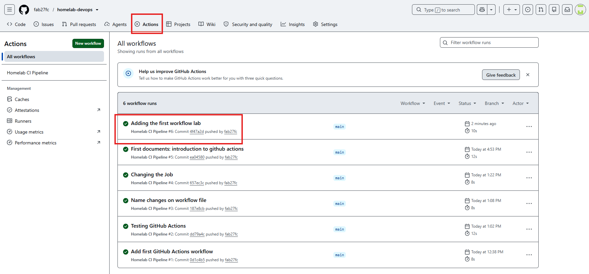

# 02 — First GitHub Actions Workflow

## Objective

Create the first GitHub Actions Workflow and understand how GitHub automatically executes workflows when a specific event occurs.

This lab introduces the basic structure of a GitHub Actions workflow and explains each of its core components.

---

# Prerequisites

Before starting this lab, complete the following:

- Finish Lab 01 – Introduction to GitHub Actions.
- Have a GitHub repository.
- Git installed and configured.
- Push access to the repository.

---

# Lab Overview

In this lab we will create the first GitHub Actions Workflow.

The workflow will execute automatically every time code is pushed to the repository.

Although the workflow only prints a simple message, it introduces the complete execution flow that every CI/CD pipeline follows.

---

# Workflow Architecture

Developer

↓

git push

↓

GitHub Repository

↓

Workflow Trigger

↓

GitHub-hosted Runner

↓

Job

↓

Steps

↓

Workflow Completed

---

# Workflow Location

GitHub automatically searches for Workflow files inside:

```text
.github/workflows/
```

Any YAML file placed inside this directory is recognized as a GitHub Actions Workflow.

---

# Workflow File

Create the following file:

```text
.github/workflows/hello-world.yml
```

---

# Workflow Structure

The workflow created in this lab contains the following sections:

- name
- on
- jobs
- runs-on
- steps
- uses
- run

Each section has a specific responsibility.

---

# Workflow Explanation

## name

Provides a friendly name displayed in the GitHub Actions interface.

Example:

```yaml
name: Hello World Workflow
```

---

## on

Defines which event starts the workflow.

Example:

```yaml
on:
  push:
```

The workflow executes every time a push is made to the repository.

---

## jobs

Defines the work to execute.

A Workflow can contain one or many Jobs.

---

## runs-on

Specifies the operating system where the Job will execute.

Example:

```yaml
runs-on: ubuntu-latest
```

GitHub creates a temporary Ubuntu virtual machine for the execution.

---

## steps

Defines the individual tasks executed inside a Job.

Steps execute sequentially.

---

## uses

Executes a reusable GitHub Action.

Example:

```yaml
uses: actions/checkout@v4
```

This Action downloads the repository into the Runner.

---

## run

Executes shell commands directly inside the Runner.

Example:

```yaml
run: echo "Hello from GitHub Actions!"
```

---

# Complete Workflow

```yaml
name: Hello World Workflow

on:
  push:

jobs:
  hello:

    runs-on: ubuntu-latest

    steps:

      - name: Checkout Repository
        uses: actions/checkout@v4

      - name: Print Message
        run: echo "Hello from GitHub Actions!"
```

---

# Execution Flow

When a developer runs:

```bash
git push
```

GitHub performs the following actions:

1. Detects the push event.
2. Searches for workflows inside `.github/workflows/`.
3. Starts a GitHub-hosted Runner.
4. Downloads the repository.
5. Executes every Step.
6. Displays the results in the Actions tab.

---

# Verification

After pushing the workflow:

1. Open the repository.
2. Select **Actions**.
3. Open the latest Workflow Run.
4. Verify that the Job completed successfully.
5. Review the execution logs.

Expected result:

- Workflow status: Success
- Job status: Success

---

# Screenshot

- GitHub Actions page
- Successful Workflow execution
- Job status

```

```

---

# Key Takeaways

- Workflows are stored inside `.github/workflows/`.
- Events trigger Workflows.
- Jobs contain Steps.
- Runners execute Jobs.
- GitHub-hosted Runners are temporary virtual machines.
- Every push can automatically trigger a CI pipeline.
