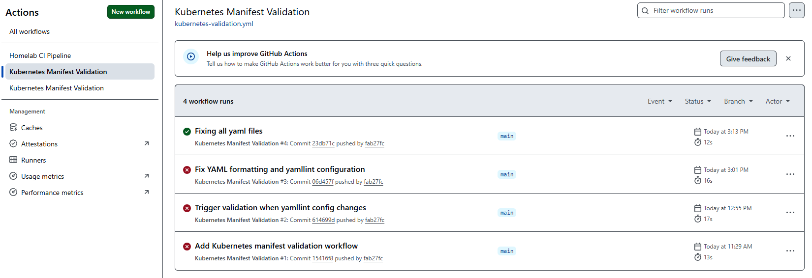
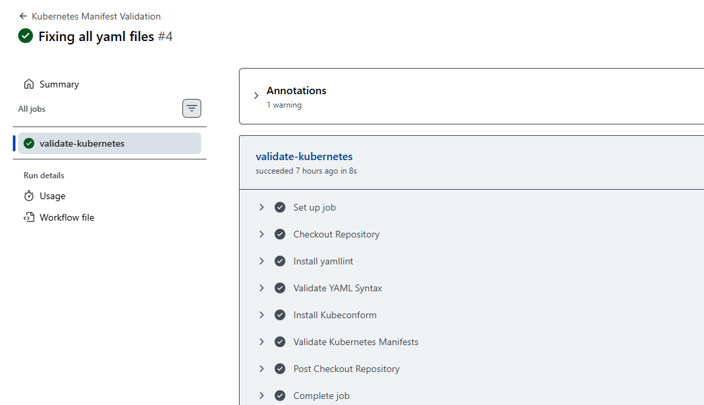
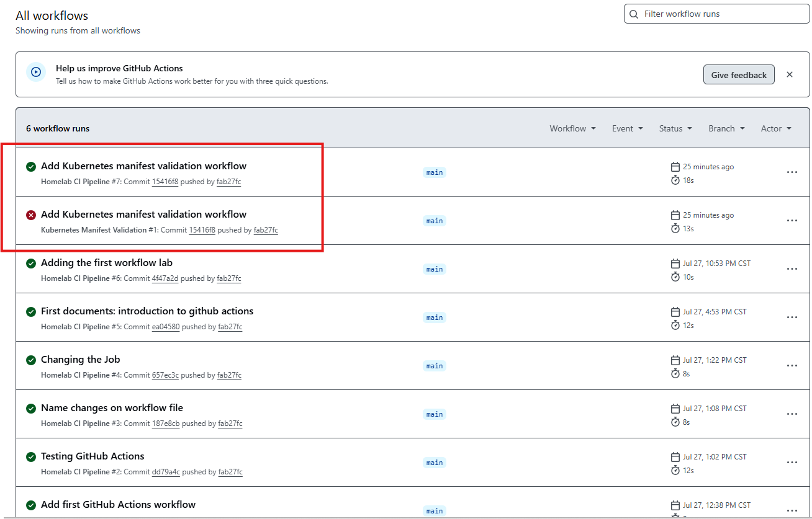
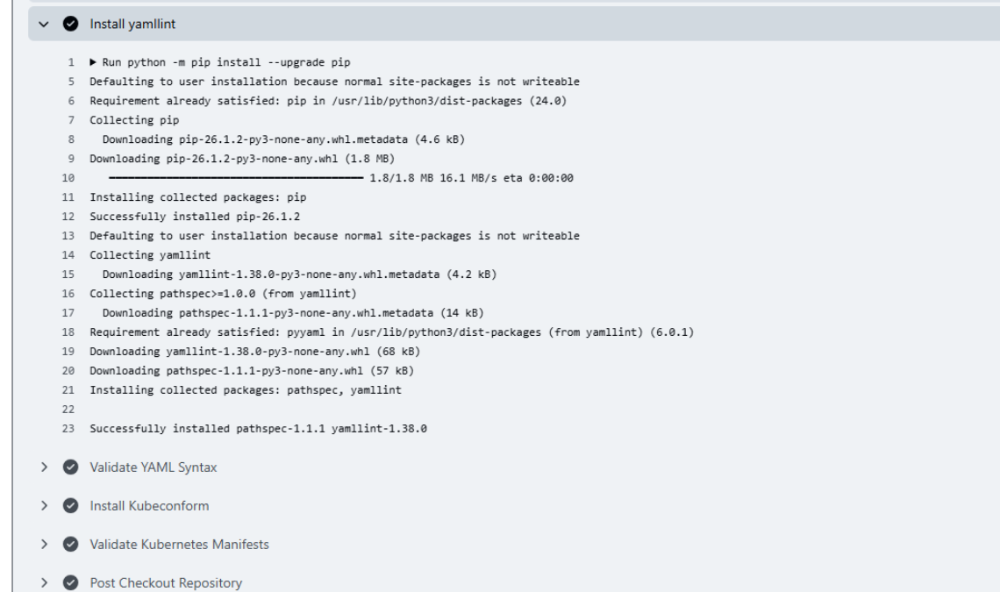
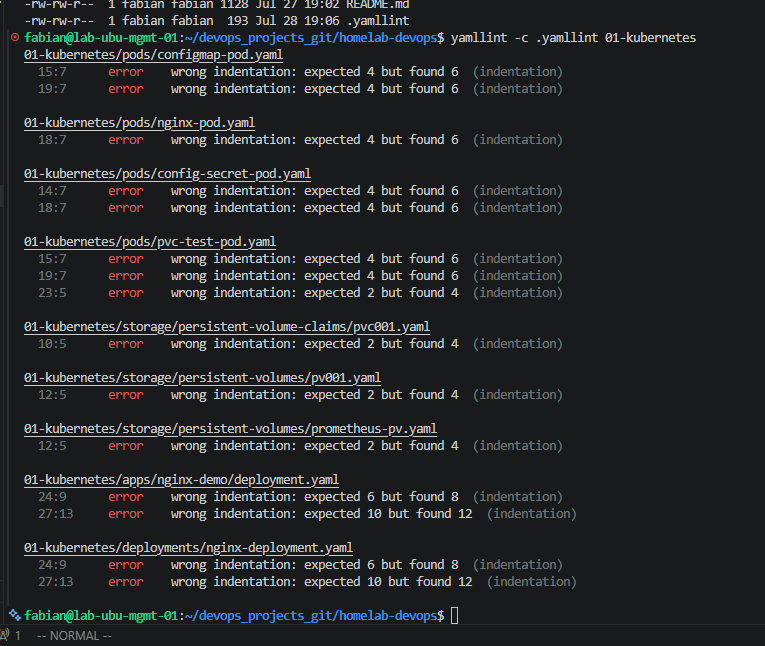
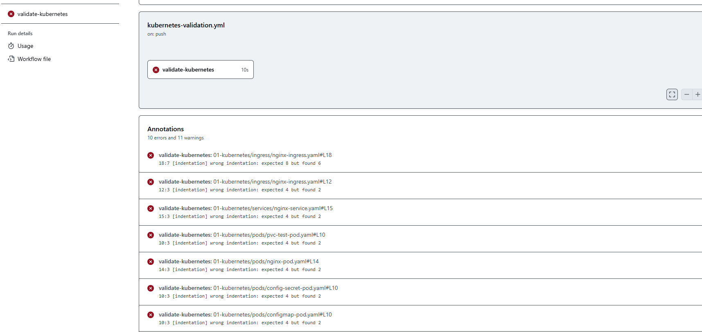
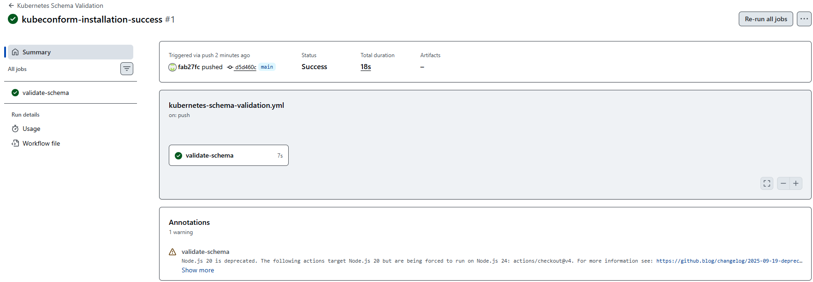
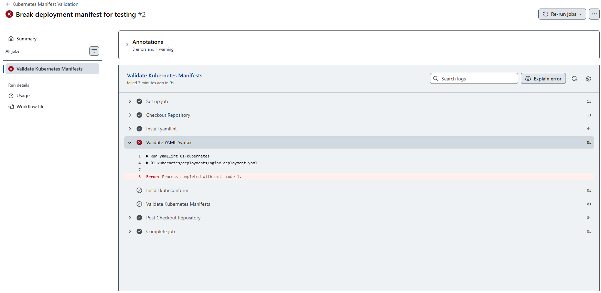
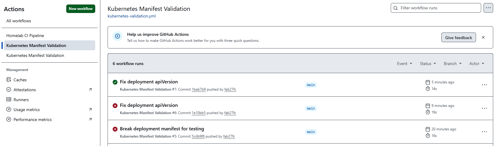
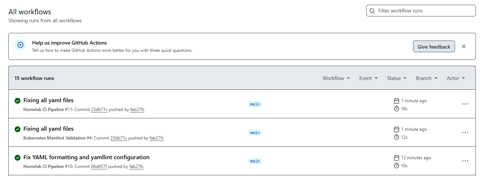

# Kubernetes Manifest Validation with GitHub Actions

## Overview

Modern DevOps practices rely heavily on Continuous Integration (CI) to ensure infrastructure changes are validated before reaching production. Kubernetes manifests are configuration files that define the desired state of applications and infrastructure. A small mistake, such as an incorrect indentation level or an invalid API version, can cause deployment failures.

In this lab, a GitHub Actions workflow was created to automatically validate every Kubernetes manifest stored in the repository. The validation process consists of two stages:

- **YAML Syntax Validation** using **yamllint**
- **Kubernetes Schema Validation** using **kubeconform**

The workflow runs automatically whenever Kubernetes manifests are modified or when a Pull Request is opened, allowing configuration issues to be detected early in the development lifecycle.

This lab demonstrates how Continuous Integration improves deployment quality by preventing invalid manifests from being merged into the repository.

---

# Objectives

The objectives of this lab are:

- Build a Continuous Integration (CI) pipeline using GitHub Actions.
- Learn how GitHub-hosted runners execute workflows.
- Automatically validate YAML syntax.
- Validate Kubernetes manifests against official Kubernetes schemas.
- Understand the difference between syntax validation and schema validation.
- Simulate pipeline failures.
- Troubleshoot validation errors.
- Automatically verify infrastructure code before deployment.

---

# Learning Outcomes

After completing this lab, you will be able to:

- Create GitHub Actions workflows.
- Configure workflow triggers.
- Understand GitHub-hosted runners.
- Install tools dynamically during workflow execution.
- Validate Infrastructure as Code (IaC).
- Troubleshoot failing pipelines.
- Read GitHub Actions logs.
- Understand how CI pipelines improve Kubernetes deployments.

---

# Prerequisites

Before starting this lab, the following requirements should already be completed.

## Software

- Git
- GitHub Account
- Visual Studio Code
- Kubernetes manifests
- Internet connection

## Knowledge

- Basic Git
- Basic YAML
- Basic Kubernetes
- GitHub repositories

---

# Technologies Used

| Technology | Purpose |
|------------|---------|
| GitHub Actions | Continuous Integration |
| Git | Version Control |
| YAML | Kubernetes configuration language |
| Kubernetes | Container orchestration |
| yamllint | YAML syntax validation |
| kubeconform | Kubernetes schema validation |

---

# Repository Structure

```text
homelab-devops/
│
├── .github/
│   └── workflows/
│       └── kubernetes-validation.yml
│
├── 01-kubernetes/
│   ├── deployments/
│   ├── services/
│   ├── ingress/
│   ├── pods/
│   ├── storage/
│   └── namespaces/
│
└── docs/
    └── 06-CICD-with-GitHub-Actions/
        ├── 03-kubernetes-manifest-validation.md
        └── images/
```

---

# Continuous Integration Architecture

The validation workflow follows the architecture below.

```text
                Developer
                    │
                    │
              git add / commit
                    │
                    ▼
               GitHub Repository
                    │
                git push
                    │
                    ▼
             GitHub Actions Trigger
                    │
                    ▼
        GitHub Hosted Runner (Ubuntu)
                    │
                    ├──────────────┐
                    │              │
                    ▼              ▼
            Install yamllint   Install kubeconform
                    │              │
                    ▼              ▼
          Validate YAML      Validate Kubernetes
              Syntax             Schema
                    │
                    ▼
           Pipeline Result
          ┌──────────────┐
          │              │
       Success        Failed
          │              │
          ▼              ▼
 Continue Development  Fix Manifest
```

---

# Continuous Integration Workflow

The workflow automatically validates every Kubernetes manifest before it can be merged into the repository.

Validation occurs in two independent stages.

## Stage 1

Validate YAML syntax.

Tool:

- yamllint

Checks:

- Indentation
- Formatting
- Invalid YAML syntax
- Empty values
- YAML structure

---

## Stage 2

Validate Kubernetes resources.

Tool:

- kubeconform

Checks:

- apiVersion
- kind
- metadata
- spec
- Required fields
- Kubernetes schemas

Unlike yamllint, kubeconform understands Kubernetes objects and validates them against the official Kubernetes API specifications.

---

# Workflow Execution

The workflow is triggered automatically when:

- A developer pushes changes to Kubernetes manifests.
- A Pull Request is created.
- The workflow is manually executed.

Once triggered, GitHub creates a temporary Ubuntu runner that performs the following operations:

1. Clone the repository.
2. Install yamllint.
3. Validate YAML syntax.
4. Install kubeconform.
5. Validate Kubernetes manifests.
6. Report Success or Failure.


## Workflow History



The image above shows the evolution of the workflow during development. Several failed executions occurred while validating and troubleshooting the manifests, followed by a successful execution after correcting the configuration.


## Successful Pipeline Execution



After fixing all validation errors, the workflow completed successfully. Every validation stage executed correctly, confirming that the Kubernetes manifests satisfy both YAML syntax requirements and Kubernetes schema validation.

---

# Workflow File

The Kubernetes validation pipeline is defined in the following GitHub Actions workflow:

```text
.github/workflows/kubernetes-validation.yml
```

The workflow is responsible for automatically validating Kubernetes manifests every time a developer pushes changes to the repository or creates a Pull Request.

The complete workflow is shown below.

```yaml
name: Kubernetes Manifest Validation

on:
  workflow_dispatch:

  push:
    paths:
      - "01-kubernetes/**"
      - ".github/workflows/kubernetes-validation.yml"
      - ".yamllint"

  pull_request:
    paths:
      - "01-kubernetes/**"
      - ".github/workflows/kubernetes-validation.yml"
      - ".yamllint"

jobs:
  validate-kubernetes:
    runs-on: ubuntu-latest

    steps:
      - name: Checkout Repository
        uses: actions/checkout@v4

      - name: Install yamllint
        run: |
          python -m pip install --upgrade pip
          pip install yamllint

      - name: Validate YAML Syntax
        run: |
          yamllint 01-kubernetes

      - name: Install kubeconform
        run: |
          curl -L \
            https://github.com/yannh/kubeconform/releases/latest/download/kubeconform-linux-amd64.tar.gz \
            -o kubeconform.tar.gz

          tar -xzf kubeconform.tar.gz

          sudo install kubeconform /usr/local/bin/kubeconform

      - name: Validate Kubernetes Manifests
        run: |
          find 01-kubernetes \
            -type f \
            \( -name "*.yaml" -o -name "*.yml" \) \
            -print0 |
          xargs -0 kubeconform \
            -summary \
            -strict \
            -ignore-missing-schemas
```


Workflow Explanation

│
├── name
├── on
│      ├── workflow_dispatch
│      ├── push
│      └── pull_request
│
├── jobs
│
├── runs-on
│
├── steps
│      ├── checkout
│      ├── yamllint
│      ├── kubeconform
│      └── validation
│
├── uses
│
└── run

---

# Workflow Explanation

The Kubernetes validation workflow is divided into multiple sections. Each section has a specific responsibility that contributes to the Continuous Integration (CI) process.

The following sections explain every part of the workflow in detail.

---

## Workflow Name

```yaml
name: Kubernetes Manifest Validation
```

The `name` field defines the display name of the workflow inside the GitHub Actions interface.

This is the name shown in the **Actions** tab whenever the workflow is executed.

Using meaningful workflow names makes repositories easier to maintain, especially when multiple workflows exist.

---

## Workflow Triggers

```yaml
on:
```

The `on` section defines which GitHub events trigger the workflow.

In this lab, three different triggers are configured.

### Manual Execution

```yaml
workflow_dispatch:
```

This trigger allows the workflow to be executed manually from the GitHub Actions interface.

It is useful for testing changes without creating a new commit.

### Push Events

```yaml
push:
```

The workflow runs automatically whenever changes are pushed to the repository.

However, it only executes when specific files or directories are modified.

```yaml
paths:
  - "01-kubernetes/**"
  - ".github/workflows/kubernetes-validation.yml"
  - ".yamllint"
```

This optimization prevents unnecessary workflow executions.

The pipeline only runs when:

- Kubernetes manifests are modified.
- The workflow itself changes.
- The yamllint configuration changes.

### Pull Requests

```yaml
pull_request:
```

The workflow also executes whenever a Pull Request modifies the same files.

This provides an additional validation layer before changes are merged into the main branch.

Running validation during Pull Requests helps detect errors before they reach production.

---

## GitHub Actions Workflow List



The GitHub Actions interface displays every workflow execution. Each run includes the workflow name, execution status, branch, commit information, execution time, and workflow duration.

This view makes it easy to review previous executions, investigate failures, and verify successful pipeline runs.

---

# Jobs

A GitHub Actions workflow is composed of one or more jobs.

Each job represents an independent unit of work executed by a runner.

Jobs can run sequentially or in parallel depending on the workflow configuration.

This lab uses a single job responsible for validating Kubernetes manifests.

```yaml
jobs:
  validate-kubernetes:
```

The job identifier is `validate-kubernetes`.

Inside this job, every validation task is executed in the required order.

---

# GitHub-hosted Runner

```yaml
runs-on: ubuntu-latest
```

The `runs-on` keyword specifies which operating system will execute the job.

In this lab, GitHub provides a temporary Ubuntu virtual machine.

The runner is automatically created when the workflow starts and destroyed immediately after the workflow finishes.

Because every runner is ephemeral, no previously installed software is preserved between executions.

For this reason, the workflow installs both **yamllint** and **kubeconform** every time it runs.

Using GitHub-hosted runners eliminates the need to maintain dedicated build servers and ensures a clean environment for every execution.

---

# Workflow Steps

A job is divided into multiple steps.

Each step performs a single task.

The validation workflow consists of the following steps:

1. Checkout Repository
2. Install yamllint
3. Validate YAML Syntax
4. Install kubeconform
5. Validate Kubernetes Manifests

Executing small, independent steps makes workflows easier to troubleshoot and maintain.

---

# Checkout Repository

```yaml
- name: Checkout Repository
  uses: actions/checkout@v4
```

The first step downloads the repository into the GitHub-hosted runner.

Without this step, none of the repository files would be available during workflow execution.

The `actions/checkout` action is one of the most commonly used GitHub Actions because nearly every workflow needs access to the repository contents.

Version **v4** is used in this project.

---

# Installing yamllint

```yaml
- name: Install yamllint
```

The runner starts with a clean operating system.

Because `yamllint` is not preinstalled, it must be installed during every workflow execution.

The following commands are executed.

```yaml
python -m pip install --upgrade pip
pip install yamllint
```

The first command updates the Python package manager.

The second command installs **yamllint**, which validates YAML syntax before Kubernetes schema validation begins.

## Installing yamllint



The screenshot above shows the installation of **yamllint** inside the GitHub-hosted runner. Since the runner is created from a clean environment during every workflow execution, the required validation tools must be installed each time the pipeline runs.

---

# YAML Syntax Validation

Once **yamllint** has been installed, the workflow validates every YAML file inside the Kubernetes directory.

```yaml
- name: Validate YAML Syntax
  run: |
    yamllint 01-kubernetes
```

This command scans every YAML file stored under the `01-kubernetes` directory.

Unlike Kubernetes validation tools, **yamllint** only verifies the syntax and formatting of YAML files.

It does **not** validate Kubernetes resources.

Instead, it checks for problems such as:

- Incorrect indentation
- Invalid YAML syntax
- Missing spaces
- Trailing whitespace
- Formatting inconsistencies

Performing YAML validation before Kubernetes validation prevents schema validation from running against malformed configuration files.

This approach follows the principle of failing fast, allowing errors to be detected as early as possible during the CI process.

---

## YAML Validation Errors

During this lab, several YAML formatting issues were intentionally introduced to verify that the workflow could detect invalid syntax.

The following screenshot shows the validation errors reported by **yamllint**.



The workflow immediately stopped after detecting the formatting issues.

This behavior prevents invalid configuration files from reaching the Kubernetes schema validation stage.

---

## Indentation Errors

One of the most common YAML problems is incorrect indentation.

Because YAML uses spaces to represent hierarchy, even a single misplaced space can make a file invalid.

The following screenshot shows an example of indentation errors detected during the lab.



After correcting the indentation, the workflow successfully continued to the next validation stage.

---

# Installing kubeconform

After the YAML syntax validation completes successfully, the workflow installs **kubeconform**.

Unlike **yamllint**, which only validates YAML formatting, **kubeconform** validates Kubernetes resources against the official Kubernetes API schemas.

The installation is performed during every workflow execution because GitHub-hosted runners are temporary and do not preserve installed software between runs.

The following commands are executed.

```yaml
- name: Install kubeconform
  run: |
    curl -L \
      https://github.com/yannh/kubeconform/releases/latest/download/kubeconform-linux-amd64.tar.gz \
      -o kubeconform.tar.gz

    tar -xzf kubeconform.tar.gz

    sudo install kubeconform /usr/local/bin/kubeconform
```

The installation process consists of three steps:

1. Download the latest kubeconform release from the official GitHub repository.
2. Extract the compressed archive.
3. Install the binary into `/usr/local/bin`, making it available from anywhere in the runner.

Installing the tool during the workflow ensures that every pipeline execution uses a clean and consistent environment.

---

## kubeconform Installation

The following screenshot shows the successful installation of **kubeconform** during the workflow execution.



Once the installation is complete, the workflow proceeds to validate the Kubernetes manifests contained in the repository.

---

# Why kubeconform?

Kubernetes manifests may have valid YAML syntax but still contain invalid Kubernetes objects.

For example, a Deployment may reference:

- An unsupported API version
- An invalid field
- A misspelled property
- An incorrect resource structure

These errors cannot be detected by **yamllint** because they are related to the Kubernetes API rather than YAML syntax.

By validating manifests against the official Kubernetes schemas, **kubeconform** helps detect these issues before they are deployed to a cluster.

Using schema validation as part of a Continuous Integration pipeline improves reliability and reduces deployment failures.

---

# Kubernetes Manifest Validation

After installing **kubeconform**, the workflow validates every Kubernetes manifest stored in the repository.

The validation step is shown below.

```yaml
- name: Validate Kubernetes Manifests
  run: |
    find 01-kubernetes \
      -type f \
      \( -name "*.yaml" -o -name "*.yml" \) \
      -print0 |
    xargs -0 kubeconform \
      -summary \
      -strict \
      -ignore-missing-schemas
```

This step automatically discovers every Kubernetes manifest located inside the `01-kubernetes` directory and validates each file against the official Kubernetes API schemas.

Unlike manually specifying each manifest, this approach automatically includes new YAML files as they are added to the repository, making the workflow easier to maintain and scale.

---

# Command Breakdown

The validation command is composed of several Linux utilities working together.

## find

```bash
find 01-kubernetes
```

The `find` command searches recursively through the `01-kubernetes` directory.

Only files with the extensions `.yaml` or `.yml` are selected.

This allows every Kubernetes manifest in the repository to be validated automatically.

---

## xargs

```bash
xargs -0
```

The `xargs` command receives the list of files produced by `find` and passes them to **kubeconform**.

Using the `-0` option ensures that file names containing spaces or special characters are processed correctly.

---

## kubeconform

```bash
kubeconform
```

**kubeconform** validates Kubernetes manifests against the official Kubernetes JSON schemas.

It verifies that each resource follows the expected structure for its API version and resource type.

If a manifest contains unsupported fields, incorrect API versions, or invalid resource definitions, the validation fails immediately.

---

## Validation Options

The workflow uses three important kubeconform options.

### -summary

```bash
-summary
```

Displays a summary of the validation results after all manifests have been processed.

Instead of reviewing each file individually, the summary provides a quick overview of successful and failed validations.

---

### -strict

```bash
-strict
```

Strict mode performs additional validation checks.

It detects unknown fields that Kubernetes might ignore during deployment.

Using strict validation helps identify configuration mistakes before they reach the cluster.

---

### -ignore-missing-schemas

```bash
-ignore-missing-schemas
```

Some Custom Resource Definitions (CRDs) do not have publicly available schemas.

Instead of failing the workflow because a schema cannot be downloaded, this option skips those resources while continuing to validate all standard Kubernetes objects.

This is particularly useful when working with tools such as Argo CD, Prometheus Operator, or cert-manager.

---

# Validation Flow

The complete validation process executed by the workflow follows these steps.

1. Search for every Kubernetes manifest.
2. Pass the files to kubeconform.
3. Download the appropriate Kubernetes schemas.
4. Validate every resource.
5. Generate a validation summary.
6. Return a success or failure status to GitHub Actions.

If every manifest passes validation, the workflow finishes successfully.

Otherwise, the workflow stops immediately and reports the validation errors.

## Successful Kubernetes Validation

The following screenshot shows the successful execution of the Kubernetes manifest validation stage.


All manifests passed schema validation successfully, confirming that the Kubernetes resources comply with the official API specifications.

---

# Failure Simulation

A validation pipeline should not only succeed when the manifests are correct but also fail when invalid configurations are introduced.

To verify that the workflow behaved as expected, an intentional error was introduced into one of the Kubernetes manifests.

Instead of deploying invalid resources to a cluster, the pipeline detected the problem during the validation stage and immediately stopped the execution.

This test confirmed that the Continuous Integration pipeline correctly prevents invalid Kubernetes configurations from progressing further.

---

## Pipeline Failure

The following screenshot shows the failed workflow execution after introducing an invalid Kubernetes manifest.



GitHub Actions reported the validation failure and marked the workflow as unsuccessful.

Stopping the pipeline at this stage prevents configuration errors from reaching production environments.

---

## Root Cause Analysis

The validation output identified that one of the Kubernetes manifests contained an invalid API definition.

Because **kubeconform** validates manifests against the official Kubernetes schemas, the incorrect resource definition was detected immediately.

This demonstrates one of the primary advantages of schema validation within a CI pipeline:

- Invalid Kubernetes resources are detected before deployment.
- Configuration errors are identified early in the development process.
- Developers receive immediate feedback.
- Deployment failures are significantly reduced.

By shifting validation to the Continuous Integration stage, configuration problems become easier and less expensive to fix.

---

# Correcting the Deployment

After identifying the validation failure, the incorrect Kubernetes manifest was reviewed and corrected.

The invalid API version was replaced with the appropriate value supported by the Kubernetes cluster.

The following screenshot shows the corrected Deployment manifest.



Once the manifest was corrected, the changes were committed and pushed to the GitHub repository.

GitHub Actions automatically executed the validation workflow again using the updated configuration.


---

# Successful Pipeline Execution

After correcting the manifest, the workflow completed successfully.

The validation process confirmed that:

- All YAML files contained valid syntax.
- Every Kubernetes manifest complied with the official API schemas.
- No validation errors remained.
- The repository was ready for deployment.

The following screenshot shows the successful workflow execution after the issue was resolved.



This exercise demonstrated the complete validation lifecycle:

1. Introduce a configuration error.
2. Detect the error automatically.
3. Analyze the validation output.
4. Correct the manifest.
5. Re-run the pipeline.
6. Confirm a successful validation.

This process reflects a real-world Continuous Integration workflow and helps ensure that only valid Kubernetes manifests are accepted into the repository.

---

# Troubleshooting

During the implementation of this lab, several issues were encountered while developing the GitHub Actions workflow.

The following table summarizes the most common problems and their corresponding solutions.

| Problem | Cause | Solution |
|----------|-------|----------|
| YAML validation failed | Incorrect indentation or formatting | Corrected the YAML syntax using yamllint output |
| kubeconform validation failed | Invalid Kubernetes manifest | Updated the manifest to match the official Kubernetes schema |
| Workflow did not execute | Workflow file or paths were incorrect | Verified the workflow location and trigger configuration |
| Validation tool not found | GitHub runner is ephemeral | Installed the required tools during every workflow execution |
| Pipeline failed after changes | Invalid manifest committed | Reviewed the logs, fixed the resource, and pushed a new commit |

The GitHub Actions logs were used throughout the lab to identify the source of each issue and verify that every correction resolved the problem.

---

# Best Practices

Several best practices were implemented while building this Continuous Integration pipeline.

- Validate YAML syntax before Kubernetes schemas.
- Use GitHub-hosted runners to ensure a clean execution environment.
- Keep validation workflows simple and modular.
- Validate every Kubernetes manifest automatically.
- Fail the pipeline immediately when errors are detected.
- Store infrastructure as code in version control.
- Test the pipeline by intentionally introducing configuration errors.
- Use descriptive workflow names and step names.
- Document every stage of the validation process.
- Keep workflow files under version control alongside the infrastructure code.

Applying these practices improves code quality, reduces deployment risks, and makes the repository easier to maintain.

---

# Lessons Learned

This lab provided practical experience with GitHub Actions and Kubernetes manifest validation.

The main lessons learned include:

- Understanding the role of Continuous Integration in Infrastructure as Code.
- Building automated validation pipelines using GitHub Actions.
- Differentiating YAML syntax validation from Kubernetes schema validation.
- Using GitHub-hosted runners effectively.
- Installing and using third-party validation tools during workflow execution.
- Reading and interpreting GitHub Actions logs.
- Troubleshooting validation failures.
- Applying schema validation before deployment.
- Improving repository quality through automated checks.

Completing this lab reinforced the importance of validating infrastructure before deployment and demonstrated how automation helps reduce operational risk.

---

# Conclusion

This project demonstrates how GitHub Actions can be used to implement a practical Continuous Integration pipeline for Kubernetes Infrastructure as Code.

The workflow automatically validates YAML syntax, verifies Kubernetes manifests against the official schemas, and prevents invalid configurations from reaching later deployment stages.

Throughout the lab, the pipeline was intentionally tested with both valid and invalid manifests to verify that the validation process behaved as expected.

By combining GitHub Actions, yamllint, and kubeconform, the repository now includes an automated validation process that improves consistency, reliability, and maintainability.

This project also serves as a foundation for future DevOps workflows, where additional stages such as security scanning, container image validation, unit testing, and Continuous Deployment can be integrated into the pipeline.

The knowledge and experience gained from this lab reflect real-world DevOps practices and provide a strong foundation for building production-ready CI/CD pipelines.

## Final Workflow Status


The final workflow history shows multiple executions performed throughout the lab, including successful validations, intentional failures, and subsequent fixes. This iterative approach demonstrates the development, testing, troubleshooting, and verification process followed during the implementation of the Continuous Integration pipeline.

