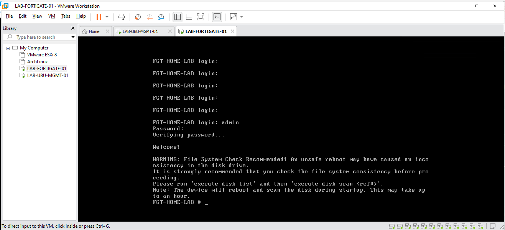
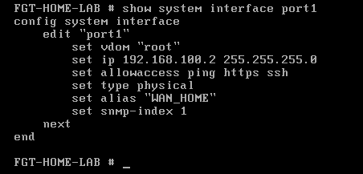
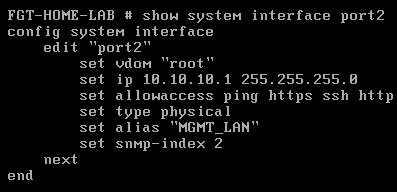
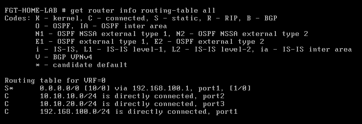
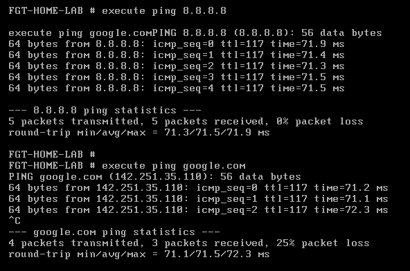
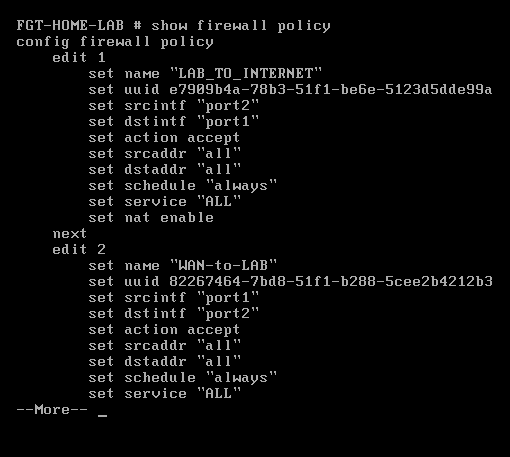
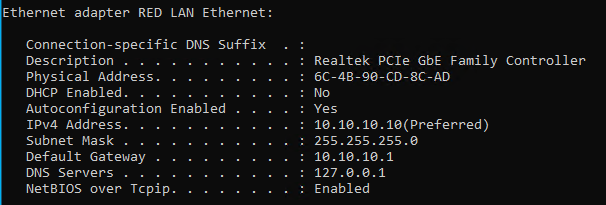

# FortiGate VM Installation and Configuration

## Overview

This document explains how to deploy and configure a FortiGate VM firewall for a DevOps/SRE Homelab environment.

The firewall provides:

- Internet connectivity
- Routing
- Firewall policies
- NAT
- Network security

---

# Environment

## Infrastructure

| Component | Value |
|---|---|
| Hypervisor | VMware |
| Host Server | Windows Server |
| Firewall | FortiGate VM |
| LAN Network | 10.10.10.0/24 |
| WAN Network | 192.168.100.0/24 |

---

# FortiGate VM Deployment

## Steps

1. Download FortiGate VM from Fortinet Support Portal.

2. Import OVF file into VMware:

```text
FortiGate-VM64.ovf
```

3. Start VM.

Default login:

```text
Username: admin
Password: Empty
```

Change administrator password.

---

## Screenshot

VMware FortiGate VM deployment:




---

# WAN Interface Configuration

## Port

```text
port1
```

Purpose:

Internet Access

Configuration:

```bash
config system interface
edit port1
set alias "WAN_HOME"
set mode static
set ip 192.168.100.2/24
set allowaccess ping https http ssh
next
end
```

Validate:

```bash
show system interface port1
```

## Screenshot

WAN interface:




---

# LAN Interface Configuration

## Port

```text
port2
```

Purpose:

Internal Homelab LAN


Configuration:

```bash
config system interface
edit port2
set alias "MGMT_LAN"
set mode static
set ip 10.10.10.1/24
set allowaccess ping https http ssh
set role lan
next
end
```

Validate:

```bash
show system interface port2
```

## Screenshot

LAN interface:




---

# Static Route Configuration

Purpose:

Send traffic to the Internet gateway.

Configuration:

```bash
config router static
edit 1
set gateway 192.168.100.1
set device port1
next
end
```

Validate:

```bash
get router info routing-table all
```

## Screenshot

Routing table:




---

# DNS Configuration


Configuration:

```bash
config system dns

set primary 8.8.8.8

set secondary 1.1.1.1

end
```


Validation:

```bash
execute ping 8.8.8.8

execute ping google.com
```


## Screenshot

Connectivity test:




---

# Firewall Policy LAN to WAN

Purpose:

Allow internal devices to access the Internet.


Traffic flow:

```text
LAN

 |
 |
FortiGate

 |
 |
NAT

 |
 |

Internet
```


Configuration:

```bash
config firewall policy

edit 1

set name "LAB_TO_INTERNET"

set srcintf "port2"

set dstintf "port1"

set srcaddr "all"

set dstaddr "all"

set action accept

set schedule "always"

set service "ALL"

set nat enable

next

end
```


Validate:

```bash
show firewall policy
```


## Screenshot

Firewall policy:




---

# Windows Server Network Configuration


## Check Network Interfaces


PowerShell:

```powershell
Get-NetAdapter
```


---

# Rename Interfaces


LAN:

```powershell
Rename-NetAdapter `
-Name "VMware Network Adapter VMnet1" `
-NewName "RED_LAN_10.10.10.X"
```


WAN:

```powershell
Rename-NetAdapter `
-Name "WAN Wifi" `
-NewName "RED_WAN_192.168.100.X"
```


---

# Configure LAN IP


```powershell
New-NetIPAddress `
-InterfaceAlias "RED_LAN_10.10.10.X" `
-IPAddress 10.10.10.10 `
-PrefixLength 24
```


Configure DNS:

```powershell
Set-DnsClientServerAddress `
-InterfaceAlias "RED_LAN_10.10.10.X" `
-ServerAddresses 10.10.10.10
```


Validate:

```powershell
ipconfig /all
```


## Screenshot

Windows Server network:




---

# Troubleshooting Commands


## Interfaces


```bash
show system interface port1

show system interface port2
```


## Hardware Information


```bash
diagnose hardware deviceinfo nic port1
```


## Routing


```bash
get router info routing-table all
```


## ARP


```bash
get system arp
```


---

# Final Architecture


```text

Windows Server
10.10.10.10


Ubuntu Management
10.10.10.20


RHEL Kubernetes
10.10.10.30


        |

LAN 10.10.10.0/24


        |

FortiGate VM

10.10.10.1


        |

NAT


        |

Internet

```

---

# Validation Checklist


| Component | Status |
|---|---|
| FortiGate VM Installed | Completed |
| WAN Configured | Completed |
| LAN Configured | Completed |
| Static Route Added | Completed |
| DNS Working | Completed |
| NAT Enabled | Completed |
| Internet Access Working | Completed |
